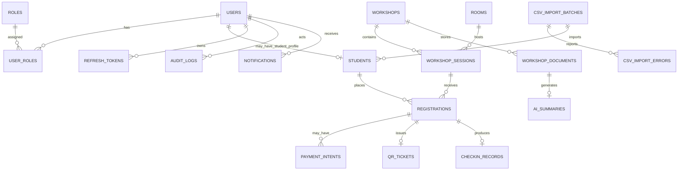

# UniHub Workshop — Database Design

## 1. Overview

This document defines the database design for UniHub Workshop.

PostgreSQL is the system of record for durable business data. Redis is used only for volatile coordination such as rate limiting, short-lived idempotency, optional caching, and worker coordination. Object storage is used for uploaded PDF files. The React Native mobile app uses local SQLite for offline check-in data.

Storage responsibilities:

| Storage          | Responsibility                                                                                                                                                             |
| ---------------- | -------------------------------------------------------------------------------------------------------------------------------------------------------------------------- |
| PostgreSQL       | Users, roles, students, workshops, sessions, registrations, payments, QR tickets, check-ins, notifications, AI summary metadata/results, CSV import audit data, audit logs |
| Redis            | Rate limiting, short-lived idempotency cache, optional read cache, temporary locks, worker queue coordination                                                              |
| Object Storage   | Uploaded workshop PDF files                                                                                                                                                |
| SQLite on Mobile | Cached sessions and unsynced offline check-in events                                                                                                                       |

General conventions:

- Primary keys use UUID.
- All timestamps are stored in UTC.
- Status values are stored as strings with application-level enums and database CHECK constraints where practical.
- PostgreSQL remains the source of truth for seat allocation, payment state, registration state, QR ticket state, and final check-in state.
- Redis must not be used as the durable source of truth for any business state.

---

## 2. Entity Relationship Diagram



---

## 3. Core Status Values

### User account status

```text
ACTIVE
DISABLED
LOCKED
```

### Student status

```text
ACTIVE
INACTIVE
GRADUATED
SUSPENDED
```

### Workshop status

```text
DRAFT
PUBLISHED
CANCELED
ARCHIVED
```

### Workshop session status

```text
OPEN
CLOSED
CANCELED
FULL
```

### Fee type

```text
FREE
PAID
```

### Registration status

```text
PENDING_PAYMENT
CONFIRMED
PAYMENT_FAILED
EXPIRED
CANCELED
```

### Payment status

```text
PENDING_GATEWAY
PENDING_PAYMENT
PENDING_RECONCILIATION
SUCCEEDED
FAILED
EXPIRED
CANCELED
```

### QR ticket status

```text
ACTIVE
REVOKED
EXPIRED
```

### Check-in source mode

```text
ONLINE
OFFLINE_SYNC
MANUAL_CORRECTION
```

### Notification channel

```text
IN_APP
EMAIL
TELEGRAM
```

### Notification status

```text
PENDING
SENT
FAILED
RETRYING
READ
```

### AI summary status

```text
PENDING
PROCESSING
COMPLETED
FAILED
RETRYING
```

### Workshop document upload status

```text
UPLOADED
PROCESSING
FAILED
SUPERSEDED
```

### CSV import status

```text
PROCESSING
SUCCESS
PARTIAL_SUCCESS
FAILED
MISSED
```

---

## 4. PostgreSQL Tables

## 4.1 `users`

Stores login identity and account-level security state.

| Field            | Type         | Constraints      | Description                    |
| ---------------- | ------------ | ---------------- | ------------------------------ |
| `id`             | UUID         | PK               | User account ID                |
| `email`          | VARCHAR(255) | NOT NULL, UNIQUE | Login email                    |
| `password_hash`  | VARCHAR(255) | NOT NULL         | Salted password hash           |
| `full_name`      | VARCHAR(255) | NOT NULL         | Display name                   |
| `account_status` | VARCHAR(30)  | NOT NULL         | `ACTIVE`, `DISABLED`, `LOCKED` |
| `created_at`     | TIMESTAMP    | NOT NULL         | Creation time                  |
| `updated_at`     | TIMESTAMP    | NOT NULL         | Last update time               |
| `last_login_at`  | TIMESTAMP    | NULL             | Last successful login          |

Indexes:

- Unique index on `email`.
- Index on `account_status`.

Notes:

- Passwords must never be stored as plaintext.
- Organizer, check-in staff, system operator, and student accounts are all represented as `users`.

---

## 4.2 `roles`

Stores RBAC role names.

| Field         | Type         | Constraints      | Description                |
| ------------- | ------------ | ---------------- | -------------------------- |
| `id`          | UUID         | PK               | Role ID                    |
| `name`        | VARCHAR(50)  | NOT NULL, UNIQUE | Role name                  |
| `description` | VARCHAR(255) | NULL             | Human-readable description |

Seed roles:

```text
student
organizer
checkin_staff
system_operator
```

---

## 4.3 `user_roles`

Maps users to roles.

| Field        | Type      | Constraints               | Description     |
| ------------ | --------- | ------------------------- | --------------- |
| `user_id`    | UUID      | PK part, FK -> `users.id` | User ID         |
| `role_id`    | UUID      | PK part, FK -> `roles.id` | Role ID         |
| `created_at` | TIMESTAMP | NOT NULL                  | Assignment time |

Constraints:

- Primary key or unique constraint on `(user_id, role_id)`.

---

## 4.4 `students`

Stores student profile data imported from the legacy CSV system.

| Field             | Type         | Constraints                         | Description                                              |
| ----------------- | ------------ | ----------------------------------- | -------------------------------------------------------- |
| `id`              | UUID         | PK                                  | Internal student profile ID                              |
| `user_id`         | UUID         | NULL, UNIQUE, FK -> `users.id`      | Linked login account, nullable before account activation |
| `student_id`      | VARCHAR(50)  | NOT NULL, UNIQUE                    | Official student code from legacy system                 |
| `full_name`       | VARCHAR(255) | NOT NULL                            | Student full name from CSV                               |
| `email`           | VARCHAR(255) | NULL                                | Student email from CSV if available                      |
| `faculty`         | VARCHAR(255) | NULL                                | Faculty                                                  |
| `major`           | VARCHAR(255) | NULL                                | Major                                                    |
| `class_name`      | VARCHAR(100) | NULL                                | Class/group name                                         |
| `status`          | VARCHAR(30)  | NOT NULL                            | `ACTIVE`, `INACTIVE`, `GRADUATED`, `SUSPENDED`           |
| `import_batch_id` | UUID         | NULL, FK -> `csv_import_batches.id` | Last import batch that updated this row                  |
| `imported_at`     | TIMESTAMP    | NOT NULL                            | Last import time                                         |
| `created_at`      | TIMESTAMP    | NOT NULL                            | Creation time                                            |
| `updated_at`      | TIMESTAMP    | NOT NULL                            | Last update time                                         |

Indexes:

- Unique index on `student_id`.
- Unique index on `user_id` where `user_id IS NOT NULL`.
- Index on `status`.
- Index on `faculty`.

Notes:

- `users` stores login/auth data.
- `students` stores academic/student roster data.
- Organizer and check-in staff are users but not students.
- A student can self-register only if their `student_id` already exists and status is `ACTIVE`.

---

## 4.5 `refresh_tokens`

Stores hashed refresh tokens for logout and refresh token rotation.

| Field                  | Type         | Constraints                     | Description                            |
| ---------------------- | ------------ | ------------------------------- | -------------------------------------- |
| `id`                   | UUID         | PK                              | Refresh token ID                       |
| `user_id`              | UUID         | NOT NULL, FK -> `users.id`      | Owner                                  |
| `token_hash`           | VARCHAR(255) | NOT NULL, UNIQUE                | Hash of refresh token, never raw token |
| `expires_at`           | TIMESTAMP    | NOT NULL                        | Expiration time                        |
| `revoked_at`           | TIMESTAMP    | NULL                            | Revocation time                        |
| `created_at`           | TIMESTAMP    | NOT NULL                        | Creation time                          |
| `replaced_by_token_id` | UUID         | NULL, FK -> `refresh_tokens.id` | New token created by rotation          |

Indexes:

- Unique index on `token_hash`.
- Index on `(user_id, revoked_at)`.
- Index on `expires_at`.

Notes:

- Raw refresh tokens must not be stored.
- Logout revokes refresh token.
- Refresh flow should rotate refresh tokens.

---

## 4.6 `rooms`

Stores physical room information.

| Field        | Type         | Constraints                    | Description              |
| ------------ | ------------ | ------------------------------ | ------------------------ |
| `id`         | UUID         | PK                             | Room ID                  |
| `name`       | VARCHAR(100) | NOT NULL                       | Room name, e.g. `H1-201` |
| `building`   | VARCHAR(100) | NULL                           | Building name            |
| `capacity`   | INT          | NOT NULL, CHECK `capacity > 0` | Room capacity            |
| `map_url`    | TEXT         | NULL                           | Room map URL             |
| `status`     | VARCHAR(30)  | NOT NULL                       | `ACTIVE`, `INACTIVE`     |
| `created_at` | TIMESTAMP    | NOT NULL                       | Creation time            |
| `updated_at` | TIMESTAMP    | NOT NULL                       | Last update time         |

Indexes:

- Unique index on `(building, name)`.
- Index on `status`.

---

## 4.7 `workshops`

Stores high-level workshop metadata.

| Field                | Type         | Constraints                | Description                                  |
| -------------------- | ------------ | -------------------------- | -------------------------------------------- |
| `id`                 | UUID         | PK                         | Workshop ID                                  |
| `title`              | VARCHAR(255) | NOT NULL                   | Workshop title                               |
| `speaker`            | VARCHAR(255) | NOT NULL                   | Speaker name                                 |
| `description`        | TEXT         | NOT NULL                   | Full description                             |
| `status`             | VARCHAR(30)  | NOT NULL                   | `DRAFT`, `PUBLISHED`, `CANCELED`, `ARCHIVED` |
| `created_by_user_id` | UUID         | NOT NULL, FK -> `users.id` | Organizer who created the workshop           |
| `created_at`         | TIMESTAMP    | NOT NULL                   | Creation time                                |
| `updated_at`         | TIMESTAMP    | NOT NULL                   | Last update time                             |
| `published_at`       | TIMESTAMP    | NULL                       | Publish time                                 |
| `canceled_at`        | TIMESTAMP    | NULL                       | Cancel time                                  |

Indexes:

- Index on `status`.
- Index on `created_by_user_id`.
- Text search index on `title`, `speaker`, and `description` if implemented.

Notes:

- Public browsing should show only published workshops unless policy says otherwise.
- Canceled workshops remain in admin history.

---

## 4.8 `workshop_sessions`

Stores concrete time slots for workshops.

| Field             | Type          | Constraints                         | Description                                    |
| ----------------- | ------------- | ----------------------------------- | ---------------------------------------------- |
| `id`              | UUID          | PK                                  | Session ID                                     |
| `workshop_id`     | UUID          | NOT NULL, FK -> `workshops.id`      | Parent workshop                                |
| `room_id`         | UUID          | NOT NULL, FK -> `rooms.id`          | Room                                           |
| `start_at`        | TIMESTAMP     | NOT NULL                            | Start time                                     |
| `end_at`          | TIMESTAMP     | NOT NULL                            | End time                                       |
| `status`          | VARCHAR(30)   | NOT NULL                            | `OPEN`, `CLOSED`, `CANCELED`, `FULL`           |
| `seat_capacity`   | INT           | NOT NULL, CHECK `seat_capacity > 0` | Session capacity                               |
| `seats_confirmed` | INT           | NOT NULL DEFAULT 0                  | Confirmed seats                                |
| `seats_reserved`  | INT           | NOT NULL DEFAULT 0                  | Temporarily reserved seats for pending payment |
| `fee_type`        | VARCHAR(20)   | NOT NULL                            | `FREE` or `PAID`                               |
| `fee_amount`      | NUMERIC(12,2) | NOT NULL DEFAULT 0                  | Payment amount                                 |
| `currency`        | VARCHAR(10)   | NOT NULL DEFAULT `VND`              | Currency                                       |
| `created_at`      | TIMESTAMP     | NOT NULL                            | Creation time                                  |
| `updated_at`      | TIMESTAMP     | NOT NULL                            | Last update time                               |
| `canceled_at`     | TIMESTAMP     | NULL                                | Cancel time                                    |

Constraints:

- `end_at > start_at`.
- `seats_confirmed >= 0`.
- `seats_reserved >= 0`.
- `seats_confirmed + seats_reserved <= seat_capacity`.
- If `fee_type = 'FREE'`, `fee_amount = 0`.
- If `fee_type = 'PAID'`, `fee_amount > 0`.

Indexes:

- Index on `workshop_id`.
- Index on `room_id`.
- Index on `start_at`.
- Index on `(status, start_at)`.
- Optional exclusion constraint for room schedule conflicts if using PostgreSQL range types.

Notes:

- Registration flow must lock the target session row before changing seat counters.
- Remaining seats are calculated as `seat_capacity - seats_confirmed - seats_reserved`.
- Remaining seats must never be negative.

---

## 4.9 `registrations`

Stores student registration attempts and confirmed registrations.

| Field               | Type        | Constraints                            | Description                                                             |
| ------------------- | ----------- | -------------------------------------- | ----------------------------------------------------------------------- |
| `id`                | UUID        | PK                                     | Registration ID                                                         |
| `student_id`        | UUID        | NOT NULL, FK -> `students.id`          | Student                                                                 |
| `session_id`        | UUID        | NOT NULL, FK -> `workshop_sessions.id` | Registered session                                                      |
| `status`            | VARCHAR(30) | NOT NULL                               | `PENDING_PAYMENT`, `CONFIRMED`, `PAYMENT_FAILED`, `EXPIRED`, `CANCELED` |
| `registration_type` | VARCHAR(20) | NOT NULL                               | `FREE` or `PAID`                                                        |
| `reserved_at`       | TIMESTAMP   | NULL                                   | Time seat was reserved                                                  |
| `confirmed_at`      | TIMESTAMP   | NULL                                   | Time registration became confirmed                                      |
| `expires_at`        | TIMESTAMP   | NULL                                   | Expiration for pending paid registration                                |
| `canceled_at`       | TIMESTAMP   | NULL                                   | Cancel time                                                             |
| `created_at`        | TIMESTAMP   | NOT NULL                               | Creation time                                                           |
| `updated_at`        | TIMESTAMP   | NOT NULL                               | Last update time                                                        |

Indexes and constraints:

- Index on `student_id`.
- Index on `session_id`.
- Index on `(status, expires_at)` for cleanup worker.
- Recommended partial unique index:

```sql
UNIQUE (student_id, session_id)
WHERE status IN ('PENDING_PAYMENT', 'CONFIRMED')
```

Notes:

- This allows historical `EXPIRED` or `CANCELED` records while preventing multiple active registrations.
- If the project chooses a stricter rule, use full unique constraint on `(student_id, session_id)` and reuse/update expired rows instead.
- QR tickets are created only for `CONFIRMED` registrations.
- Paid registrations start as `PENDING_PAYMENT`.

---

## 4.10 `payment_intents`

Stores local payment intent state and gateway references.

| Field             | Type          | Constraints                        | Description                      |
| ----------------- | ------------- | ---------------------------------- | -------------------------------- |
| `id`              | UUID          | PK                                 | Payment intent ID                |
| `registration_id` | UUID          | NOT NULL, FK -> `registrations.id` | Related registration             |
| `idempotency_key` | VARCHAR(255)  | NOT NULL, UNIQUE                   | Client-generated idempotency key |
| `gateway_ref`     | VARCHAR(255)  | NULL, UNIQUE                       | Payment gateway reference        |
| `status`          | VARCHAR(40)   | NOT NULL                           | Payment status                   |
| `amount`          | NUMERIC(12,2) | NOT NULL                           | Amount                           |
| `currency`        | VARCHAR(10)   | NOT NULL DEFAULT `VND`             | Currency                         |
| `payment_url`     | TEXT          | NULL                               | Gateway redirect URL if used     |
| `expires_at`      | TIMESTAMP     | NOT NULL                           | Payment expiration               |
| `paid_at`         | TIMESTAMP     | NULL                               | Gateway-confirmed payment time   |
| `failure_reason`  | TEXT          | NULL                               | Failure reason                   |
| `created_at`      | TIMESTAMP     | NOT NULL                           | Creation time                    |
| `updated_at`      | TIMESTAMP     | NOT NULL                           | Last update time                 |

Indexes:

- Unique index on `idempotency_key`.
- Unique index on `gateway_ref` where `gateway_ref IS NOT NULL`.
- Index on `registration_id`.
- Index on `(status, expires_at)` for reconciliation/expiration worker.

Notes:

- Payment gateway callback processing must be idempotent.
- The database transaction must not stay open while calling the external gateway.
- Callback amount and currency must match the local payment intent.

---

## 4.11 `qr_tickets`

Stores QR ticket metadata for confirmed registrations.

| Field             | Type         | Constraints                                | Description                     |
| ----------------- | ------------ | ------------------------------------------ | ------------------------------- |
| `id`              | UUID         | PK                                         | QR ticket ID                    |
| `registration_id` | UUID         | NOT NULL, UNIQUE, FK -> `registrations.id` | Related confirmed registration  |
| `qr_token_hash`   | VARCHAR(255) | NOT NULL, UNIQUE                           | Hash of QR token/payload secret |
| `status`          | VARCHAR(30)  | NOT NULL                                   | `ACTIVE`, `REVOKED`, `EXPIRED`  |
| `issued_at`       | TIMESTAMP    | NOT NULL                                   | Issue time                      |
| `expires_at`      | TIMESTAMP    | NULL                                       | Optional QR expiration          |
| `revoked_at`      | TIMESTAMP    | NULL                                       | Revocation time                 |
| `created_at`      | TIMESTAMP    | NOT NULL                                   | Creation time                   |

Indexes:

- Unique index on `registration_id`.
- Unique index on `qr_token_hash`.
- Index on `status`.

Notes:

- Raw QR secrets should not be logged.
- QR must be generated only for confirmed registrations.
- QR token should be signed, random, or otherwise tamper-resistant.

---

## 4.12 `checkin_records`

Stores final accepted check-in records.

| Field                | Type         | Constraints                                | Description                                   |
| -------------------- | ------------ | ------------------------------------------ | --------------------------------------------- |
| `id`                 | UUID         | PK                                         | Check-in record ID                            |
| `registration_id`    | UUID         | NOT NULL, UNIQUE, FK -> `registrations.id` | Checked-in registration                       |
| `session_id`         | UUID         | NOT NULL, FK -> `workshop_sessions.id`     | Session context                               |
| `scanned_by_user_id` | UUID         | NOT NULL, FK -> `users.id`                 | Check-in staff                                |
| `sync_event_id`      | VARCHAR(255) | NULL, UNIQUE                               | Mobile-generated sync event ID                |
| `source_mode`        | VARCHAR(30)  | NOT NULL                                   | `ONLINE`, `OFFLINE_SYNC`, `MANUAL_CORRECTION` |
| `scanned_at`         | TIMESTAMP    | NOT NULL                                   | Time of scan from device/backend              |
| `server_received_at` | TIMESTAMP    | NOT NULL                                   | Time received by backend                      |
| `created_at`         | TIMESTAMP    | NOT NULL                                   | Creation time                                 |

Indexes:

- Unique index on `registration_id`.
- Unique index on `sync_event_id` where `sync_event_id IS NOT NULL`.
- Index on `session_id`.
- Index on `scanned_by_user_id`.
- Index on `scanned_at`.

Notes:

- One registration can have at most one successful check-in.
- Invalid scans are not stored here as successful attendance; they may be captured in audit logs or sync results if implemented.
- Backend is the final source of truth for attendance.

---

## 4.13 `notifications`

Stores in-app and outbound notification delivery records.

| Field               | Type         | Constraints                | Description                                     |
| ------------------- | ------------ | -------------------------- | ----------------------------------------------- |
| `id`                | UUID         | PK                         | Notification ID                                 |
| `recipient_user_id` | UUID         | NOT NULL, FK -> `users.id` | Recipient                                       |
| `event_id`          | VARCHAR(255) | NULL                       | Source event ID for deduplication               |
| `event_type`        | VARCHAR(100) | NOT NULL                   | Example: `REGISTRATION_CONFIRMED`               |
| `channel`           | VARCHAR(30)  | NOT NULL                   | `IN_APP`, `EMAIL`, `TELEGRAM`                   |
| `template_key`      | VARCHAR(100) | NOT NULL                   | Template key                                    |
| `title`             | VARCHAR(255) | NOT NULL                   | Notification title                              |
| `message`           | TEXT         | NOT NULL                   | Rendered message                                |
| `status`            | VARCHAR(30)  | NOT NULL                   | `PENDING`, `SENT`, `FAILED`, `RETRYING`, `READ` |
| `read_at`           | TIMESTAMP    | NULL                       | Read time for in-app notifications              |
| `retry_count`       | INT          | NOT NULL DEFAULT 0         | Retry count                                     |
| `next_retry_at`     | TIMESTAMP    | NULL                       | Next retry time                                 |
| `last_error_code`   | VARCHAR(100) | NULL                       | Last delivery error                             |
| `created_at`        | TIMESTAMP    | NOT NULL                   | Creation time                                   |
| `updated_at`        | TIMESTAMP    | NOT NULL                   | Last update time                                |

Indexes:

- Index on `recipient_user_id`.
- Index on `(status, next_retry_at)`.
- Index on `(event_type, created_at)`.
- Recommended unique index on `(event_id, recipient_user_id, channel)` where `event_id IS NOT NULL`.

Notes:

- Each channel can have its own row.
- Notification failure must not roll back registration/payment/workshop changes.
- Provider-specific delivery details belong in infrastructure adapters, not core business logic.

---

## 4.14 `workshop_documents`

Stores metadata for organizer-uploaded PDF files.

| Field                 | Type         | Constraints                    | Description                                      |
| --------------------- | ------------ | ------------------------------ | ------------------------------------------------ |
| `id`                  | UUID         | PK                             | Document ID                                      |
| `workshop_id`         | UUID         | NOT NULL, FK -> `workshops.id` | Related workshop                                 |
| `uploaded_by_user_id` | UUID         | NOT NULL, FK -> `users.id`     | Organizer                                        |
| `object_key`          | TEXT         | NOT NULL, UNIQUE               | Object storage key                               |
| `original_filename`   | VARCHAR(255) | NOT NULL                       | Uploaded filename                                |
| `content_type`        | VARCHAR(100) | NOT NULL                       | Should be `application/pdf`                      |
| `file_size_bytes`     | BIGINT       | NOT NULL                       | File size                                        |
| `checksum`            | VARCHAR(255) | NULL                           | Optional file checksum                           |
| `version_no`          | INT          | NOT NULL DEFAULT 1             | Document version number                          |
| `upload_status`       | VARCHAR(30)  | NOT NULL                       | `UPLOADED`, `PROCESSING`, `FAILED`, `SUPERSEDED` |
| `superseded_at`       | TIMESTAMP    | NULL                           | Time replaced by newer document                  |
| `created_at`          | TIMESTAMP    | NOT NULL                       | Upload time                                      |
| `updated_at`          | TIMESTAMP    | NOT NULL                       | Last update time                                 |

Indexes:

- Index on `workshop_id`.
- Index on `(workshop_id, version_no)`.
- Unique index on `object_key`.

Notes:

- PDF binary content is stored in object storage, not PostgreSQL.
- PostgreSQL stores only metadata.
- Re-uploading can create a new version and mark old document as `SUPERSEDED`.

---

## 4.15 `ai_summaries`

Stores generated AI summary result and processing status.

| Field                | Type         | Constraints                                     | Description                                                |
| -------------------- | ------------ | ----------------------------------------------- | ---------------------------------------------------------- |
| `id`                 | UUID         | PK                                              | Summary ID                                                 |
| `document_id`        | UUID         | NOT NULL, UNIQUE, FK -> `workshop_documents.id` | Source document                                            |
| `status`             | VARCHAR(30)  | NOT NULL                                        | `PENDING`, `PROCESSING`, `COMPLETED`, `FAILED`, `RETRYING` |
| `summary_text`       | TEXT         | NULL                                            | Generated summary                                          |
| `model_name`         | VARCHAR(100) | NULL                                            | AI model/provider name                                     |
| `attempt_count`      | INT          | NOT NULL DEFAULT 0                              | Processing attempts                                        |
| `last_error_code`    | VARCHAR(100) | NULL                                            | Last error                                                 |
| `last_error_message` | TEXT         | NULL                                            | Error details                                              |
| `started_at`         | TIMESTAMP    | NULL                                            | Processing start                                           |
| `completed_at`       | TIMESTAMP    | NULL                                            | Processing completion                                      |
| `created_at`         | TIMESTAMP    | NOT NULL                                        | Creation time                                              |
| `updated_at`         | TIMESTAMP    | NOT NULL                                        | Last update time                                           |

Indexes:

- Unique index on `document_id`.
- Index on `status`.
- Index on `(status, updated_at)` for worker polling.

Notes:

- AI processing must run asynchronously.
- Workshop detail must not fail if summary is pending or failed.
- Rerun can either update this row with incremented `attempt_count` or create a separate attempt table if more detail is needed.

---

## 4.16 `csv_import_batches`

Stores each CSV import attempt.

| Field             | Type         | Constraints        | Description                                                    |
| ----------------- | ------------ | ------------------ | -------------------------------------------------------------- |
| `id`              | UUID         | PK                 | Import batch ID                                                |
| `file_name`       | VARCHAR(255) | NOT NULL           | CSV filename                                                   |
| `checksum`        | VARCHAR(255) | NULL, UNIQUE       | File checksum for idempotency                                  |
| `status`          | VARCHAR(30)  | NOT NULL           | `PROCESSING`, `SUCCESS`, `PARTIAL_SUCCESS`, `FAILED`, `MISSED` |
| `total_rows`      | INT          | NOT NULL DEFAULT 0 | Total rows parsed                                              |
| `success_count`   | INT          | NOT NULL DEFAULT 0 | Valid rows imported                                            |
| `error_count`     | INT          | NOT NULL DEFAULT 0 | Invalid rows                                                   |
| `duplicate_count` | INT          | NOT NULL DEFAULT 0 | Duplicate rows detected                                        |
| `failure_reason`  | TEXT         | NULL               | Failure reason                                                 |
| `started_at`      | TIMESTAMP    | NOT NULL           | Start time                                                     |
| `finished_at`     | TIMESTAMP    | NULL               | Finish time                                                    |
| `created_at`      | TIMESTAMP    | NOT NULL           | Creation time                                                  |

Indexes:

- Unique index on `checksum` where `checksum IS NOT NULL`.
- Index on `status`.
- Index on `started_at`.

Notes:

- Invalid files must not corrupt existing student data.
- Latest valid student data remains usable if newest import fails.
- Same checksum should not be imported twice as a new effect.

---

## 4.17 `csv_import_errors`

Stores row-level import errors.

| Field           | Type         | Constraints                             | Description                 |
| --------------- | ------------ | --------------------------------------- | --------------------------- |
| `id`            | UUID         | PK                                      | Error ID                    |
| `batch_id`      | UUID         | NOT NULL, FK -> `csv_import_batches.id` | Import batch                |
| `row_number`    | INT          | NOT NULL                                | Row number in CSV           |
| `student_id`    | VARCHAR(50)  | NULL                                    | Student ID if present       |
| `field_name`    | VARCHAR(100) | NULL                                    | Invalid field               |
| `error_code`    | VARCHAR(100) | NOT NULL                                | Error code                  |
| `error_message` | TEXT         | NOT NULL                                | Human-readable error        |
| `raw_row_json`  | JSONB        | NULL                                    | Optional sanitized row data |
| `created_at`    | TIMESTAMP    | NOT NULL                                | Creation time               |

Indexes:

- Index on `batch_id`.
- Index on `(batch_id, row_number)`.
- Index on `error_code`.

Notes:

- Do not store sensitive unnecessary data in `raw_row_json`.
- Partial row errors should not stop the entire import if the file structure is valid.

---

## 4.18 `audit_logs`

Stores security-sensitive and admin/business audit events.

| Field           | Type         | Constraints            | Description                                    |
| --------------- | ------------ | ---------------------- | ---------------------------------------------- |
| `id`            | UUID         | PK                     | Audit log ID                                   |
| `actor_user_id` | UUID         | NULL, FK -> `users.id` | User who performed the action                  |
| `action`        | VARCHAR(100) | NOT NULL               | Action name                                    |
| `target_type`   | VARCHAR(100) | NULL                   | Example: `WORKSHOP`, `REGISTRATION`, `PAYMENT` |
| `target_id`     | VARCHAR(100) | NULL                   | Target ID                                      |
| `payload_json`  | JSONB        | NULL                   | Sanitized metadata                             |
| `ip_address`    | VARCHAR(100) | NULL                   | Request IP                                     |
| `user_agent`    | TEXT         | NULL                   | User agent                                     |
| `created_at`    | TIMESTAMP    | NOT NULL               | Event time                                     |

Indexes:

- Index on `actor_user_id`.
- Index on `(target_type, target_id)`.
- Index on `action`.
- Index on `created_at`.

Notes:

- Audit payload must not contain plaintext passwords, raw tokens, raw QR secrets, payment secrets, or provider credentials.
- Important actions such as login, logout, admin changes, payment state changes, CSV import, AI summary processing, and manual correction should be auditable.

---

## 5. Key Cross-Table Constraints

### Authentication and RBAC

- `users.email` must be unique.
- `roles.name` must be unique.
- `user_roles(user_id, role_id)` must be unique.
- Public student registration can only assign role `student`.
- Organizer/check-in staff/system operator accounts are created through seed data, admin tooling, or controlled internal flows.

### Student profile

- `students.student_id` must be unique.
- `students.user_id` must be unique when not null.
- A student account can register for workshops only if linked student status is `ACTIVE`.

### Workshop/session

- Session end time must be after start time.
- Session capacity must be positive.
- Room conflicts must be prevented at application level or with database exclusion constraints.
- `seats_confirmed + seats_reserved <= seat_capacity`.
- Canceled sessions cannot accept new registrations.

### Registration

- Only one active registration per student per session is allowed.
- Recommended active unique index:

```sql
CREATE UNIQUE INDEX uq_active_registration
ON registrations(student_id, session_id)
WHERE status IN ('PENDING_PAYMENT', 'CONFIRMED');
```

- Confirmed registration must have one QR ticket.
- QR ticket must not exist for unconfirmed registration.

### Payment

- `payment_intents.idempotency_key` must be unique.
- `payment_intents.gateway_ref` should be unique when available.
- Payment callback must be processed idempotently.
- Payment success must atomically:
  - mark payment intent as `SUCCEEDED`,
  - mark registration as `CONFIRMED`,
  - convert reserved seat to confirmed seat,
  - create QR ticket.

### Check-in

- `checkin_records.registration_id` must be unique.
- `checkin_records.sync_event_id` must be unique when provided.
- Backend final validation overrides local mobile validation.
- Duplicate sync must not create duplicate attendance.

### Notification

- Notification deduplication should use `(event_id, recipient_user_id, channel)` when `event_id` exists.
- Notification failure must not roll back core business transactions.

### AI summary

- `ai_summaries.document_id` should be unique if one summary is stored per document.
- PDF files are stored in object storage.
- PostgreSQL stores metadata and summary result only.

### CSV import

- `csv_import_batches.checksum` should be unique when checksum exists.
- `students.student_id` remains the stable unique identifier.
- Invalid files must not overwrite current valid student data.

---

## 6. Recommended Index Summary

```text
users(email) UNIQUE
roles(name) UNIQUE
user_roles(user_id, role_id) UNIQUE

students(student_id) UNIQUE
students(user_id) UNIQUE WHERE user_id IS NOT NULL
students(status)

refresh_tokens(token_hash) UNIQUE
refresh_tokens(user_id, revoked_at)
refresh_tokens(expires_at)

rooms(building, name) UNIQUE
rooms(status)

workshops(status)
workshops(created_by_user_id)

workshop_sessions(workshop_id)
workshop_sessions(room_id)
workshop_sessions(start_at)
workshop_sessions(status, start_at)

registrations(student_id)
registrations(session_id)
registrations(status, expires_at)
registrations(student_id, session_id) UNIQUE WHERE status IN ('PENDING_PAYMENT', 'CONFIRMED')

payment_intents(idempotency_key) UNIQUE
payment_intents(gateway_ref) UNIQUE WHERE gateway_ref IS NOT NULL
payment_intents(registration_id)
payment_intents(status, expires_at)

qr_tickets(registration_id) UNIQUE
qr_tickets(qr_token_hash) UNIQUE
qr_tickets(status)

checkin_records(registration_id) UNIQUE
checkin_records(sync_event_id) UNIQUE WHERE sync_event_id IS NOT NULL
checkin_records(session_id)
checkin_records(scanned_by_user_id)
checkin_records(scanned_at)

notifications(recipient_user_id)
notifications(status, next_retry_at)
notifications(event_type, created_at)
notifications(event_id, recipient_user_id, channel) UNIQUE WHERE event_id IS NOT NULL

workshop_documents(workshop_id)
workshop_documents(workshop_id, version_no)
workshop_documents(object_key) UNIQUE

ai_summaries(document_id) UNIQUE
ai_summaries(status)
ai_summaries(status, updated_at)

csv_import_batches(checksum) UNIQUE WHERE checksum IS NOT NULL
csv_import_batches(status)
csv_import_batches(started_at)

csv_import_errors(batch_id)
csv_import_errors(batch_id, row_number)
csv_import_errors(error_code)

audit_logs(actor_user_id)
audit_logs(target_type, target_id)
audit_logs(action)
audit_logs(created_at)
```

---

## 7. Redis Data Model

Redis data is volatile and must be reconstructable.

Recommended key patterns:

```text
rate_limit:login:{ip}
rate_limit:register:{user_id}
rate_limit:checkin:{user_id}

idem:registration:{idempotency_key}
idem:payment:{idempotency_key}

cache:workshop:list:{filter_hash}
cache:workshop:detail:{workshop_id}

job_lock:csv_import:{file_checksum}
job_lock:ai_summary:{document_id}
job_lock:payment_reconcile:{payment_intent_id}

circuit:payment_gateway
```

Rules:

- Redis must not be the source of truth for seat counts.
- Redis must not be the source of truth for payment status.
- Redis must not be the source of truth for check-in records.
- If Redis fails, durable business data remains safe in PostgreSQL.
- Fallback behavior is defined in ADR-003.

---

## 8. Object Storage Model

Object storage stores binary PDF files uploaded by organizers.

Recommended object key format:

```text
workshops/{workshop_id}/documents/{document_id}/{original_filename}
```

PostgreSQL stores only metadata in `workshop_documents`.

Rules:

- PDF binary content must not be stored directly in PostgreSQL.
- `object_key` must be unique.
- Worker reads PDF files from object storage for AI summary generation.
- If object storage upload fails, the system must not mark the document as successfully uploaded.

---

## 9. Mobile SQLite Local Schema

The React Native check-in app uses SQLite for offline operation.

SQLite data is provisional. PostgreSQL remains the final source of truth.

### `cached_sessions`

| Field            | Type    | Description           |
| ---------------- | ------- | --------------------- |
| `session_id`     | TEXT    | Session ID            |
| `workshop_title` | TEXT    | Workshop title        |
| `room_name`      | TEXT    | Room name             |
| `start_at`       | TEXT    | Start time            |
| `end_at`         | TEXT    | End time              |
| `checkin_open`   | INTEGER | 1 if check-in is open |
| `cached_at`      | TEXT    | Cache time            |

### `offline_checkin_events`

| Field           | Type | Description                                                      |
| --------------- | ---- | ---------------------------------------------------------------- |
| `sync_event_id` | TEXT | Local unique event ID                                            |
| `session_id`    | TEXT | Selected session                                                 |
| `qr_token`      | TEXT | QR token/payload                                                 |
| `scanned_at`    | TEXT | Device scan time                                                 |
| `device_id`     | TEXT | Device ID                                                        |
| `local_status`  | TEXT | `PENDING_SYNC`, `SYNCED`, `REJECTED`, `DUPLICATE`, `SYNC_FAILED` |
| `server_result` | TEXT | Backend result after sync                                        |
| `synced_at`     | TEXT | Sync completion time                                             |
| `error_code`    | TEXT | Error code from backend                                          |

Indexes:

```text
offline_checkin_events(sync_event_id) UNIQUE
offline_checkin_events(local_status)
offline_checkin_events(session_id)
```

Rules:

- Offline events must survive app restart.
- `sync_event_id` must be stable across retries.
- Backend sync result overrides provisional local result.
- Local SQLite must not be considered final attendance truth.

---

## 10. Migration and Seed Data Notes

Recommended seed data:

- Roles:
  - `student`
  - `organizer`
  - `checkin_staff`
  - `system_operator`
- At least one organizer account.
- At least one check-in staff account.
- At least one system operator account if admin/audit features are enabled.
- Sample rooms.
- Sample students imported through CSV import or seed file.
- Sample workshops and sessions for demo.

Migration order recommendation:

1. `users`
2. `roles`
3. `user_roles`
4. `csv_import_batches`
5. `students`
6. `refresh_tokens`
7. `rooms`
8. `workshops`
9. `workshop_sessions`
10. `registrations`
11. `payment_intents`
12. `qr_tickets`
13. `checkin_records`
14. `notifications`
15. `workshop_documents`
16. `ai_summaries`
17. `csv_import_errors`
18. `audit_logs`

---

## 11. Data Safety Rules

- Do not store plaintext passwords.
- Do not store raw refresh tokens.
- Do not log raw QR secrets.
- Do not log payment gateway secrets.
- Do not store PDF binary content in PostgreSQL.
- Do not rely on Redis for durable business state.
- Do not trust frontend/mobile route guards for authorization.
- Do not trust payment redirect alone as proof of payment.
- Do not accept check-in as final until backend validation succeeds.
- Do not let failed CSV imports delete or corrupt existing valid student data.

---

## 12. Implementation Notes for Java Spring Boot

Recommended persistence approach:

- Use JPA repositories in `infrastructure/persistence`.
- Keep repository interfaces or domain contracts in `domain` where useful.
- Use application services to control transaction boundaries.
- Use `@Transactional` in application services, not controllers.
- Use row-level locking for high-contention registration operations.
- Use database unique constraints as final protection against duplicate registration, duplicate QR tickets, duplicate payment callbacks, and duplicate check-ins.

Important transaction boundaries:

- Free registration:
  - lock session row,
  - verify capacity,
  - insert registration,
  - increment confirmed seats,
  - create QR ticket,
  - commit.

- Paid registration initiation:
  - lock session row,
  - verify capacity,
  - create `PENDING_PAYMENT` registration,
  - increment reserved seats,
  - create local `payment_intent`,
  - commit,
  - then call external payment gateway.

- Payment success:
  - verify callback,
  - lock payment/registration/session rows,
  - mark payment as succeeded,
  - confirm registration,
  - convert reserved seat to confirmed seat,
  - create QR ticket,
  - commit.

- Expired payment cleanup:
  - lock registration/session rows,
  - mark registration expired,
  - release reserved seat,
  - commit.

- Offline check-in sync:
  - process each event idempotently by `sync_event_id`,
  - validate QR and registration,
  - insert check-in record if not duplicate,
  - return per-event result.
