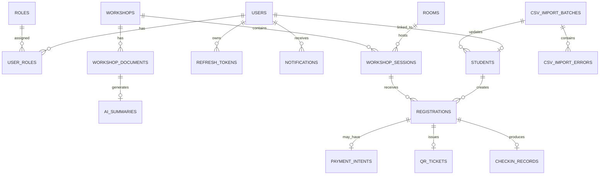

# UniHub Workshop — Database Design

## 1. Overview

This document defines the database schema for UniHub Workshop.

The system uses:

| Storage          | Purpose                                                                                                                                                             |
| ---------------- | ------------------------------------------------------------------------------------------------------------------------------------------------------------------- |
| PostgreSQL       | Main system of record for users, roles, students, workshops, sessions, registrations, payments, QR tickets, check-ins, notifications, AI summaries, and CSV imports |
| Redis            | Volatile coordination only: rate limiting, short-lived idempotency, optional cache, circuit-breaker state, and worker coordination                                  |
| Object Storage   | Uploaded workshop PDF files                                                                                                                                         |
| SQLite on Mobile | Offline check-in cache and unsynced check-in events                                                                                                                 |

PostgreSQL is the source of truth for durable business data. Redis and mobile SQLite must not be used as the final source of truth for seat allocation, payment status, registration status, or attendance.

General conventions:

- Primary keys use UUID.
- All timestamps are stored in UTC.
- Status fields are stored as strings with application-level enums.
- Foreign keys are required for core relationships.
- Database constraints are used to protect correctness where practical.
- Complex business rules that cannot be fully expressed by database constraints are enforced in the application service layer.

---

## 2. Entity Relationship Overview



---

## 3. Core Status Values

### User account status

```text
ACTIVE
DISABLED
LOCKED
```

### Student status

```text
ACTIVE
INACTIVE
GRADUATED
SUSPENDED
```

### Workshop status

```text
DRAFT
PUBLISHED
CANCELED
ARCHIVED
```

### Workshop session status

```text
OPEN
CLOSED
CANCELED
FULL
```

### Fee type

```text
FREE
PAID
```

### Registration status

```text
PENDING_PAYMENT
CONFIRMED
PAYMENT_FAILED
EXPIRED
CANCELED
```

### Payment status

```text
PENDING_GATEWAY
PENDING_PAYMENT
SUCCEEDED
FAILED
EXPIRED
CANCELED
```

### QR ticket status

```text
ACTIVE
REVOKED
EXPIRED
```

### Check-in source mode

```text
ONLINE
OFFLINE_SYNC
```

### Notification channel

```text
IN_APP
EMAIL
```

MVP supports `IN_APP` and `EMAIL`.

Future channels such as `TELEGRAM` may be added later through the notification provider adapter without changing the core notification table structure.

### Notification delivery status

```text
PENDING
SENT
FAILED
RETRYING
```

Read state for in-app notifications is represented by `read_at`.

### AI summary status

```text
PENDING
PROCESSING
COMPLETED
FAILED
```

### Workshop document upload status

```text
UPLOADED
FAILED
```

### CSV import status

```text
PROCESSING
SUCCESS
PARTIAL_SUCCESS
FAILED
MISSED
```

---

# 4. PostgreSQL Tables

---

## 4.1 `users`

Stores login accounts for students, organizers, and check-in staff.

| Column           | Type         | Constraint       | Description                    |
| ---------------- | ------------ | ---------------- | ------------------------------ |
| `id`             | UUID         | PK               | User ID                        |
| `email`          | VARCHAR(255) | NOT NULL, UNIQUE | Login email                    |
| `password_hash`  | VARCHAR(255) | NOT NULL         | Salted password hash           |
| `full_name`      | VARCHAR(255) | NOT NULL         | Display name                   |
| `account_status` | VARCHAR(30)  | NOT NULL         | `ACTIVE`, `DISABLED`, `LOCKED` |
| `created_at`     | TIMESTAMP    | NOT NULL         | Created time                   |
| `updated_at`     | TIMESTAMP    | NOT NULL         | Last updated time              |
| `last_login_at`  | TIMESTAMP    | NULL             | Last successful login time     |

Constraints:

- `email` must be unique.
- `password_hash` must never store plaintext passwords.
- `account_status` must use one of the defined account status values.

Indexes:

```text
users(email) UNIQUE
users(account_status)
```

---

## 4.2 `roles`

Stores RBAC role names.

| Column        | Type         | Constraint       | Description      |
| ------------- | ------------ | ---------------- | ---------------- |
| `id`          | UUID         | PK               | Role ID          |
| `name`        | VARCHAR(50)  | NOT NULL, UNIQUE | Role name        |
| `description` | VARCHAR(255) | NULL             | Role description |

Seed values:

```text
student
organizer
checkin_staff
```

Constraints:

- `name` must be unique.
- Only the three MVP roles are required.

Indexes:

```text
roles(name) UNIQUE
```

---

## 4.3 `user_roles`

Maps users to roles.

| Column       | Type      | Constraint                | Description     |
| ------------ | --------- | ------------------------- | --------------- |
| `user_id`    | UUID      | PK part, FK -> `users.id` | User ID         |
| `role_id`    | UUID      | PK part, FK -> `roles.id` | Role ID         |
| `created_at` | TIMESTAMP | NOT NULL                  | Assignment time |

Constraints:

- `(user_id, role_id)` must be unique.
- A user can have one or more roles.

Indexes:

```text
user_roles(user_id, role_id) UNIQUE
user_roles(role_id)
```

---

## 4.4 `csv_import_batches`

Stores each nightly CSV import attempt from the legacy Student Management System.

This table is listed before `students` because `students.import_batch_id` references it.

| Column            | Type         | Constraint         | Description                                                    |
| ----------------- | ------------ | ------------------ | -------------------------------------------------------------- |
| `id`              | UUID         | PK                 | Import batch ID                                                |
| `file_name`       | VARCHAR(255) | NOT NULL           | CSV file name                                                  |
| `checksum`        | VARCHAR(255) | NULL, UNIQUE       | File checksum for idempotency                                  |
| `status`          | VARCHAR(30)  | NOT NULL           | `PROCESSING`, `SUCCESS`, `PARTIAL_SUCCESS`, `FAILED`, `MISSED` |
| `total_rows`      | INT          | NOT NULL DEFAULT 0 | Total parsed rows                                              |
| `success_count`   | INT          | NOT NULL DEFAULT 0 | Valid rows imported                                            |
| `error_count`     | INT          | NOT NULL DEFAULT 0 | Invalid rows                                                   |
| `duplicate_count` | INT          | NOT NULL DEFAULT 0 | Duplicate rows detected                                        |
| `failure_reason`  | TEXT         | NULL               | Failure reason                                                 |
| `started_at`      | TIMESTAMP    | NOT NULL           | Import start time                                              |
| `finished_at`     | TIMESTAMP    | NULL               | Import finish time                                             |
| `created_at`      | TIMESTAMP    | NOT NULL           | Created time                                                   |

Constraints:

- Same checksum should not be imported twice as a new effect.
- Invalid files must not overwrite current valid student data.
- If a nightly file is missing, a `MISSED` batch may be created.

Indexes:

```text
csv_import_batches(checksum) UNIQUE WHERE checksum IS NOT NULL
csv_import_batches(status)
csv_import_batches(started_at)
```

---

## 4.5 `students`

Stores student roster data imported from the legacy CSV system.

`students.id` is the internal database ID.  
`student_code` is the official student ID from the university CSV file.

| Column            | Type         | Constraint                          | Description                                    |
| ----------------- | ------------ | ----------------------------------- | ---------------------------------------------- |
| `id`              | UUID         | PK                                  | Internal student profile ID                    |
| `user_id`         | UUID         | NULL, UNIQUE, FK -> `users.id`      | Linked login account                           |
| `student_code`    | VARCHAR(50)  | NOT NULL, UNIQUE                    | Official student ID from legacy CSV            |
| `full_name`       | VARCHAR(255) | NOT NULL                            | Student full name                              |
| `email`           | VARCHAR(255) | NULL                                | Student email from CSV                         |
| `faculty`         | VARCHAR(255) | NULL                                | Faculty                                        |
| `major`           | VARCHAR(255) | NULL                                | Major                                          |
| `class_name`      | VARCHAR(100) | NULL                                | Class/group name                               |
| `status`          | VARCHAR(30)  | NOT NULL                            | `ACTIVE`, `INACTIVE`, `GRADUATED`, `SUSPENDED` |
| `import_batch_id` | UUID         | NULL, FK -> `csv_import_batches.id` | Last import batch that updated this row        |
| `imported_at`     | TIMESTAMP    | NOT NULL                            | Last import time                               |
| `created_at`      | TIMESTAMP    | NOT NULL                            | Created time                                   |
| `updated_at`      | TIMESTAMP    | NOT NULL                            | Last updated time                              |

Constraints:

- `student_code` must be unique.
- `user_id` must be unique when not null.
- Only students with status `ACTIVE` are eligible to register for workshops.
- Student data is updated by CSV import.
- Public student self-registration is not required for MVP; student accounts may be seeded or created through controlled setup.

Indexes:

```text
students(student_code) UNIQUE
students(user_id) UNIQUE WHERE user_id IS NOT NULL
students(status)
students(import_batch_id)
```

---

## 4.6 `refresh_tokens`

Stores hashed refresh tokens for token rotation and logout.

| Column                 | Type         | Constraint                      | Description              |
| ---------------------- | ------------ | ------------------------------- | ------------------------ |
| `id`                   | UUID         | PK                              | Refresh token ID         |
| `user_id`              | UUID         | NOT NULL, FK -> `users.id`      | Token owner              |
| `token_hash`           | VARCHAR(255) | NOT NULL, UNIQUE                | Hash of refresh token    |
| `expires_at`           | TIMESTAMP    | NOT NULL                        | Expiration time          |
| `revoked_at`           | TIMESTAMP    | NULL                            | Revocation time          |
| `created_at`           | TIMESTAMP    | NOT NULL                        | Created time             |
| `replaced_by_token_id` | UUID         | NULL, FK -> `refresh_tokens.id` | New token after rotation |

Constraints:

- Raw refresh tokens must not be stored.
- `token_hash` must be unique.
- Revoked tokens cannot be used again.

Indexes:

```text
refresh_tokens(token_hash) UNIQUE
refresh_tokens(user_id)
refresh_tokens(expires_at)
refresh_tokens(revoked_at)
```

---

## 4.7 `rooms`

Stores physical room information.

| Column       | Type         | Constraint                     | Description                |
| ------------ | ------------ | ------------------------------ | -------------------------- |
| `id`         | UUID         | PK                             | Room ID                    |
| `name`       | VARCHAR(100) | NOT NULL                       | Room name                  |
| `building`   | VARCHAR(100) | NULL                           | Building name              |
| `capacity`   | INT          | NOT NULL, CHECK `capacity > 0` | Room capacity              |
| `map_url`    | TEXT         | NULL                           | Room map or floor plan URL |
| `status`     | VARCHAR(30)  | NOT NULL                       | `ACTIVE`, `INACTIVE`       |
| `created_at` | TIMESTAMP    | NOT NULL                       | Created time               |
| `updated_at` | TIMESTAMP    | NOT NULL                       | Last updated time          |

Constraints:

- `(building, name)` should be unique.
- `capacity` must be greater than zero.

Indexes:

```text
rooms(building, name) UNIQUE
rooms(status)
```

---

## 4.8 `workshops`

Stores high-level workshop information.

| Column               | Type         | Constraint                 | Description                                  |
| -------------------- | ------------ | -------------------------- | -------------------------------------------- |
| `id`                 | UUID         | PK                         | Workshop ID                                  |
| `title`              | VARCHAR(255) | NOT NULL                   | Workshop title                               |
| `speaker`            | VARCHAR(255) | NOT NULL                   | Speaker name                                 |
| `description`        | TEXT         | NOT NULL                   | Workshop description                         |
| `status`             | VARCHAR(30)  | NOT NULL                   | `DRAFT`, `PUBLISHED`, `CANCELED`, `ARCHIVED` |
| `created_by_user_id` | UUID         | NOT NULL, FK -> `users.id` | Organizer who created the workshop           |
| `created_at`         | TIMESTAMP    | NOT NULL                   | Created time                                 |
| `updated_at`         | TIMESTAMP    | NOT NULL                   | Last updated time                            |
| `published_at`       | TIMESTAMP    | NULL                       | Published time                               |
| `canceled_at`        | TIMESTAMP    | NULL                       | Canceled time                                |

Constraints:

- Public workshop list should only expose `PUBLISHED` workshops.
- Canceled workshops should not accept new registrations.
- Workshop deletion is not required for MVP; status changes are enough.

Indexes:

```text
workshops(status)
workshops(created_by_user_id)
workshops(title)
```

---

## 4.9 `workshop_sessions`

Stores concrete time slots for workshops.

| Column            | Type          | Constraint                          | Description                                    |
| ----------------- | ------------- | ----------------------------------- | ---------------------------------------------- |
| `id`              | UUID          | PK                                  | Session ID                                     |
| `workshop_id`     | UUID          | NOT NULL, FK -> `workshops.id`      | Parent workshop                                |
| `room_id`         | UUID          | NOT NULL, FK -> `rooms.id`          | Room                                           |
| `start_at`        | TIMESTAMP     | NOT NULL                            | Session start time                             |
| `end_at`          | TIMESTAMP     | NOT NULL                            | Session end time                               |
| `status`          | VARCHAR(30)   | NOT NULL                            | `OPEN`, `CLOSED`, `CANCELED`, `FULL`           |
| `seat_capacity`   | INT           | NOT NULL, CHECK `seat_capacity > 0` | Maximum seats                                  |
| `seats_confirmed` | INT           | NOT NULL DEFAULT 0                  | Confirmed seats                                |
| `seats_reserved`  | INT           | NOT NULL DEFAULT 0                  | Temporarily reserved seats for pending payment |
| `fee_type`        | VARCHAR(20)   | NOT NULL                            | `FREE` or `PAID`                               |
| `fee_amount`      | NUMERIC(12,2) | NOT NULL DEFAULT 0                  | Fee amount                                     |
| `currency`        | VARCHAR(10)   | NOT NULL DEFAULT 'VND'              | Currency                                       |
| `created_at`      | TIMESTAMP     | NOT NULL                            | Created time                                   |
| `updated_at`      | TIMESTAMP     | NOT NULL                            | Last updated time                              |
| `canceled_at`     | TIMESTAMP     | NULL                                | Canceled time                                  |

Constraints:

- `end_at > start_at`.
- `seat_capacity > 0`.
- `seats_confirmed >= 0`.
- `seats_reserved >= 0`.
- `seats_confirmed + seats_reserved <= seat_capacity`.
- If `fee_type = 'FREE'`, then `fee_amount = 0`.
- If `fee_type = 'PAID'`, then `fee_amount > 0`.
- Room conflict must be prevented for active sessions:
  - same `room_id`,
  - overlapping `start_at` and `end_at`,
  - session not canceled.
- Registration flow must lock the session row before updating seat counters.

Indexes:

```text
workshop_sessions(workshop_id)
workshop_sessions(room_id)
workshop_sessions(start_at)
workshop_sessions(status, start_at)
```

Optional PostgreSQL exclusion constraint:

```sql
-- Optional if using PostgreSQL range types.
-- Prevent overlapping active sessions in the same room.
EXCLUDE USING gist (
  room_id WITH =,
  tsrange(start_at, end_at) WITH &&
)
WHERE (status <> 'CANCELED');
```

---

## 4.10 `registrations`

Stores student workshop registration records.

| Column              | Type        | Constraint                             | Description                                                             |
| ------------------- | ----------- | -------------------------------------- | ----------------------------------------------------------------------- |
| `id`                | UUID        | PK                                     | Registration ID                                                         |
| `student_id`        | UUID        | NOT NULL, FK -> `students.id`          | Registered student                                                      |
| `session_id`        | UUID        | NOT NULL, FK -> `workshop_sessions.id` | Registered session                                                      |
| `status`            | VARCHAR(30) | NOT NULL                               | `PENDING_PAYMENT`, `CONFIRMED`, `PAYMENT_FAILED`, `EXPIRED`, `CANCELED` |
| `registration_type` | VARCHAR(20) | NOT NULL                               | `FREE` or `PAID`                                                        |
| `reserved_at`       | TIMESTAMP   | NULL                                   | Time seat was reserved                                                  |
| `confirmed_at`      | TIMESTAMP   | NULL                                   | Time registration was confirmed                                         |
| `expires_at`        | TIMESTAMP   | NULL                                   | Expiration time for pending paid registration                           |
| `canceled_at`       | TIMESTAMP   | NULL                                   | Cancellation time                                                       |
| `created_at`        | TIMESTAMP   | NOT NULL                               | Created time                                                            |
| `updated_at`        | TIMESTAMP   | NOT NULL                               | Last updated time                                                       |

Constraints:

- A student cannot have more than one active registration for the same session.
- QR ticket is created only when registration becomes `CONFIRMED`.
- Paid registration starts as `PENDING_PAYMENT`.
- Free registration is created as `CONFIRMED`.
- Expired paid registration must release the reserved seat.
- Registration is allowed only if linked student status is `ACTIVE`.

Recommended partial unique index:

```sql
CREATE UNIQUE INDEX uq_active_registration_student_session
ON registrations(student_id, session_id)
WHERE status IN ('PENDING_PAYMENT', 'CONFIRMED');
```

Indexes:

```text
registrations(student_id)
registrations(session_id)
registrations(status)
registrations(status, expires_at)
registrations(student_id, session_id) UNIQUE WHERE status IN ('PENDING_PAYMENT', 'CONFIRMED')
```

---

## 4.11 `payment_intents`

Stores local payment state for paid workshop registrations.

| Column            | Type          | Constraint                                 | Description                                                                        |
| ----------------- | ------------- | ------------------------------------------ | ---------------------------------------------------------------------------------- |
| `id`              | UUID          | PK                                         | Payment intent ID                                                                  |
| `registration_id` | UUID          | NOT NULL, UNIQUE, FK -> `registrations.id` | Related paid registration                                                          |
| `idempotency_key` | VARCHAR(255)  | NOT NULL, UNIQUE                           | Client-generated idempotency key                                                   |
| `gateway_ref`     | VARCHAR(255)  | NULL, UNIQUE                               | Payment gateway reference                                                          |
| `status`          | VARCHAR(40)   | NOT NULL                                   | `PENDING_GATEWAY`, `PENDING_PAYMENT`, `SUCCEEDED`, `FAILED`, `EXPIRED`, `CANCELED` |
| `amount`          | NUMERIC(12,2) | NOT NULL                                   | Payment amount                                                                     |
| `currency`        | VARCHAR(10)   | NOT NULL DEFAULT 'VND'                     | Currency                                                                           |
| `payment_url`     | TEXT          | NULL                                       | Gateway payment URL                                                                |
| `expires_at`      | TIMESTAMP     | NOT NULL                                   | Payment expiration time                                                            |
| `paid_at`         | TIMESTAMP     | NULL                                       | Successful payment time                                                            |
| `failure_reason`  | TEXT          | NULL                                       | Failure reason                                                                     |
| `created_at`      | TIMESTAMP     | NOT NULL                                   | Created time                                                                       |
| `updated_at`      | TIMESTAMP     | NOT NULL                                   | Last updated time                                                                  |

Constraints:

- `registration_id` must reference a paid registration.
- `registration_id` is unique for MVP because one paid registration has one active payment intent.
- `idempotency_key` must be unique.
- `gateway_ref` must be unique when present.
- Callback amount and currency must match the local payment intent.
- Duplicate callback must not confirm registration twice.
- External gateway call must not happen inside an open registration transaction.

Indexes:

```text
payment_intents(registration_id) UNIQUE
payment_intents(idempotency_key) UNIQUE
payment_intents(gateway_ref) UNIQUE WHERE gateway_ref IS NOT NULL
payment_intents(status, expires_at)
```

---

## 4.12 `qr_tickets`

Stores QR ticket metadata for confirmed registrations.

| Column            | Type         | Constraint                                 | Description                    |
| ----------------- | ------------ | ------------------------------------------ | ------------------------------ |
| `id`              | UUID         | PK                                         | QR ticket ID                   |
| `registration_id` | UUID         | NOT NULL, UNIQUE, FK -> `registrations.id` | Confirmed registration         |
| `qr_token_hash`   | VARCHAR(255) | NOT NULL, UNIQUE                           | Hash of QR token               |
| `status`          | VARCHAR(30)  | NOT NULL                                   | `ACTIVE`, `REVOKED`, `EXPIRED` |
| `issued_at`       | TIMESTAMP    | NOT NULL                                   | Issue time                     |
| `expires_at`      | TIMESTAMP    | NULL                                       | Optional expiration time       |
| `revoked_at`      | TIMESTAMP    | NULL                                       | Revocation time                |
| `created_at`      | TIMESTAMP    | NOT NULL                                   | Created time                   |

Constraints:

- One confirmed registration has one QR ticket.
- QR ticket must not be created for `PENDING_PAYMENT`, `EXPIRED`, `CANCELED`, or `PAYMENT_FAILED` registrations.
- Raw QR token must not be stored directly.
- `qr_token_hash` must be unique.

Indexes:

```text
qr_tickets(registration_id) UNIQUE
qr_tickets(qr_token_hash) UNIQUE
qr_tickets(status)
```

---

## 4.13 `checkin_records`

Stores final accepted check-in records.

| Column               | Type         | Constraint                                 | Description                                |
| -------------------- | ------------ | ------------------------------------------ | ------------------------------------------ |
| `id`                 | UUID         | PK                                         | Check-in record ID                         |
| `registration_id`    | UUID         | NOT NULL, UNIQUE, FK -> `registrations.id` | Checked-in registration                    |
| `session_id`         | UUID         | NOT NULL, FK -> `workshop_sessions.id`     | Session context                            |
| `scanned_by_user_id` | UUID         | NOT NULL, FK -> `users.id`                 | Check-in staff user                        |
| `sync_event_id`      | VARCHAR(255) | NULL, UNIQUE                               | Mobile-generated event ID for offline sync |
| `source_mode`        | VARCHAR(30)  | NOT NULL                                   | `ONLINE` or `OFFLINE_SYNC`                 |
| `scanned_at`         | TIMESTAMP    | NOT NULL                                   | Time QR was scanned                        |
| `server_received_at` | TIMESTAMP    | NOT NULL                                   | Time backend received the event            |
| `created_at`         | TIMESTAMP    | NOT NULL                                   | Created time                               |

Constraints:

- One registration can have at most one successful check-in.
- `registration_id` must be unique.
- `sync_event_id` must be unique when provided.
- Check-in is allowed only for `CONFIRMED` registrations.
- Backend final validation overrides mobile offline validation.

Indexes:

```text
checkin_records(registration_id) UNIQUE
checkin_records(sync_event_id) UNIQUE WHERE sync_event_id IS NOT NULL
checkin_records(session_id)
checkin_records(scanned_by_user_id)
checkin_records(scanned_at)
```

---

## 4.14 `notifications`

Stores in-app and email notification records.

This table is intentionally channel-generic. The MVP uses `IN_APP` and `EMAIL`, but future channels such as `TELEGRAM` can be added later by introducing a new provider adapter and using a new `channel` value.

| Column              | Type         | Constraint                 | Description                                            |
| ------------------- | ------------ | -------------------------- | ------------------------------------------------------ |
| `id`                | UUID         | PK                         | Notification ID                                        |
| `recipient_user_id` | UUID         | NOT NULL, FK -> `users.id` | Recipient                                              |
| `event_id`          | VARCHAR(255) | NULL                       | Source event ID for deduplication                      |
| `event_type`        | VARCHAR(100) | NOT NULL                   | Example: `REGISTRATION_CONFIRMED`                      |
| `channel`           | VARCHAR(30)  | NOT NULL                   | `IN_APP`, `EMAIL`; future value may include `TELEGRAM` |
| `template_key`      | VARCHAR(100) | NULL                       | Template key                                           |
| `title`             | VARCHAR(255) | NOT NULL                   | Notification title                                     |
| `message`           | TEXT         | NOT NULL                   | Rendered message                                       |
| `status`            | VARCHAR(30)  | NOT NULL                   | `PENDING`, `SENT`, `FAILED`, `RETRYING`                |
| `read_at`           | TIMESTAMP    | NULL                       | Read time for in-app notifications                     |
| `retry_count`       | INT          | NOT NULL DEFAULT 0         | Retry count                                            |
| `next_retry_at`     | TIMESTAMP    | NULL                       | Next retry time                                        |
| `last_error_code`   | VARCHAR(100) | NULL                       | Last delivery error                                    |
| `created_at`        | TIMESTAMP    | NOT NULL                   | Created time                                           |
| `updated_at`        | TIMESTAMP    | NOT NULL                   | Last updated time                                      |

Constraints:

- A notification must belong to one recipient user.
- User can only view their own notifications.
- Notification failure must not roll back registration, payment, or workshop update.
- Duplicate worker execution should not create duplicate user-facing notifications.
- If `event_id` exists, `(event_id, recipient_user_id, channel)` should be unique.
- The database should not hard-code only two channel values if the project wants to add Telegram later.

Indexes:

```text
notifications(recipient_user_id)
notifications(status, next_retry_at)
notifications(event_type, created_at)
notifications(event_id, recipient_user_id, channel) UNIQUE WHERE event_id IS NOT NULL
```

---

## 4.15 `workshop_documents`

Stores metadata for organizer-uploaded PDF files.

| Column                | Type         | Constraint                     | Description                 |
| --------------------- | ------------ | ------------------------------ | --------------------------- |
| `id`                  | UUID         | PK                             | Document ID                 |
| `workshop_id`         | UUID         | NOT NULL, FK -> `workshops.id` | Related workshop            |
| `uploaded_by_user_id` | UUID         | NOT NULL, FK -> `users.id`     | Organizer                   |
| `object_key`          | TEXT         | NOT NULL, UNIQUE               | Object storage key          |
| `original_filename`   | VARCHAR(255) | NOT NULL                       | Uploaded filename           |
| `content_type`        | VARCHAR(100) | NOT NULL                       | Should be `application/pdf` |
| `file_size_bytes`     | BIGINT       | NOT NULL                       | File size                   |
| `checksum`            | VARCHAR(255) | NULL                           | Optional file checksum      |
| `upload_status`       | VARCHAR(30)  | NOT NULL                       | `UPLOADED` or `FAILED`      |
| `created_at`          | TIMESTAMP    | NOT NULL                       | Uploaded time               |
| `updated_at`          | TIMESTAMP    | NOT NULL                       | Last updated time           |

Constraints:

- Only PDF files are allowed.
- PDF binary content is stored in object storage, not PostgreSQL.
- `object_key` must be unique.
- File size must not exceed the configured limit.

Indexes:

```text
workshop_documents(workshop_id)
workshop_documents(uploaded_by_user_id)
workshop_documents(object_key) UNIQUE
```

---

## 4.16 `ai_summaries`

Stores generated AI summary status and result.

| Column               | Type         | Constraint                                      | Description                                    |
| -------------------- | ------------ | ----------------------------------------------- | ---------------------------------------------- |
| `id`                 | UUID         | PK                                              | Summary ID                                     |
| `document_id`        | UUID         | NOT NULL, UNIQUE, FK -> `workshop_documents.id` | Source PDF document                            |
| `status`             | VARCHAR(30)  | NOT NULL                                        | `PENDING`, `PROCESSING`, `COMPLETED`, `FAILED` |
| `summary_text`       | TEXT         | NULL                                            | Generated summary                              |
| `model_name`         | VARCHAR(100) | NULL                                            | AI model/provider name                         |
| `attempt_count`      | INT          | NOT NULL DEFAULT 0                              | Number of processing attempts                  |
| `last_error_code`    | VARCHAR(100) | NULL                                            | Last processing error code                     |
| `last_error_message` | TEXT         | NULL                                            | Last processing error message                  |
| `started_at`         | TIMESTAMP    | NULL                                            | Processing start time                          |
| `completed_at`       | TIMESTAMP    | NULL                                            | Processing completion time                     |
| `created_at`         | TIMESTAMP    | NOT NULL                                        | Created time                                   |
| `updated_at`         | TIMESTAMP    | NOT NULL                                        | Last updated time                              |

Constraints:

- One document should have one summary record.
- Summary generation is asynchronous.
- Workshop browsing must not fail if summary is `PENDING`, `PROCESSING`, or `FAILED`.
- `summary_text` can be null until status is `COMPLETED`.

Indexes:

```text
ai_summaries(document_id) UNIQUE
ai_summaries(status)
ai_summaries(status, updated_at)
```

---

## 4.17 `csv_import_errors`

Stores row-level CSV import validation errors.

| Column          | Type         | Constraint                              | Description               |
| --------------- | ------------ | --------------------------------------- | ------------------------- |
| `id`            | UUID         | PK                                      | Error ID                  |
| `batch_id`      | UUID         | NOT NULL, FK -> `csv_import_batches.id` | Import batch              |
| `row_number`    | INT          | NOT NULL                                | Row number in CSV         |
| `student_code`  | VARCHAR(50)  | NULL                                    | Student code if available |
| `field_name`    | VARCHAR(100) | NULL                                    | Invalid field             |
| `error_code`    | VARCHAR(100) | NOT NULL                                | Error code                |
| `error_message` | TEXT         | NOT NULL                                | Human-readable error      |
| `created_at`    | TIMESTAMP    | NOT NULL                                | Created time              |

Constraints:

- Each import error must belong to one import batch.
- Invalid rows should not stop the whole import if the file structure is valid.
- Do not store unnecessary sensitive data from raw CSV rows.

Indexes:

```text
csv_import_errors(batch_id)
csv_import_errors(batch_id, row_number)
csv_import_errors(error_code)
```

---

# 5. Mobile SQLite Tables

The React Native mobile app uses SQLite for offline check-in. SQLite data is provisional. PostgreSQL remains the final source of truth.

---

## 5.1 `cached_sessions`

Stores check-in session data for offline use.

| Column           | Type    | Constraint | Description           |
| ---------------- | ------- | ---------- | --------------------- |
| `session_id`     | TEXT    | PK         | Session ID            |
| `workshop_title` | TEXT    | NOT NULL   | Workshop title        |
| `room_name`      | TEXT    | NULL       | Room name             |
| `start_at`       | TEXT    | NOT NULL   | Start time            |
| `end_at`         | TEXT    | NOT NULL   | End time              |
| `checkin_open`   | INTEGER | NOT NULL   | 1 if check-in is open |
| `cached_at`      | TEXT    | NOT NULL   | Cache time            |

Constraints:

- `session_id` must be unique.
- Cache should be refreshed before the event.

---

## 5.2 `offline_checkin_events`

Stores unsynced offline check-in events.

| Column          | Type | Constraint | Description                                                      |
| --------------- | ---- | ---------- | ---------------------------------------------------------------- |
| `sync_event_id` | TEXT | PK         | Local unique event ID                                            |
| `session_id`    | TEXT | NOT NULL   | Selected session                                                 |
| `qr_token`      | TEXT | NOT NULL   | Scanned QR token                                                 |
| `scanned_at`    | TEXT | NOT NULL   | Device scan time                                                 |
| `device_id`     | TEXT | NULL       | Device ID                                                        |
| `local_status`  | TEXT | NOT NULL   | `PENDING_SYNC`, `SYNCED`, `REJECTED`, `DUPLICATE`, `SYNC_FAILED` |
| `server_result` | TEXT | NULL       | Backend result after sync                                        |
| `synced_at`     | TEXT | NULL       | Sync completion time                                             |
| `error_code`    | TEXT | NULL       | Backend error code                                               |

Constraints:

- `sync_event_id` must be stable across retries.
- Offline events must survive app restart.
- Backend result overrides local provisional validation.

Indexes:

```text
offline_checkin_events(sync_event_id) UNIQUE
offline_checkin_events(local_status)
offline_checkin_events(session_id)
```

---

# 6. Redis Key Patterns

Redis data is volatile and reconstructable.

Recommended key patterns:

```text
rate_limit:login:{ip}
rate_limit:registration:{user_id}
rate_limit:checkin:{user_id}

idem:payment:{idempotency_key}
idem:registration:{idempotency_key}

cache:workshop:list:{filter_hash}
cache:workshop:detail:{workshop_id}

job_lock:csv_import:{file_checksum}
job_lock:ai_summary:{document_id}
job_lock:expired_reservation_cleanup

circuit:payment_gateway
```

Rules:

- Redis must not be the source of truth for seat counts.
- Redis must not be the source of truth for payment status.
- Redis must not be the source of truth for check-in records.
- If Redis fails, durable business data remains safe in PostgreSQL.

---

# 7. Object Storage Model

Object storage stores binary PDF files uploaded by organizers.

Recommended object key format:

```text
workshops/{workshop_id}/documents/{document_id}/{original_filename}
```

PostgreSQL stores only metadata in `workshop_documents`.

Rules:

- PDF binary content must not be stored directly in PostgreSQL.
- `object_key` must be unique.
- Worker reads PDF files from object storage for AI summary generation.
- If object storage upload fails, the system must not mark the document as successfully uploaded.

---

# 8. Important Cross-Table Rules

## 8.1 Authentication and RBAC

- `users.email` must be unique.
- `roles.name` must be unique.
- `user_roles(user_id, role_id)` must be unique.
- MVP roles are `student`, `organizer`, and `checkin_staff`.

## 8.2 Student eligibility

- `students.student_code` must be unique.
- `students.user_id` must be unique when not null.
- A student can register for workshops only if linked student status is `ACTIVE`.

## 8.3 Seat allocation

- `workshop_sessions.seats_confirmed + seats_reserved <= seat_capacity`.
- Registration transaction must lock the target session row.
- Free registration increments `seats_confirmed`.
- Paid registration increments `seats_reserved`.
- Payment success converts reserved seat into confirmed seat.
- Payment expiration releases reserved seat.

## 8.4 Duplicate registration prevention

```sql
CREATE UNIQUE INDEX uq_active_registration_student_session
ON registrations(student_id, session_id)
WHERE status IN ('PENDING_PAYMENT', 'CONFIRMED');
```

This prevents one student from holding or confirming more than one active registration for the same session.

## 8.5 Double-charge prevention

- `payment_intents.idempotency_key` must be unique.
- Reusing the same idempotency key with the same request returns the same result.
- Reusing the same idempotency key with different request data is rejected.
- Gateway callback handling must be idempotent.

## 8.6 QR ticket rules

- QR ticket is created only for confirmed registration.
- `qr_tickets.registration_id` must be unique.
- QR token should be signed, random, or otherwise tamper-resistant.
- Raw QR token should not be stored directly.

## 8.7 Check-in rules

- `checkin_records.registration_id` must be unique.
- `checkin_records.sync_event_id` must be unique when provided.
- Only confirmed registrations can be checked in.
- Duplicate offline sync must not create duplicate attendance.

## 8.8 Notification extensibility

- `notifications.channel` supports `IN_APP` and `EMAIL` in MVP.
- Future channels such as `TELEGRAM` can be added through a new provider adapter.
- Adding a future channel should not require changing registration, payment, or workshop business logic.
- Notification failure must not roll back registration, payment, or workshop updates.

## 8.9 CSV import

- `students.student_code` must remain unique.
- Invalid CSV files must not overwrite current valid student records.
- Duplicate rows are handled deterministically.
- Import result is stored in `csv_import_batches`.
- Row-level errors are stored in `csv_import_errors`.

---

# 9. Recommended Index Summary

```text
users(email) UNIQUE
users(account_status)

roles(name) UNIQUE
user_roles(user_id, role_id) UNIQUE
user_roles(role_id)

csv_import_batches(checksum) UNIQUE WHERE checksum IS NOT NULL
csv_import_batches(status)
csv_import_batches(started_at)

students(student_code) UNIQUE
students(user_id) UNIQUE WHERE user_id IS NOT NULL
students(status)
students(import_batch_id)

refresh_tokens(token_hash) UNIQUE
refresh_tokens(user_id)
refresh_tokens(expires_at)
refresh_tokens(revoked_at)

rooms(building, name) UNIQUE
rooms(status)

workshops(status)
workshops(created_by_user_id)
workshops(title)

workshop_sessions(workshop_id)
workshop_sessions(room_id)
workshop_sessions(start_at)
workshop_sessions(status, start_at)

registrations(student_id)
registrations(session_id)
registrations(status)
registrations(status, expires_at)
registrations(student_id, session_id) UNIQUE WHERE status IN ('PENDING_PAYMENT', 'CONFIRMED')

payment_intents(registration_id) UNIQUE
payment_intents(idempotency_key) UNIQUE
payment_intents(gateway_ref) UNIQUE WHERE gateway_ref IS NOT NULL
payment_intents(status, expires_at)

qr_tickets(registration_id) UNIQUE
qr_tickets(qr_token_hash) UNIQUE
qr_tickets(status)

checkin_records(registration_id) UNIQUE
checkin_records(sync_event_id) UNIQUE WHERE sync_event_id IS NOT NULL
checkin_records(session_id)
checkin_records(scanned_by_user_id)
checkin_records(scanned_at)

notifications(recipient_user_id)
notifications(status, next_retry_at)
notifications(event_type, created_at)
notifications(event_id, recipient_user_id, channel) UNIQUE WHERE event_id IS NOT NULL

workshop_documents(workshop_id)
workshop_documents(uploaded_by_user_id)
workshop_documents(object_key) UNIQUE

ai_summaries(document_id) UNIQUE
ai_summaries(status)
ai_summaries(status, updated_at)

csv_import_errors(batch_id)
csv_import_errors(batch_id, row_number)
csv_import_errors(error_code)
```

---

# 10. Recommended Migration Order

```text
1. users
2. roles
3. user_roles
4. csv_import_batches
5. students
6. refresh_tokens
7. rooms
8. workshops
9. workshop_sessions
10. registrations
11. payment_intents
12. qr_tickets
13. checkin_records
14. notifications
15. workshop_documents
16. ai_summaries
17. csv_import_errors
```

---

# 11. Seed Data Required for Demo

The project should provide seed data for:

- roles:
  - `student`
  - `organizer`
  - `checkin_staff`
- sample organizer account,
- sample check-in staff account,
- sample student accounts linked to imported students,
- sample rooms,
- sample workshops and sessions,
- sample CSV file for student import,
- optional sample PDF for AI Summary demo.

---

# 12. Tables Intentionally Excluded from MVP

The following tables are not included because they are not required by the project brief or MVP scope:

| Table                             | Reason                                                                                                  |
| --------------------------------- | ------------------------------------------------------------------------------------------------------- |
| `audit_logs`                      | Full audit logging is not explicitly required for MVP and can be added later                            |
| `system_operators`                | The brief defines student, organizer, and check-in staff                                                |
| `manual_corrections`              | Manual correction flow is not required for MVP                                                          |
| `payment_reconciliation_requests` | Manual reconciliation endpoint is not required for MVP                                                  |
| `telegram_notifications`          | Telegram is a future channel; the existing `notifications` table and provider adapter design are enough |

---

# 13. Data Safety Rules

- Do not store plaintext passwords.
- Do not store raw refresh tokens.
- Do not store raw QR tokens directly.
- Do not log payment gateway secrets.
- Do not store PDF binary content in PostgreSQL.
- Do not rely on Redis for durable business state.
- Do not trust frontend/mobile route guards for authorization.
- Do not trust payment redirect alone as proof of payment.
- Do not accept check-in as final until backend validation succeeds.
- Do not let failed CSV imports delete or corrupt existing valid student data.
