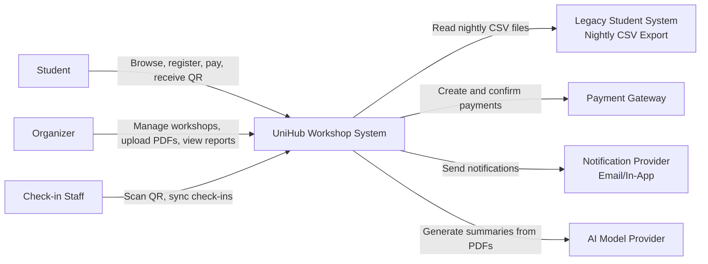
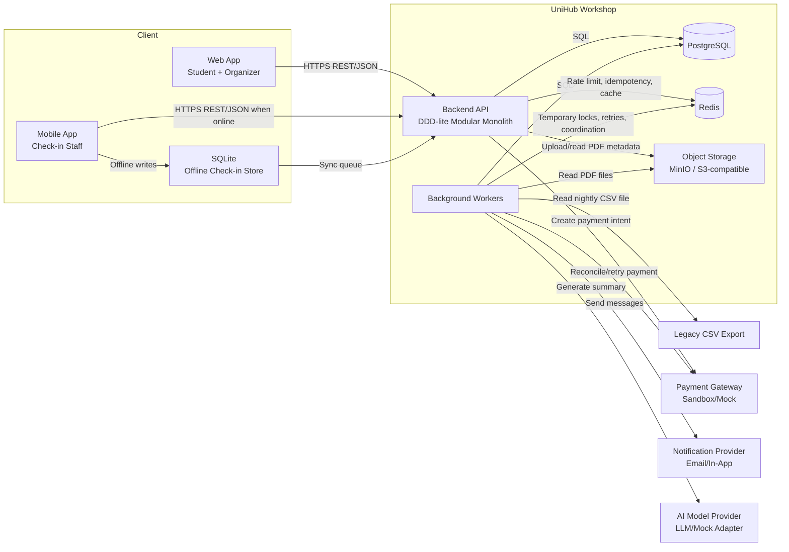
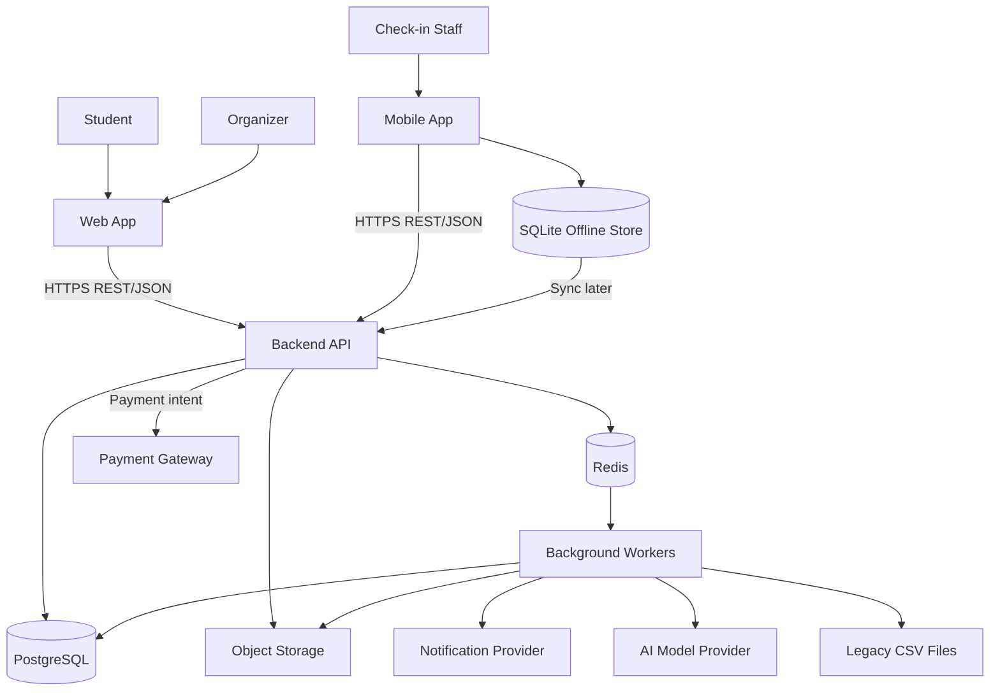
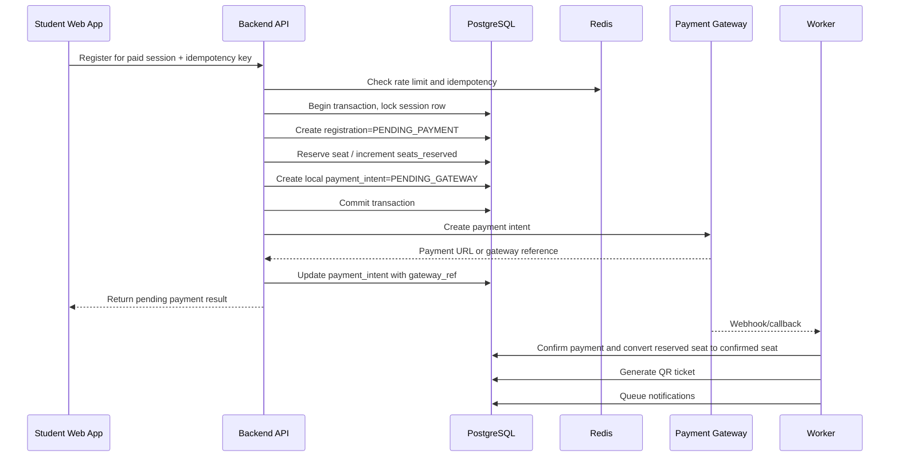
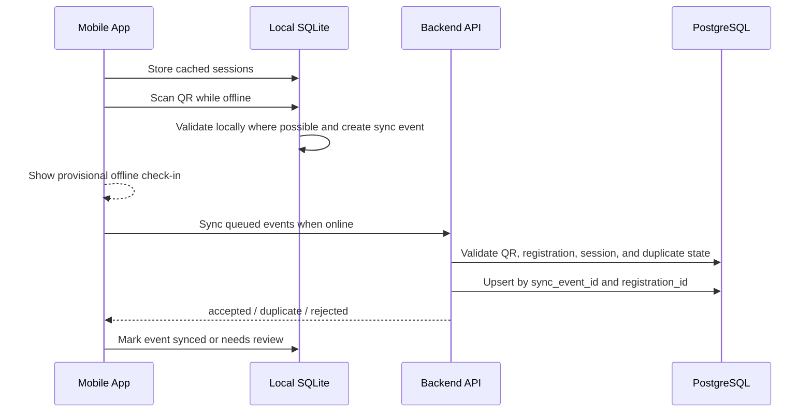
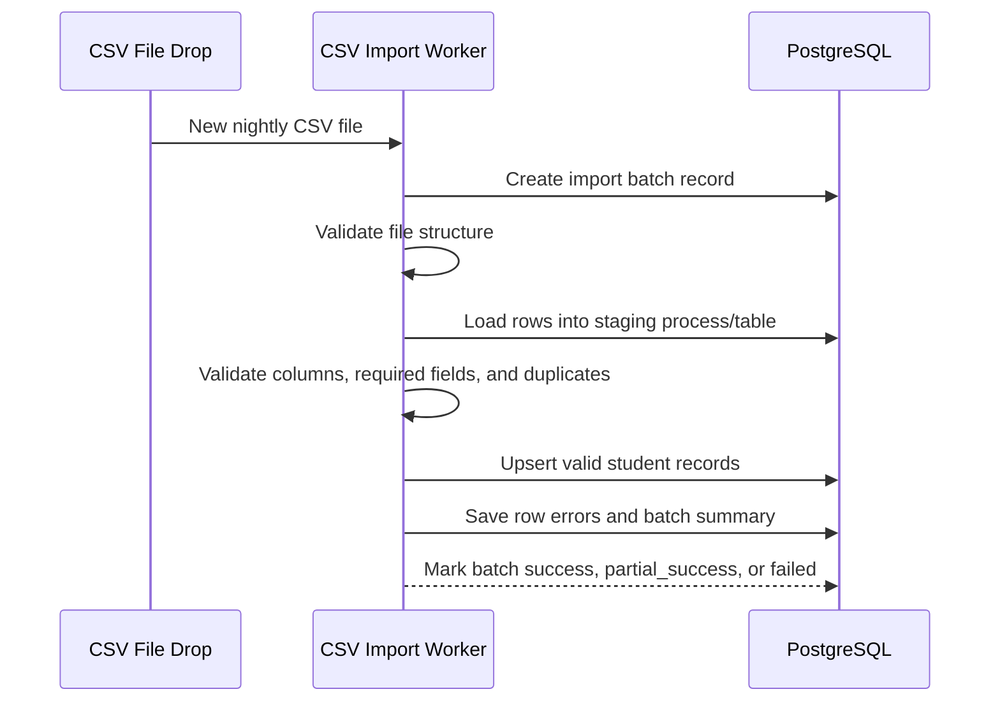

# UniHub Workshop — Technical Design

## 1. Architecture Overview

UniHub Workshop uses a **Java Spring Boot modular monolith with background workers**, organized using a **DDD-lite layered architecture**.

The system has two client applications:

- A **Next.js web application** for students and organizers.
- A **React Native mobile application** for check-in staff.

Both clients communicate with the same Java Spring Boot Backend API over HTTPS. The backend remains one deployable application, but its internal modules are separated by domain:

- Auth/RBAC
- Workshop
- Registration
- Payment
- Notification
- Check-in
- AI Summary
- CSV Import

The backend follows a DDD-lite layered structure:

- `presentation/`: REST controllers, request/response DTOs, request validation, response formatting, and global exception handling.
- `application/`: use case orchestration, transaction boundaries, command/query services, and ports to external providers.
- `domain/`: aggregate roots, value objects, business rules, domain policies, repository interfaces, and domain exceptions.
- `infrastructure/`: database repositories, Redis integration, JWT implementation, payment adapter, notification adapter, object storage adapter, AI adapter, and CSV file integration.

Core persistence and coordination decisions:

- PostgreSQL stores all transactional business data and remains the source of truth for seat reservation, registration state, payment state, and check-in state.
- Redis supports rate limiting, short-lived idempotency state, optional caching, temporary locks, and worker coordination.
- Object storage stores organizer-uploaded PDF files.
- The React Native mobile app uses SQLite for offline check-in storage and synchronization.

Why this fits the course project:

- A modular monolith is easier for a student team to build, test, deploy, and explain than a distributed microservice system.
- DDD-lite keeps important business rules inside the correct domain modules instead of spreading them across controllers or database scripts.
- Background workers isolate long-running or failure-prone tasks such as email sending, AI summarization, CSV import, payment reconciliation, and expired reservation cleanup.
- PostgreSQL transactions are appropriate because the hardest correctness problem is seat allocation, which requires strong consistency.
- Payment, AI summary, notification, and CSV import are isolated so failures in those integrations do not break workshop browsing.

Audit logging is not part of the MVP scope. It may be added later as an optional enhancement for admin and security-sensitive actions.

---

## 2. Implementation Technology Stack

The selected implementation stack is:

| Area                             | Selected technology               | Reason                                                                                                                   |
| -------------------------------- | --------------------------------- | ------------------------------------------------------------------------------------------------------------------------ |
| Student/Organizer Web App        | Next.js + TypeScript              | Supports structured routing, role-based pages, form-heavy admin UI, and API integration with the backend                 |
| Check-in Mobile App              | React Native + TypeScript         | Provides a real mobile experience for QR scanning, offline storage, and synchronization                                  |
| Backend API                      | Java Spring Boot                  | Provides strong typing, mature transaction support, dependency injection, validation, and structured backend development |
| Backend architecture             | DDD-lite layered modular monolith | Keeps one deployable backend while preserving clear domain boundaries                                                    |
| Primary database                 | PostgreSQL                        | Supports transactions, row-level locking, unique constraints, and relational integrity                                   |
| Volatile coordination            | Redis                             | Supports rate limiting, short-lived idempotency, optional caching, temporary locks, and worker coordination              |
| Object storage                   | MinIO for local development       | Stores uploaded PDF files independently from the application database                                                    |
| Mobile offline storage           | SQLite                            | Provides durable local storage for offline check-in events                                                               |
| API style                        | REST/JSON over HTTPS              | Simple and suitable for both web and mobile clients                                                                      |
| Authentication and authorization | JWT with RBAC                     | Supports stateless authentication and role-based endpoint protection                                                     |

The selected stack is intentionally practical for a course project. It avoids the operational complexity of microservices while still demonstrating real architectural concerns such as transaction safety, offline synchronization, idempotency, rate limiting, and integration isolation.

---

## 3. Architecture Decision Records

Detailed architecture decisions are documented separately in the `blueprint/adr/` folder:

- [ADR-001: Use modular monolith with background workers](adr/001-architecture-style.md)
- [ADR-002: Use PostgreSQL as the system of record](adr/002-database-choice.md)
- [ADR-003: Use Redis for volatile coordination](adr/003-redis-coordination.md)
- [ADR-004: Use adapter pattern for external providers](adr/004-provider-adapter.md)
- [ADR-005: Use local mobile database for offline check-in](adr/005-offline-checkin-storage.md)
- [ADR-006: Use Java Spring Boot with DDD-lite layered architecture](adr/006-java-spring-boot-ddd-lite.md)

---

## 4. Main Components

| Component                        | Responsibility                                                                               | Technology                                | Communication method                                 | Failure impact                                  |
| -------------------------------- | -------------------------------------------------------------------------------------------- | ----------------------------------------- | ---------------------------------------------------- | ----------------------------------------------- |
| Student/Organizer Web App        | Student browsing and registration; organizer admin UI                                        | Next.js + TypeScript                      | HTTPS to Backend API                                 | UI unavailable, but core data remains intact    |
| Check-in Mobile App              | QR scanning, offline check-in, and sync                                                      | React Native + TypeScript                 | HTTPS when online; local SQLite when offline         | Staff can continue offline if sync path is down |
| Backend API                      | Main request handling and business orchestration                                             | Java Spring Boot                          | REST/JSON                                            | Core application unavailable                    |
| Auth/RBAC Module                 | Login, JWT issuance, role loading, permission enforcement                                    | Java Spring Boot module                   | In-process                                           | Blocks protected operations if faulty           |
| Workshop Module                  | Workshop/session CRUD, schedules, room assignment, cancellation                              | Java Spring Boot module                   | In-process                                           | Workshop browsing/admin impacted                |
| Registration Module              | Seat allocation, free registration, reservation lifecycle, QR issuance trigger               | Java Spring Boot module                   | In-process + PostgreSQL transaction                  | Overbooking risk if incorrect                   |
| Payment Module                   | Payment intent creation, callback handling, reconciliation, idempotency                      | Java Spring Boot module                   | HTTPS to gateway; worker for callback/reconciliation | Paid registration degraded only                 |
| Notification Module              | Notification composition and dispatch                                                        | Java Spring Boot worker + adapter pattern | Worker + provider API                                | Messages delayed, core registration still works |
| AI Summary Worker                | PDF text extraction and summary generation                                                   | Java Spring Boot worker                   | Worker + object storage + AI API/adapter             | Summary delayed only                            |
| CSV Import Worker                | Nightly student import from legacy CSV files                                                 | Java Spring Boot worker                   | File polling + PostgreSQL                            | Student data freshness delayed                  |
| PostgreSQL Database              | Source of truth for users, workshops, registrations, payments, and check-ins                 | PostgreSQL                                | SQL                                                  | Critical system dependency                      |
| Redis / Worker Coordination      | Rate limiting, idempotency cache, optional caching, temporary locks, and worker coordination | Redis                                     | TCP                                                  | Degraded protection/async coordination          |
| Object Storage                   | PDF file storage                                                                             | MinIO or S3-compatible storage            | HTTP/S3 API                                          | PDF uploads and summary jobs blocked            |
| Mobile Offline Storage           | Local check-in persistence and sync queue                                                    | SQLite                                    | Local file IO                                        | Offline mode impaired on that device            |
| Payment Gateway                  | External payment processing                                                                  | Sandbox payment gateway or mock adapter   | HTTPS/webhook                                        | Paid registration degraded                      |
| Notification Provider            | Email and in-app notification delivery                                                       | SMTP/service API or mock adapter          | HTTPS/SMTP                                           | Messages delayed                                |
| AI Model Provider                | Summary generation                                                                           | External LLM API or mock adapter          | HTTPS                                                | Summary delayed                                 |
| Legacy Student System CSV Export | Nightly student roster source                                                                | Existing system                           | File drop / shared storage                           | Student eligibility freshness delayed           |

---

## 5. Backend Architecture: DDD-lite Layered Modular Monolith

The backend is implemented with Java Spring Boot using a DDD-lite layered architecture inside a modular monolith.

The purpose of DDD-lite in this project is not to introduce unnecessary complexity, but to keep important business rules close to the domain concepts they belong to. Business-critical modules such as Registration, Workshop, Payment, Check-in, and CSV Import contain domain models that protect their own invariants.

### 5.1 Layer Responsibilities

| Layer             | Responsibility                                                                                                                                                  |
| ----------------- | --------------------------------------------------------------------------------------------------------------------------------------------------------------- |
| `presentation/`   | REST controllers, request/response DTOs, request validation, response formatting, and global exception handling                                                 |
| `application/`    | Use case orchestration, command/query services, transaction boundaries, and calls to repositories or provider interfaces                                        |
| `domain/`         | Aggregate roots, value objects, domain rules, domain policies, domain exceptions, and repository contracts                                                      |
| `infrastructure/` | PostgreSQL repositories, Redis integration, JWT implementation, payment adapter, notification adapter, object storage adapter, AI adapter, and CSV file adapter |

### 5.2 Module Boundaries

The backend is divided into domain modules:

- Auth/RBAC
- Workshop
- Registration
- Payment
- Notification
- Check-in
- AI Summary
- CSV Import

Each module owns its domain rules and exposes application services to other modules. Modules should not directly modify another module’s internal state.

Examples:

- The Registration Module owns seat allocation rules, registration status transitions, reservation expiration, and QR issuance triggers.
- The Workshop Module owns workshop metadata, room assignment, session schedule, and cancellation rules.
- The Payment Module owns payment intents, idempotency checks, callback handling, and payment status mapping.
- The Check-in Module owns QR validation, attendance records, offline sync event handling, and duplicate detection.
- The Notification Module does not decide business status. It sends messages based on events emitted by other modules.
- The CSV Import Module updates the student roster but does not directly create registrations.

This structure keeps the backend deployable as one application while reducing coupling between business areas.

---

## 6. Frontend and Mobile Architecture

### 6.1 Web Application

The web application is implemented with Next.js and TypeScript. A single Next.js application serves both students and organizers, separated by role-based routing.

Student-facing pages include:

- workshop listing and filtering,
- workshop detail,
- free and paid registration,
- payment status,
- QR ticket viewing,
- registration history,
- notifications.

Organizer-facing pages include:

- workshop management,
- session scheduling,
- room assignment,
- PDF upload,
- AI summary status,
- registration statistics,
- CSV import reports.

Frontend route guards are used to improve user experience, but they are not the source of truth for security. All authorization decisions are enforced by the backend through JWT validation and RBAC.

### 6.2 Mobile Application

The check-in mobile application is implemented with React Native and TypeScript. It is used by check-in staff at room entrances.

The mobile app supports:

- staff login,
- assigned/open session list,
- QR scanning,
- online QR validation,
- offline check-in recording,
- local SQLite sync queue,
- synchronization when connectivity is restored,
- duplicate/rejected/accepted sync result display.

The mobile app is designed for intermittent connectivity. When offline, check-in events are stored locally and marked as provisional. When the device reconnects, queued events are sent to the backend, where final validation and duplicate detection are performed.

The mobile app is not intended to replace the student web app or organizer admin web app. It focuses on check-in staff workflows only.

---

## 7. Synchronous vs Asynchronous Communication

### 7.1 Synchronous Operations

Synchronous operations return immediate user-facing results and stay in the request path:

- login,
- student self-registration,
- workshop browsing,
- registration request,
- payment initiation,
- admin workshop update,
- online check-in.

### 7.2 Asynchronous Operations

Asynchronous operations are handled by background workers:

- email sending,
- in-app notification fan-out,
- AI Summary generation,
- nightly CSV import,
- expired seat reservation cleanup,
- payment callback processing or reconciliation,
- offline check-in sync retry.

Asynchronous processing improves resilience because slow external providers do not hold user requests open. It also allows retries and workload smoothing during spikes.

---

## 8. C4 Diagram — Level 1: System Context

Relationship notes:

- Students use the system primarily for workshop browsing, registration, payment, and QR ticket access.
- Organizers access privileged functions that need stronger backend authorization.
- Check-in staff use a mobile flow optimized for fast validation and intermittent connectivity.
- The legacy student system is one-way only; UniHub Workshop consumes CSV exports and never calls it directly.
- Payment, notification, and AI are external dependencies and must be isolated from the core browsing experience.

---

## 9. C4 Diagram — Level 2: Container

---

## 10. High-Level Architecture Diagram

Key dependency rules:

- Browsing depends only on the web app, Backend API, and PostgreSQL, so it remains available if payment or AI is unavailable.
- Paid registration depends on the payment module, but free registration does not.
- Offline check-in depends on local SQLite storage first and remote sync second.
- CSV import, AI summary, notifications, payment reconciliation, and cleanup jobs are worker-driven so they cannot directly block browsing.

---

## 11. Data Design

PostgreSQL is the system of record for transactional data. Redis is used only for volatile coordination such as rate limiting, idempotency, optional caching, temporary locks, and worker coordination. Object storage is used for organizer-uploaded PDF files. SQLite is used on the mobile app for offline check-in events.

Detailed ERD, table definitions, constraints, indexes, Redis key patterns, object storage layout, and mobile SQLite schema are documented in [`database.md`](database.md).

Important source-of-truth rules:

- PostgreSQL is the source of truth for users, roles, students, workshops, sessions, registrations, payments, QR tickets, check-ins, notifications, AI summary results, and CSV import records.
- Redis must not be used as the durable source of truth for seat counts, payment state, or check-in records.
- Object storage stores PDF binary files; PostgreSQL stores only PDF metadata.
- Mobile SQLite stores provisional offline check-in events; backend validation remains final.

---

## 12. Key Business Flows

### 12.1 Paid Workshop Registration

Failure handling:

- If payment intent creation times out before a gateway reference is returned, the registration stays `PENDING_PAYMENT` until reconciliation or expiration.
- Expired reservations are cleaned by a background worker and seats are released.
- Duplicate client retries reuse the same idempotency key and return the same payment intent instead of creating a new charge.
- The database transaction must not stay open while calling the external payment gateway. The system creates the short-lived reservation and local payment intent record first, commits the transaction, then calls the gateway. If gateway creation fails, the payment intent is marked as failed or pending reconciliation.

### 12.2 Offline Check-in and Later Sync

Failure handling:

- If the same QR is scanned twice on one device, local validation can block the second provisional check-in.
- If two devices sync the same student, the backend keeps the first successful `checkin_record` and returns `duplicate` for later events.
- If sync fails, unsent events remain in SQLite and retry later.
- If the QR is invalid, revoked, expired, or does not match the session, the backend rejects the event during final synchronization.

### 12.3 Nightly CSV Import

Failure handling:

- Invalid files are quarantined or marked failed and do not overwrite existing student data.
- Partial row errors do not cancel the whole batch unless the file structure itself is invalid.
- Duplicate rows are resolved deterministically by student ID and latest valid row precedence within the same file.
- If the newest import fails, registration can continue using the latest valid student data.

---

## 13. Access Control Design

### 13.1 Chosen Model

- **Chosen:** RBAC with roles `student`, `organizer`, and `checkin_staff`.
- **Why:** The user groups and permissions in the project brief map directly to stable role boundaries.
- **Trade-offs / risks:** RBAC is less flexible than attribute-based policies if fine-grained departmental rules appear later.
- **Alternatives not chosen:** ABAC was rejected because it adds policy complexity not required by the current brief.

### 13.2 Role Matrix

| Capability                    | Student | Organizer | Check-in Staff |
| ----------------------------- | ------- | --------- | -------------- |
| Browse workshop list/detail   | Yes     | Yes       | Limited        |
| Register for workshop         | Yes     | No        | No             |
| View own QR ticket            | Yes     | No        | No             |
| View own notifications        | Yes     | Yes       | Yes            |
| Create/update/cancel workshop | No      | Yes       | No             |
| Upload PDF for AI summary     | No      | Yes       | No             |
| View registration statistics  | No      | Yes       | No             |
| View CSV import reports       | No      | Yes       | No             |
| Scan QR and create check-in   | No      | No        | Yes            |
| Sync offline check-in events  | No      | No        | Yes            |
| Access organizer admin pages  | No      | Yes       | No             |
| Access mobile check-in flow   | No      | No        | Yes            |

### 13.3 Enforcement Points

- API middleware/security filters validate JWT, load roles, and enforce endpoint policies.
- Organizer web routes additionally require role checks in the UI to reduce accidental navigation, but backend checks remain the source of truth.
- Mobile app only exposes scan screens for `checkin_staff`.
- Frontend and mobile route guards improve user experience but are not considered security boundaries.

---

## 14. System Protection Mechanisms

### 14.1 Seat Contention Protection

- **Chosen:** Row-level locking on `workshop_sessions` plus short-lived seat reservations for paid flows.
- **Why:** The final seat problem requires strong consistency at commit time.
- **How it works:** The registration transaction locks the session row, verifies remaining seats, increments reserved or confirmed counters, and commits atomically.
- **Trade-offs / risks:** High contention on one workshop can reduce throughput on that row.
- **Alternatives not chosen:** Pure Redis counters were rejected as source of truth because reconciliation back to durable registration records is harder.

### 14.2 Traffic Spike Protection

- **Chosen:** Redis-backed token bucket or sliding-window rate limiting with stricter thresholds on registration endpoints.
- **Why:** Registration opening periods may cause bursts of traffic.
- **How it works:** Browsing endpoints get higher budgets; registration endpoints use lower per-user and per-IP budgets; repeated offenders receive `429 Too Many Requests`.
- **Trade-offs / risks:** Shared campus IPs can cause false positives if the IP limit is too aggressive.
- **Alternatives not chosen:** Database-only rate limiting was rejected because it creates unnecessary load on PostgreSQL during spikes.

### 14.3 Payment Gateway Instability

- **Chosen:** Circuit breaker plus graceful degradation.
- **Why:** Paid registration depends on an external provider, but workshop browsing and free registration must survive gateway errors.
- **How it works:** The breaker stays `closed` during healthy calls, opens after repeated failures, rejects new paid attempts quickly while showing a clear status, and probes in `half-open` before recovery.
- **Trade-offs / risks:** Some users may be temporarily blocked even after the gateway has recovered if the cool-down is too conservative.
- **Alternatives not chosen:** Blind retries inside the request path were rejected because they increase latency and load during provider incidents.

### 14.4 Double-Charge Prevention

- **Chosen:** Idempotency keys stored in Redis and PostgreSQL-backed payment intent uniqueness.
- **Why:** Clients and mobile networks can retry unpredictably.
- **How it works:** Each paid registration request carries a client-generated idempotency key. If the same key reappears with the same request data, the API returns the original result instead of issuing a new payment intent.
- **Trade-offs / risks:** Clients must preserve the same key across retries.
- **Alternatives not chosen:** Deduplicating only by timestamp or amount is unsafe because different users can pay identical amounts.

### 14.5 Offline Check-in Durability

- **Chosen:** Local SQLite event log plus backend upsert by `sync_event_id`.
- **Why:** The staff app must continue working during network loss and sync safely later.
- **How it works:** The mobile app stores provisional check-in events locally. When online, it sends queued events to the backend. The backend validates and deduplicates them.
- **Trade-offs / risks:** Devices must protect local data and may require periodic cache refresh before the event.
- **Alternatives not chosen:** In-memory-only offline storage was rejected because app restarts would lose unsynced check-ins.

### 14.6 Robust CSV Import

- **Chosen:** Staging-style import with validation, deduplication, and batch records.
- **Why:** Invalid or duplicate data must not interrupt the running system.
- **How it works:** The CSV worker loads data into a staging process/table, validates rows, upserts valid records, and records invalid rows in import error reports.
- **Trade-offs / risks:** The import pipeline is more complex than direct row upserts.
- **Alternatives not chosen:** Direct import into production tables was rejected because bad files could corrupt student eligibility data.

### 14.7 External Provider Isolation

- **Chosen:** Adapter pattern for payment, notification, AI, and object storage providers.
- **Why:** External providers can fail, change APIs, or be replaced by mock implementations for local development.
- **How it works:** Application code depends on provider interfaces; infrastructure implements concrete adapters.
- **Trade-offs / risks:** Adds abstraction code.
- **Alternatives not chosen:** Direct provider calls inside controllers or domain logic were rejected because they increase coupling and make testing harder.

---

## 15. Quality Attribute Mapping

| Quality attribute | Design decision                                                              |
| ----------------- | ---------------------------------------------------------------------------- |
| Consistency       | PostgreSQL transactions, unique constraints, row-level locking               |
| Availability      | Payment graceful degradation, async workers, isolation of external providers |
| Scalability       | Rate limiting, optional caching, background workers, lightweight read paths  |
| Security          | JWT, RBAC, backend endpoint enforcement                                      |
| Resilience        | Circuit breaker, retry policy, idempotency keys, worker-based processing     |
| Offline support   | React Native local SQLite queue and sync protocol                            |
| Extensibility     | Adapter pattern for payment, notification, AI, and storage providers         |
| Maintainability   | Java Spring Boot modular monolith with DDD-lite layered architecture         |
| Testability       | Domain rules isolated from HTTP and infrastructure details                   |

---

## 16. MVP Scope and Optional Enhancements

### 16.1 MVP Scope

The MVP focuses on the requirements that are central to the project brief:

- user authentication and RBAC,
- workshop browsing and organizer management,
- free and paid registration,
- seat allocation correctness,
- payment idempotency and callback handling,
- QR ticket generation,
- online and offline check-in synchronization,
- nightly CSV student import,
- AI summary generation from uploaded PDFs,
- basic notification delivery.

### 16.2 Optional Enhancements Not Required for MVP

The following features are intentionally excluded from the MVP to reduce implementation scope:

- full audit logging system,
- `system_operator` role,
- manual payment override,
- manual check-in correction,
- advanced admin console,
- provider delivery dashboard,
- complex distributed message queue setup,
- advanced analytics.

These features may be added later if time permits.

---

## 17. Summary

The UniHub Workshop system is designed as a **Java Spring Boot modular monolith** with **DDD-lite layered architecture**. The web client uses **Next.js**, the check-in mobile client uses **React Native**, and both communicate with the same backend API over HTTPS.

PostgreSQL is used as the system of record for transactional business data, while Redis supports volatile coordination such as rate limiting, idempotency, optional caching, temporary locks, and worker coordination. Object storage stores uploaded PDFs, and SQLite supports durable offline check-in on mobile devices.

This architecture is suitable for the course project because it avoids the complexity of microservices while still addressing the main architectural challenges: seat contention, traffic spikes, payment instability, double-charge prevention, offline check-in, CSV import robustness, AI summary processing, notification delivery, and role-based access control.
