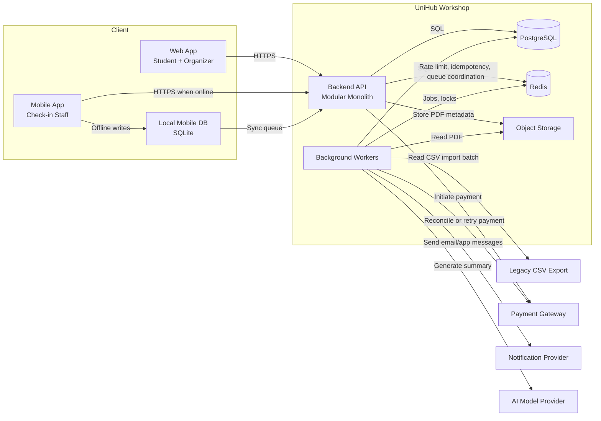
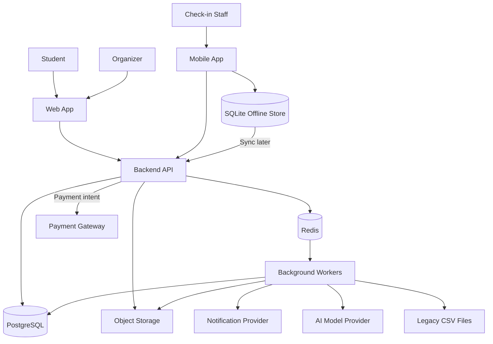
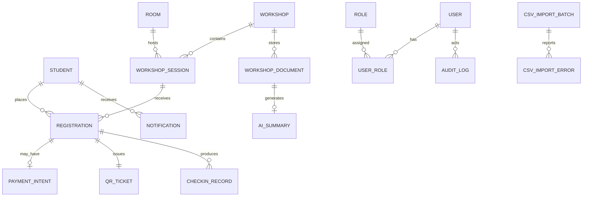
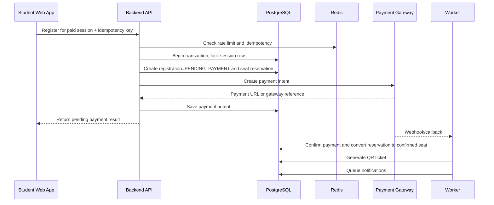
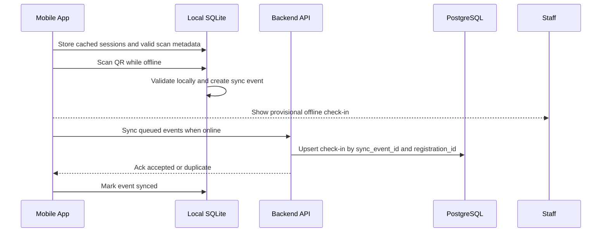
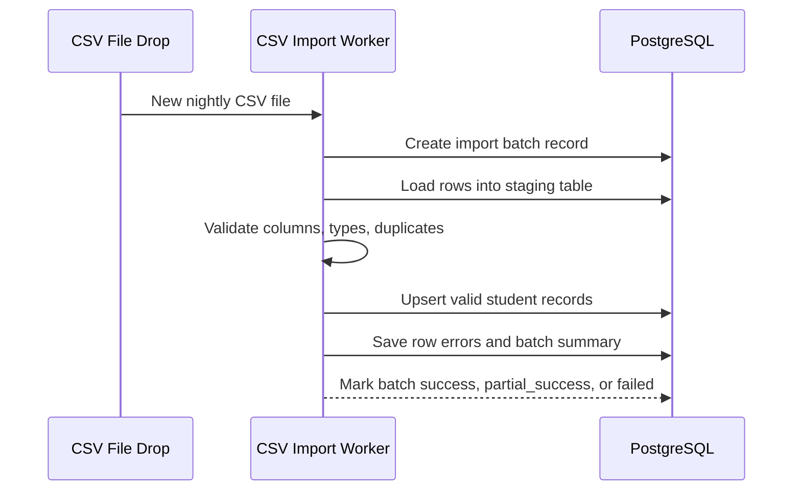

# UniHub Workshop - Technical Design

## 1. Architecture Overview

UniHub Workshop uses a **modular monolith with background workers**.

- The backend API stays in one deployable application, but internal modules are separated by domain: Auth/RBAC, Workshop, Registration, Payment, Notification, Check-in, AI Summary, and CSV Import.
- Background workers process slow or failure-prone tasks outside the request-response path.
- PostgreSQL stores all transactional business data.
- Redis supports rate limiting, short-lived idempotency state, seat reservation coordination, and worker queue coordination.
- Object storage stores organizer-uploaded PDF files.
- A web app serves students and organizers.
- A mobile app serves check-in staff and uses a local mobile database for offline operation.

Why this fits the course project:

- A modular monolith is easier for a student team to build, test, and explain than a distributed microservice system.
- Background workers isolate long-running tasks such as email sending, AI summarization, and CSV import from the user-facing API.
- SQL transactions are appropriate because the hardest correctness problem is seat allocation, which needs strong consistency.
- Payment, AI summary, notification, and CSV import are isolated so failures in those integrations do not break workshop browsing.

## 2. Architectural Style Decision

### ADR-001: Use a modular monolith with background workers

- **Context:** The system has several different functional areas, but the team must still produce a coherent, runnable student project with reliable seat allocation and manageable operational complexity.
- **Chosen option:** One backend codebase and one deployable API application, internally split into domain modules, plus worker processes that consume background jobs.
- **Why it is suitable:** It preserves clear separation of responsibilities without adding network-level complexity between internal modules. The team can keep transactional boundaries inside one process and one database.
- **Trade-offs:** The application will be larger than a narrowly scoped service and requires discipline to keep module boundaries clean. Independent scaling of modules is limited.
- **Alternatives rejected:**
  - **Microservices:** Better independent scaling, but too costly for a course project because of service discovery, distributed tracing, deployment complexity, and cross-service consistency.
  - **Single-layer monolith without modules:** Faster to start, but it becomes hard to reason about access control, domain rules, and future maintenance.
  - **Serverless-only architecture:** Attractive for burst traffic, but less suitable for transaction-heavy seat allocation, local development simplicity, and offline sync coordination.

## 3. Main Components

| Component | Responsibility | Suggested technology | Communication method | Failure impact |
| --- | --- | --- | --- | --- |
| Student/Admin Web App | Student browsing and registration; organizer admin UI | React or Next.js | HTTPS to Backend API | UI unavailable, but core data remains intact |
| Check-in Mobile App | QR scanning, offline check-in, sync | Flutter or React Native | HTTPS when online; local DB when offline | Staff can continue offline if sync path is down |
| Backend API | Main request handling and orchestration | Node.js/NestJS, Spring Boot, or ASP.NET Core | REST/JSON | Core application unavailable |
| Auth/RBAC Module | Login, token issue, permission enforcement | Same backend stack | In-process | Blocks protected operations if faulty |
| Workshop Module | Workshop/session CRUD, schedules, room assignment | Same backend stack | In-process | Workshop browsing/admin impacted |
| Registration Module | Seat allocation, free registration, reservation lifecycle, QR issuance | Same backend stack | In-process + PostgreSQL transaction | Overbooking risk if incorrect |
| Payment Module | Payment intent creation, callback handling, reconciliation | Same backend stack | HTTPS to gateway; queue to workers | Paid registration degraded only |
| Notification Module | Notification composition and dispatch | Worker + adapter pattern | Queue + provider API | Messages delayed, core registration still works |
| AI Summary Worker | PDF text extraction and summary generation | Worker process | Queue + object storage + AI API | Summary delayed only |
| CSV Import Worker | Nightly student import | Worker process | File polling + queue + PostgreSQL | Student data freshness delayed |
| PostgreSQL Database | Source of truth for users, workshops, registrations, check-ins, audit | PostgreSQL | SQL | Critical system dependency |
| Redis / Message Queue | Rate limiting, idempotency cache, job coordination | Redis | TCP | Degraded protection/async handling |
| Object Storage | PDF file storage | MinIO or S3-compatible storage | HTTP/S3 API | PDF uploads and summary jobs blocked |
| Mobile Offline Storage | Local check-in persistence and sync queue | SQLite | Local file IO | Offline mode impaired on that device |
| Payment Gateway | External payment processing | Sandbox gateway | HTTPS/webhook | Paid registration degraded |
| Notification Provider | Email and app delivery | SMTP/service API | HTTPS/SMTP | Messages delayed |
| AI Model Provider | Summary generation | External LLM API | HTTPS | Summary delayed |
| Legacy Student System CSV Export | Nightly student roster source | Existing system | File drop / shared storage | Student eligibility freshness delayed |

## 4. Synchronous vs Asynchronous Communication

### Synchronous operations

- Login
- Workshop browsing
- Registration request
- Payment initiation
- Admin workshop update
- Online check-in

These operations return immediate user-facing results and therefore stay in the request path.

### Asynchronous operations

- Email sending
- In-app notification fan-out
- AI Summary generation
- Nightly CSV import
- Expired seat reservation cleanup
- Payment callback processing if routed through a queue
- Offline check-in sync retry

Asynchronous processing improves resilience because slow external providers do not hold user requests open. It also allows retries, dead-letter handling, and workload smoothing during spikes.

## 5. C4 Diagram - Level 1: System Context

Relationship notes:

- Students use the system primarily for read-heavy browsing and high-contention registration.
- Organizers access privileged functions that need stronger authorization and audit logging.
- Check-in staff use a mobile flow optimized for fast validation and intermittent connectivity.
- The legacy student system is one-way only; UniHub Workshop consumes CSV exports and never calls it directly.
- Payment, notification, and AI are all external dependencies and must be isolated from the core browsing experience.

## 6. C4 Diagram - Level 2: Container

## 7. High-Level Architecture Diagram

Key dependency rules:

- Browsing depends only on the web app, API, and database, so it remains available if payment or AI is unavailable.
- Paid registration depends on the payment module, but free registration does not.
- Offline check-in depends on local storage first and remote sync second.
- CSV import, AI summary, and notifications are worker-driven so they cannot directly block browsing.

## 8. Data Design

### Database choice

- **Chosen:** PostgreSQL for transactional data; Redis for volatile coordination data; object storage for PDFs.
- **Why:** Seat allocation and check-in correctness need transactions, unique constraints, and predictable relational queries.
- **Trade-offs / risks:** Relational schemas require more upfront modeling than document storage. Redis introduces another dependency.
- **Alternatives not chosen:** NoSQL-only storage was rejected because strong transactional seat allocation is harder to guarantee.

### Core entities

### Important tables and design notes

| Entity | Purpose | Important fields / constraints |
| --- | --- | --- |
| `users` | Login identity for all roles | unique email, password hash, account status |
| `roles`, `user_roles` | RBAC mapping | role name unique; many-to-many if staff can have multiple roles |
| `students` | Student roster imported from CSV | unique student_id, faculty, status, imported_at |
| `rooms` | Event rooms and maps | name unique per venue, map_url, capacity |
| `workshops` | High-level workshop information | title, speaker, description, fee_type, status |
| `workshop_sessions` | Time-slot specific session | workshop_id, room_id, start_at, end_at, seat_capacity, seats_confirmed, seats_reserved |
| `registrations` | Student registration record | unique(student_id, session_id), status, qr_token_id nullable until confirmed |
| `payment_intents` | Paid flow tracking | unique idempotency_key, gateway_ref unique nullable, status, amount, expires_at |
| `qr_tickets` | QR payload and validity | registration_id unique, qr_secret, issued_at, revoked_at nullable |
| `checkin_records` | Attendance evidence | unique(registration_id), scanned_by, scanned_at, source_mode, sync_event_id unique |
| `notifications` | App/email delivery record | recipient, channel, template_key, status, retry_count |
| `workshop_documents` | PDF metadata | workshop_id, object_key, upload_status |
| `ai_summaries` | Generated summary result | document_id unique, status, summary_text, error_code |
| `csv_import_batches` | Import audit batch | file_name, checksum, started_at, finished_at, status |
| `csv_import_errors` | Row-level validation errors | batch_id, row_number, error_message |
| `audit_logs` | Security and admin audit trail | actor_user_id, action, target_type, target_id, payload_json |

### Indexing and constraints

- Unique index on `registrations(student_id, session_id)` prevents duplicate registration.
- Unique index on `checkin_records(registration_id)` prevents duplicate attendance.
- Unique index on `payment_intents(idempotency_key)` prevents duplicate paid attempts.
- Time-based index on `workshop_sessions(start_at)` supports schedule queries.
- Status index on `notifications(status)` and `ai_summaries(status)` supports worker polling.

## 9. Key Business Flows

### 9.1 Paid workshop registration

Failure handling:

- If payment intent creation times out before a gateway reference is returned, the registration stays `PENDING_PAYMENT` until reconciliation or expiration.
- Expired reservations are cleaned by a background worker and seats are released.
- Duplicate client retries reuse the same idempotency key and return the same payment intent instead of creating a new charge.

### 9.2 Offline check-in and later sync

Failure handling:

- If the same QR is scanned twice on one device, local validation blocks the second provisional check-in.
- If two devices sync the same student, the backend keeps the first successful `checkin_record` and returns `duplicate` for later events.
- If sync fails, unsent events remain in SQLite and retry with exponential backoff.

### 9.3 Nightly CSV import

Failure handling:

- Invalid files are quarantined and do not overwrite existing student data.
- Partial row errors do not cancel the whole batch unless the file structure itself is invalid.
- Duplicate rows are resolved deterministically by student ID and latest row precedence within the same file.

## 10. Access Control Design

### Chosen model

- **Chosen:** RBAC with roles `student`, `organizer`, and `checkin_staff`.
- **Why:** The user groups and permissions in the project brief map directly to stable role boundaries.
- **Trade-offs / risks:** RBAC is less flexible than attribute-based policies if fine-grained departmental rules appear later.
- **Alternatives not chosen:** ABAC was rejected because it adds policy complexity not required by the current brief.

### Role matrix

| Capability | Student | Organizer | Check-in Staff |
| --- | --- | --- | --- |
| Browse workshop list/detail | Yes | Yes | Limited |
| Register for workshop | Yes | No | No |
| View own QR ticket | Yes | No | No |
| Create/update/cancel workshop | No | Yes | No |
| Upload PDF for AI summary | No | Yes | No |
| View registration statistics | No | Yes | No |
| Scan QR and create check-in | No | No | Yes |
| Access admin pages | No | Yes | No |

### Enforcement points

- API middleware validates JWT, loads roles, and enforces endpoint policies.
- Organizer web routes additionally require role checks in the UI to reduce accidental navigation, but backend checks remain the source of truth.
- Mobile app only exposes scan screens for `checkin_staff`.
- Audit logs are written for workshop administration, payment state overrides, CSV imports, and manual check-in corrections.

## 11. System Protection Mechanisms

### 11.1 Seat contention protection

- **Chosen:** Row-level locking on `workshop_sessions` plus short-lived seat reservations for paid flows.
- **Why:** The final seat problem requires strong consistency at commit time.
- **How it works:** The registration transaction locks the session row, verifies remaining seats, increments reserved or confirmed counters, and commits atomically.
- **Trade-offs / risks:** High contention on one workshop can reduce throughput on that row.
- **Alternatives not chosen:** Pure Redis counters were rejected as source of truth because reconciliation back to durable registration records is harder.

### 11.2 Traffic spike protection

- **Chosen:** Redis-backed token bucket rate limiting with stricter thresholds on registration endpoints.
- **Why:** Token bucket allows short bursts while still controlling sustained abuse, which matches the opening minutes of registration.
- **How it works:** Browsing endpoints get higher budgets; registration endpoints use lower per-user and per-IP budgets; repeated offenders receive `429`.
- **Trade-offs / risks:** Shared campus IPs can cause false positives if the IP limit is too aggressive.
- **Alternatives not chosen:** Fixed window is simpler but less fair at window boundaries; leaky bucket is smoother but less intuitive for burst allowance.

### 11.3 Payment gateway instability

- **Chosen:** Circuit breaker plus graceful degradation.
- **Why:** Paid registration depends on an external provider, but workshop browsing and free registration must survive prolonged gateway errors.
- **How it works:** The breaker stays `closed` during healthy calls, opens after repeated failures, rejects new paid attempts quickly while showing a clear status, and probes in `half-open` before recovery.
- **Trade-offs / risks:** Some users may be temporarily blocked even after the gateway has recovered if the cool-down is too conservative.
- **Alternatives not chosen:** Blind retries inside the request path were rejected because they increase latency and load during provider incidents.

### 11.4 Double charge prevention

- **Chosen:** Idempotency keys stored in Redis and PostgreSQL-backed payment intent uniqueness.
- **Why:** Clients and mobile networks can retry unpredictably.
- **How it works:** Each paid registration request carries a client-generated key. If the same key reappears, the API returns the original result instead of issuing a new payment intent.
- **Trade-offs / risks:** Clients must preserve the same key across retries.
- **Alternatives not chosen:** Deduplicating only by timestamp or amount is unsafe because different users can pay identical amounts.

### 11.5 Offline check-in durability

- **Chosen:** Local SQLite event log plus backend upsert by `sync_event_id`.
- **Why:** The staff app must continue working during network loss and sync safely later.
- **Trade-offs / risks:** Devices must protect local data and may require periodic cache refresh before the event.
- **Alternatives not chosen:** In-memory-only offline storage was rejected because app restarts would lose unsynced check-ins.

### 11.6 Robust CSV import

- **Chosen:** Staging-table import with validation, deduplication, and batch audit records.
- **Why:** Invalid or duplicate data must not interrupt the running system.
- **Trade-offs / risks:** The import pipeline is more complex than direct row upserts.
- **Alternatives not chosen:** Direct import into production tables was rejected because bad files could corrupt student eligibility data.

## 12. Additional Technical Decisions

### ADR-002: Use PostgreSQL as the system of record

- **Chosen:** PostgreSQL for business state.
- **Why:** Transactions, row locks, indexes, and relational integrity are central to registration correctness.
- **Trade-offs / risks:** Requires careful schema migration discipline.
- **Alternatives not chosen:** MongoDB-only design was rejected because cross-document seat consistency is harder to guarantee.

### ADR-003: Use Redis for volatile coordination, not as primary truth

- **Chosen:** Redis for rate limiting, cache, locks, idempotency TTLs, and queue coordination.
- **Why:** These concerns need low latency and can tolerate reconstruction from PostgreSQL if Redis is lost.
- **Trade-offs / risks:** Another infrastructure dependency must be monitored.
- **Alternatives not chosen:** Database-only coordination was rejected because it would add unnecessary write pressure during traffic spikes.

### ADR-004: Use an adapter pattern for external providers

- **Chosen:** Separate provider adapters for payment, notification, and AI.
- **Why:** The course brief explicitly expects future extensibility, especially for notifications.
- **Trade-offs / risks:** Slightly more abstraction code up front.
- **Alternatives not chosen:** Hard-coding one provider directly into business services would be faster initially but would make later replacement expensive.

### ADR-005: Use local mobile database for offline check-in

- **Chosen:** SQLite on device.
- **Why:** It is simple, durable, and widely supported by mobile frameworks.
- **Trade-offs / risks:** Conflict resolution must be explicitly designed.
- **Alternatives not chosen:** Flat-file JSON was rejected because queryability, durability, and sync bookkeeping are weaker.
