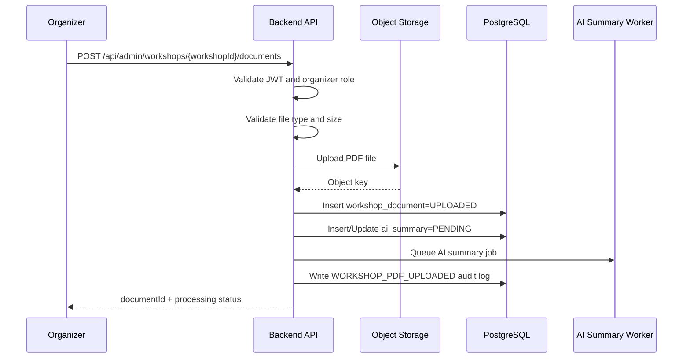
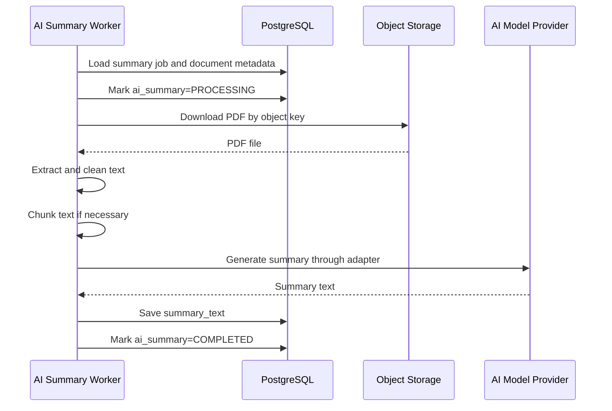
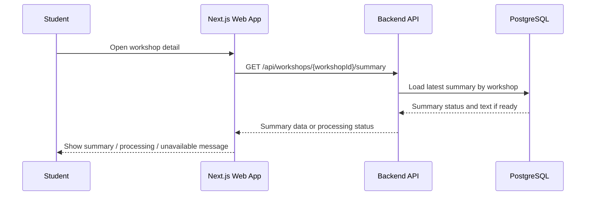
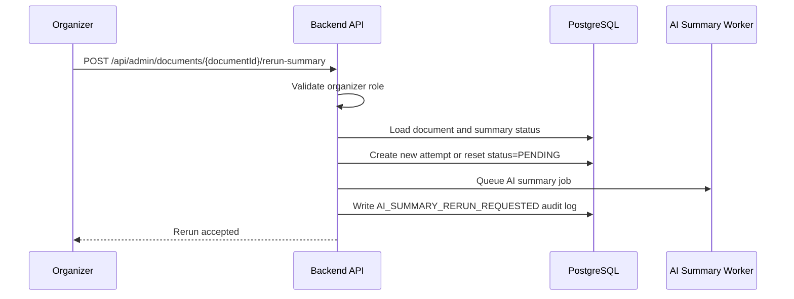

# Feature Spec: AI Summary from Workshop PDFs

## Description

The AI Summary from Workshop PDFs feature allows organizers to upload PDF documents for a workshop and automatically generate a concise summary for the workshop detail page.

The workflow includes:

- PDF upload by organizer,
- file storage in object storage,
- metadata tracking in PostgreSQL,
- asynchronous AI summary job creation,
- PDF text extraction and cleanup,
- AI summarization through an adapter,
- summary status tracking,
- failure handling and retry/rerun support.

Summary generation must not block workshop creation, workshop browsing, registration, payment, or check-in. If PDF processing or AI summarization fails, only the summary feature is affected.

Actors involved:

| Actor             | Description                                                                                  |
| ----------------- | -------------------------------------------------------------------------------------------- |
| Organizer         | Uploads PDFs, views processing status, and reruns summary generation if needed               |
| Student           | Views generated summary on the workshop detail page                                          |
| Check-in Staff    | May view workshop summary if workshop details are exposed in the mobile app                  |
| Backend API       | Validates upload requests, stores file metadata, and queues AI jobs                          |
| AI Summary Worker | Downloads PDFs, extracts text, cleans content, calls AI provider, and stores summary results |
| Object Storage    | Stores uploaded PDF files                                                                    |
| AI Model Provider | Generates summary from extracted PDF text through an adapter                                 |
| PostgreSQL        | Stores workshop document metadata, processing status, and summary results                    |
| System Operator   | Optional role for viewing failed jobs or triggering recovery actions                         |

Data involved:

- `workshops`
- `workshop_documents`
- `ai_summaries`
- `audit_logs`

Detailed schema, fields, constraints, and indexes are documented in [`../database.md`](../database.md).

---

## Main Flow

### Main Flow 1: Organizer Uploads Workshop PDF

1. Organizer opens the workshop admin page.
2. Organizer selects a PDF file and submits it to the Backend API.
3. Backend API validates the access token and checks role `organizer`.
4. Backend API validates the file type, file size, and target workshop.
5. Backend API uploads the PDF file to object storage.
6. Backend API creates a `workshop_documents` record with upload status `UPLOADED`.
7. Backend API creates or updates an `ai_summaries` record with status `PENDING` or `PROCESSING`.
8. Backend API queues an AI summary job.
9. Backend API writes an audit log entry `WORKSHOP_PDF_UPLOADED`.
10. Backend API returns the document ID and processing status.



### Main Flow 2: Worker Generates AI Summary

1. AI Summary Worker receives a queued summary job.
2. Worker loads the `workshop_documents` record.
3. Worker marks summary status as `PROCESSING`.
4. Worker downloads the PDF from object storage.
5. Worker extracts text from the PDF.
6. Worker cleans the extracted text.
7. Worker chunks the content if the text is too long for one AI request.
8. Worker calls the AI provider through `AiSummaryProvider` adapter.
9. Worker receives the generated summary.
10. Worker stores the summary text in `ai_summaries`.
11. Worker marks summary status as `COMPLETED`.
12. Worker writes processing metadata such as model name, attempt count, and processing time if implemented.



### Main Flow 3: Student Views Workshop Summary

1. Student opens the workshop detail page.
2. Frontend requests workshop detail from the Backend API.
3. Backend API loads workshop detail and latest summary status.
4. If summary status is `COMPLETED`, Backend API returns summary text.
5. If summary status is `PENDING` or `PROCESSING`, Backend API returns status without summary text.
6. If summary status is `FAILED`, Backend API returns a friendly status or fallback message.
7. Student sees the workshop detail page regardless of summary status.



### Main Flow 4: Organizer Reruns Failed Summary

1. Organizer opens the document or summary status page.
2. Organizer clicks rerun summary for a failed document.
3. Backend API validates role `organizer`.
4. Backend API checks that the document exists and belongs to a workshop the organizer can manage.
5. Backend API creates a new processing attempt or resets the existing summary status to `PENDING`.
6. Backend API queues a new AI summary job.
7. Backend API writes audit log `AI_SUMMARY_RERUN_REQUESTED`.
8. Worker processes the job again.



---

## API Contract

### Upload Workshop PDF

```http
POST /api/admin/workshops/{workshopId}/documents
```

Required role: `organizer`.

Request type: `multipart/form-data`.

Request fields:

| Field            | Type     | Required | Notes                                                        |
| ---------------- | -------- | -------- | ------------------------------------------------------------ |
| `file`           | PDF file | Yes      | Must be a valid PDF                                          |
| `title`          | string   | No       | Optional document title                                      |
| `replaceCurrent` | boolean  | No       | If true, mark previous document as superseded if implemented |

Success response:

```json
{
  "success": true,
  "data": {
    "documentId": "doc-001",
    "workshopId": "w-001",
    "status": "UPLOADED",
    "summaryStatus": "PENDING"
  }
}
```

Rules:

- Only organizers can upload workshop PDFs.
- File must be a PDF.
- File size must not exceed the configured limit.
- Uploaded file is stored in object storage.
- PostgreSQL stores only file metadata and processing status.
- Upload should return quickly and must not wait for AI summary completion.

### Get Workshop Summary

```http
GET /api/workshops/{workshopId}/summary
```

Required role: Public or authenticated, depending on workshop visibility policy.

Success response when completed:

```json
{
  "success": true,
  "data": {
    "workshopId": "w-001",
    "documentId": "doc-001",
    "summaryStatus": "COMPLETED",
    "summaryText": "This workshop introduces career planning, interview preparation, and practical communication skills.",
    "generatedAt": "2026-05-01T09:30:00Z"
  }
}
```

Success response when processing:

```json
{
  "success": true,
  "data": {
    "workshopId": "w-001",
    "documentId": "doc-001",
    "summaryStatus": "PROCESSING",
    "summaryText": null
  }
}
```

Success response when failed:

```json
{
  "success": true,
  "data": {
    "workshopId": "w-001",
    "documentId": "doc-001",
    "summaryStatus": "FAILED",
    "summaryText": null,
    "errorCode": "AI_PROVIDER_TIMEOUT"
  }
}
```

Rules:

- Workshop detail must remain available even if summary is not ready.
- Failed summary must not prevent users from viewing workshop information.
- Public visibility depends on workshop visibility rules.

### Get Document Summary Status

```http
GET /api/admin/documents/{documentId}/summary-status
```

Required role: `organizer`.

Success response:

```json
{
  "success": true,
  "data": {
    "documentId": "doc-001",
    "workshopId": "w-001",
    "uploadStatus": "UPLOADED",
    "summaryStatus": "PROCESSING",
    "attemptCount": 1,
    "lastErrorCode": null,
    "updatedAt": "2026-05-01T09:15:00Z"
  }
}
```

Rules:

- Organizer can only view status for documents they are allowed to manage.
- System operator may view all statuses if internal tooling is enabled.

### Rerun Summary Generation

```http
POST /api/admin/documents/{documentId}/rerun-summary
```

Required role: `organizer`.

Success response:

```json
{
  "success": true,
  "data": {
    "documentId": "doc-001",
    "summaryStatus": "PENDING",
    "message": "Summary regeneration has been queued."
  }
}
```

Rules:

- Rerun is allowed for `FAILED` summaries.
- Rerun may also be allowed for `COMPLETED` summaries if organizer wants to regenerate after replacing a document.
- Each rerun should be tracked as a new attempt or with an incremented attempt count.

---

## Authorization Rules

| Capability                      | Student | Organizer | Check-in Staff                | System Operator |
| ------------------------------- | ------- | --------- | ----------------------------- | --------------- |
| Upload workshop PDF             | No      | Yes       | No                            | No              |
| Replace workshop PDF            | No      | Yes       | No                            | No              |
| View summary on workshop detail | Yes     | Yes       | Yes, if visible in mobile app | Yes             |
| View document processing status | No      | Yes       | No                            | Yes, if enabled |
| Rerun failed summary            | No      | Yes       | No                            | Yes, if enabled |
| View AI failure diagnostics     | No      | Limited   | No                            | Yes, if enabled |

Example endpoint policies:

| Method | Endpoint                                           | Required role           | Purpose                        |
| ------ | -------------------------------------------------- | ----------------------- | ------------------------------ |
| POST   | `/api/admin/workshops/{workshopId}/documents`      | `organizer`             | Upload a workshop PDF          |
| GET    | `/api/workshops/{workshopId}/summary`              | Public or authenticated | View workshop summary          |
| GET    | `/api/admin/documents/{documentId}/summary-status` | `organizer`             | View summary processing status |
| POST   | `/api/admin/documents/{documentId}/rerun-summary`  | `organizer`             | Rerun summary generation       |

---

## Error Scenarios

| Scenario                                         | System Behavior                                | HTTP Status    | Error Code                      |
| ------------------------------------------------ | ---------------------------------------------- | -------------- | ------------------------------- |
| Missing or invalid access token for admin upload | Reject request                                 | `401`          | `AUTH_TOKEN_INVALID`            |
| User does not have organizer role                | Reject request                                 | `403`          | `AUTH_FORBIDDEN`                |
| Workshop not found                               | Reject request                                 | `404`          | `AI_WORKSHOP_NOT_FOUND`         |
| Organizer does not manage the workshop           | Reject request                                 | `403`          | `AI_WORKSHOP_ACCESS_DENIED`     |
| Missing file                                     | Reject request                                 | `400`          | `AI_FILE_REQUIRED`              |
| File is not PDF                                  | Reject request                                 | `400`          | `AI_FILE_TYPE_INVALID`          |
| File too large                                   | Reject request                                 | `413`          | `AI_FILE_TOO_LARGE`             |
| Object storage upload failed                     | Mark upload failed or reject request           | `503`          | `AI_STORAGE_UNAVAILABLE`        |
| PDF unreadable or corrupted                      | Mark summary failed                            | `422`          | `AI_PDF_INVALID`                |
| Extracted text is empty                          | Mark summary failed                            | `422`          | `AI_TEXT_EMPTY`                 |
| Extracted text too large                         | Chunk content or fail if chunking not possible | `202` or `422` | `AI_TEXT_TOO_LARGE`             |
| AI provider timeout                              | Retry limited times                            | `202`          | `AI_RETRY_SCHEDULED`            |
| AI provider unavailable                          | Mark retrying or failed after retry limit      | `503`          | `AI_PROVIDER_UNAVAILABLE`       |
| AI output invalid or empty                       | Mark summary failed and allow rerun            | `422`          | `AI_OUTPUT_INVALID`             |
| Summary already processing                       | Return current status                          | `200`          | `AI_SUMMARY_ALREADY_PROCESSING` |
| Rerun requested for missing document             | Reject request                                 | `404`          | `AI_DOCUMENT_NOT_FOUND`         |
| Rerun not allowed for current status             | Reject request                                 | `409`          | `AI_RERUN_NOT_ALLOWED`          |

---

## Constraints

### Business Constraints

- Only organizers can upload or replace workshop PDFs.
- Uploaded PDFs are associated with a specific workshop.
- Summary generation must be asynchronous.
- Workshop creation, browsing, registration, payment, and check-in must not depend on successful summary generation.
- A displayed summary must be tied to a specific document version.
- If a new document replaces an old one, previous document metadata and audit history should not be corrupted.
- Organizer should be able to view processing status.
- Organizer should be able to rerun summary generation when processing fails.

### File and Storage Constraints

- Only PDF files are allowed.
- PDF size must be limited by configuration.
- File content should be stored in object storage.
- PostgreSQL stores metadata such as object key, original filename, content type, file size, upload status, and processing status.
- Object storage failure should not corrupt database state.
- Raw PDF content should not be stored directly in PostgreSQL.

### AI Processing Constraints

- AI processing must run in a background worker.
- Worker must mark status transitions clearly: `PENDING`, `PROCESSING`, `COMPLETED`, `FAILED`, and optionally `RETRYING`.
- Worker must handle unreadable PDFs.
- Worker must handle empty extracted text.
- Worker should clean extracted text before sending to AI provider.
- Worker should chunk long text when needed.
- Worker should call AI provider through an adapter, not directly from domain logic.
- AI timeout or provider failure must not affect workshop browsing.
- Retry count should be limited to avoid infinite retry loops.

### Data Constraints

- `workshop_documents.workshop_id` must reference an existing workshop.
- `ai_summaries.document_id` should be unique if one summary is stored per document.
- A document should have a stable `object_key`.
- Summary status must be queryable by document and workshop.
- Detailed schema and database constraints are documented in [`../database.md`](../database.md).

### Authorization Constraints

- Backend authorization is mandatory for PDF upload and rerun APIs.
- UI route guards are only for user experience.
- Students can view completed summaries only through public workshop detail APIs.
- Students cannot upload, replace, or rerun summaries.
- Check-in staff cannot upload or rerun summaries.
- System operator access is optional and must be explicitly protected.

### Audit Constraints

The system should write audit logs for:

| Action                          | Notes                                         |
| ------------------------------- | --------------------------------------------- |
| `WORKSHOP_PDF_UPLOADED`         | Organizer uploaded a PDF                      |
| `WORKSHOP_PDF_REPLACED`         | Organizer replaced a workshop PDF, if enabled |
| `AI_SUMMARY_PROCESSING_STARTED` | Worker started processing                     |
| `AI_SUMMARY_COMPLETED`          | Summary generated successfully                |
| `AI_SUMMARY_FAILED`             | Summary generation failed                     |
| `AI_SUMMARY_RERUN_REQUESTED`    | Organizer or system operator requested rerun  |

Audit payload must not include secret provider keys, raw AI credentials, or sensitive tokens.

---

## Acceptance Criteria

### PDF Upload

- Organizer can upload a valid PDF for a workshop.
- Non-organizer users cannot upload workshop PDFs.
- Non-PDF files are rejected.
- Files larger than the configured limit are rejected.
- Uploaded file is stored in object storage.
- PostgreSQL stores document metadata and processing status.
- Upload returns quickly without waiting for AI processing.

### AI Summary Generation

- Uploading a PDF queues an AI summary job.
- Worker downloads the PDF from object storage.
- Worker extracts and cleans text from the PDF.
- Worker calls AI provider through an adapter.
- Successful processing stores summary text in `ai_summaries`.
- Successful processing marks summary status as `COMPLETED`.
- Failed processing marks summary status as `FAILED` with an error code.
- AI provider timeout triggers limited retry or retry scheduling.

### Workshop Detail Display

- Student can view workshop detail even when summary is still processing.
- If summary is completed, workshop detail shows the summary.
- If summary is processing, workshop detail shows processing status or a friendly message.
- If summary failed, workshop detail still loads and shows summary unavailable.

### Failure Isolation

- PDF processing failure does not affect workshop browsing.
- AI provider failure does not affect registration.
- Object storage failure during upload does not create a fake completed document.
- Worker failure does not corrupt previous summary or audit history.

### Rerun and Versioning

- Organizer can rerun summary generation for failed documents.
- Re-uploading a document creates a new processing attempt or document version.
- Previous document metadata and audit logs remain available.
- Displayed summary is tied to the correct document version.

### Authorization and Audit

- Students cannot upload or rerun summaries.
- Check-in staff cannot upload or rerun summaries.
- Unauthorized upload attempts are rejected.
- Upload, failure, success, and rerun actions are auditable.

---

## Implementation Notes

Recommended Java package placement:

```text
src/main/java/com/unihub/
├── presentation/
│   └── controller/aisummary/
│       └── AiSummaryController.java
├── application/
│   └── aisummary/
│       ├── AiSummaryCommandService.java
│       ├── AiSummaryQueryService.java
│       ├── UploadWorkshopDocumentCommand.java
│       ├── RerunAiSummaryCommand.java
│       ├── GenerateAiSummaryJob.java
│       ├── AiSummaryJobPublisher.java
│       └── AiSummaryProvider.java
├── domain/
│   ├── aisummary/
│   │   ├── AiSummary.java
│   │   ├── AiSummaryStatus.java
│   │   ├── AiSummaryRepository.java
│   │   └── AiSummaryErrorCode.java
│   ├── document/
│   │   ├── WorkshopDocument.java
│   │   ├── WorkshopDocumentStatus.java
│   │   ├── WorkshopDocumentRepository.java
│   │   └── WorkshopDocumentErrorCode.java
│   └── workshop/
│       ├── Workshop.java
│       └── WorkshopRepository.java
└── infrastructure/
    ├── persistence/
    │   ├── aisummary/
    │   │   └── AiSummaryJpaRepository.java
    │   └── document/
    │       └── WorkshopDocumentJpaRepository.java
    ├── storage/
    │   ├── ObjectStorageProvider.java
    │   ├── MinioStorageProvider.java
    │   └── S3StorageProvider.java
    └── ai/
        ├── MockAiSummaryProvider.java
        └── ExternalLlmSummaryProvider.java
```

Layering rules:

- Controller receives multipart upload requests and maps them to application commands.
- Application service validates use case rules, stores metadata, and queues jobs.
- Domain model protects document status and summary status transitions.
- Infrastructure implements object storage, PDF text extraction, AI provider adapter, and persistence.
- Worker executes slow AI processing outside the request path.
- Controllers must not call the AI provider directly.
- Domain logic must not depend on provider-specific AI SDKs.
- PostgreSQL stores metadata and summary result; object storage stores the PDF file.
