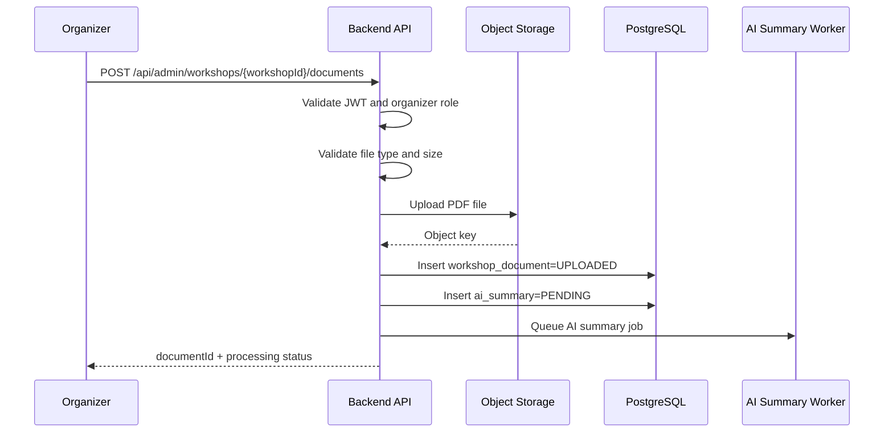
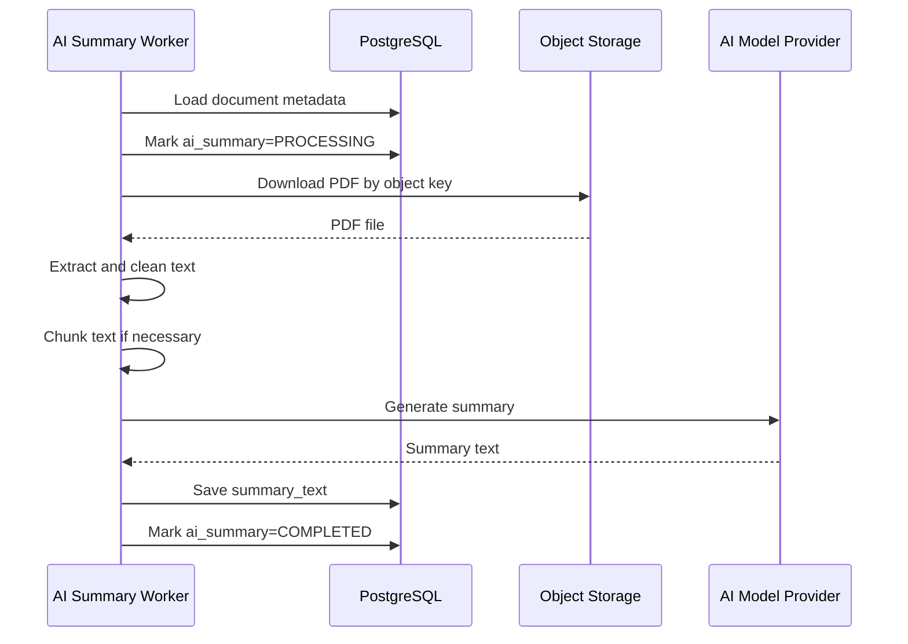
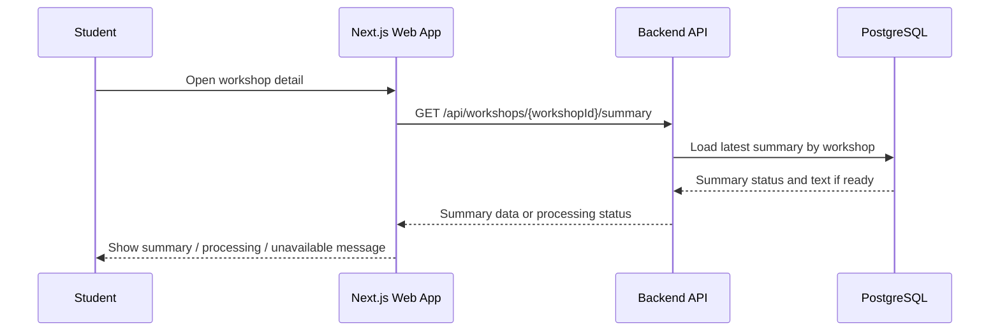

# Feature Spec: AI Summary from Workshop PDFs

## Description

The AI Summary from Workshop PDFs feature allows organizers to upload PDF documents for a workshop and automatically generate a concise summary for the workshop detail page.

The workflow includes:

- PDF upload by organizer,
- file storage in object storage,
- metadata tracking in PostgreSQL,
- asynchronous AI summary job creation,
- PDF text extraction and cleanup,
- AI summarization,
- summary status tracking,
- failure handling.

Summary generation must not block workshop creation, workshop browsing, registration, payment, or check-in. If PDF processing or AI summarization fails, only the summary feature is affected.

Actors involved:

| Actor             | Description                                                                  |
| ----------------- | ---------------------------------------------------------------------------- |
| Organizer         | Uploads PDFs and views processing status                                     |
| Student           | Views generated summary on the workshop detail page                          |
| Backend API       | Validates upload requests, stores file metadata, and queues AI jobs          |
| AI Summary Worker | Downloads PDFs, extracts text, calls AI provider, and stores summary results |
| Object Storage    | Stores uploaded PDF files                                                    |
| AI Model Provider | Generates summary from extracted PDF text                                    |
| PostgreSQL        | Stores workshop document metadata, processing status, and summary results    |

Data involved:

- `workshops`
- `workshop_documents`
- `ai_summaries`

Detailed schema, fields, constraints, and indexes are documented in [`../database.md`](../database.md).

---

## Main Flow

### Main Flow 1: Organizer Uploads Workshop PDF

1. Organizer opens the workshop admin page.
2. Organizer selects a PDF file and submits it to the Backend API.
3. Backend API validates the access token and checks role `organizer`.
4. Backend API validates the file type, file size, and target workshop.
5. Backend API uploads the PDF file to object storage.
6. Backend API creates a `workshop_documents` record with upload status `UPLOADED`.
7. Backend API creates an `ai_summaries` record with status `PENDING`.
8. Backend API queues an AI summary job.
9. Backend API returns the document ID and processing status.



### Main Flow 2: Worker Generates AI Summary

1. AI Summary Worker receives a queued summary job.
2. Worker loads the `workshop_documents` record.
3. Worker marks summary status as `PROCESSING`.
4. Worker downloads the PDF from object storage.
5. Worker extracts text from the PDF.
6. Worker cleans the extracted text.
7. Worker chunks the content if the text is too long for one AI request.
8. Worker sends the prepared content to the AI provider.
9. Worker receives the generated summary.
10. Worker stores the summary text in `ai_summaries`.
11. Worker marks summary status as `COMPLETED`.



### Main Flow 3: Student Views Workshop Summary

1. Student opens the workshop detail page.
2. Frontend requests workshop detail or summary from the Backend API.
3. Backend API loads workshop detail and latest summary status.
4. If summary status is `COMPLETED`, Backend API returns summary text.
5. If summary status is `PENDING` or `PROCESSING`, Backend API returns status without summary text.
6. If summary status is `FAILED`, Backend API returns a friendly unavailable status.
7. Student can still view the workshop detail page regardless of summary status.



---

## API Contract

### Upload Workshop PDF

```http
POST /api/admin/workshops/{workshopId}/documents
```

Required role: `organizer`.

Request type: `multipart/form-data`.

Request fields:

| Field  | Type     | Required | Notes               |
| ------ | -------- | -------- | ------------------- |
| `file` | PDF file | Yes      | Must be a valid PDF |

Success response:

```json
{
  "success": true,
  "data": {
    "documentId": "doc-001",
    "workshopId": "w-001",
    "uploadStatus": "UPLOADED",
    "summaryStatus": "PENDING"
  }
}
```

Rules:

- Only organizers can upload workshop PDFs.
- File must be a PDF.
- File size must not exceed the configured limit.
- Uploaded file is stored in object storage.
- PostgreSQL stores only file metadata and processing status.
- Upload should return quickly and must not wait for AI summary completion.

### Get Workshop Summary

```http
GET /api/workshops/{workshopId}/summary
```

Required role: Public or authenticated, depending on workshop visibility policy.

Success response when completed:

```json
{
  "success": true,
  "data": {
    "workshopId": "w-001",
    "documentId": "doc-001",
    "summaryStatus": "COMPLETED",
    "summaryText": "This workshop introduces career planning, interview preparation, and practical communication skills.",
    "generatedAt": "2026-05-01T09:30:00Z"
  }
}
```

Success response when processing:

```json
{
  "success": true,
  "data": {
    "workshopId": "w-001",
    "documentId": "doc-001",
    "summaryStatus": "PROCESSING",
    "summaryText": null
  }
}
```

Success response when failed:

```json
{
  "success": true,
  "data": {
    "workshopId": "w-001",
    "documentId": "doc-001",
    "summaryStatus": "FAILED",
    "summaryText": null,
    "errorCode": "AI_SUMMARY_FAILED"
  }
}
```

Rules:

- Workshop detail must remain available even if summary is not ready.
- Failed summary must not prevent users from viewing workshop information.

### Get Document Summary Status

```http
GET /api/admin/documents/{documentId}/summary-status
```

Required role: `organizer`.

Success response:

```json
{
  "success": true,
  "data": {
    "documentId": "doc-001",
    "workshopId": "w-001",
    "uploadStatus": "UPLOADED",
    "summaryStatus": "PROCESSING",
    "updatedAt": "2026-05-01T09:15:00Z"
  }
}
```

Rules:

- Organizer can view processing status for uploaded documents.
- This endpoint is used by the admin UI to show whether summary generation is pending, processing, completed, or failed.

---

## Authorization Rules

| Capability                      | Student | Organizer | Check-in Staff |
| ------------------------------- | ------- | --------- | -------------- |
| Upload workshop PDF             | No      | Yes       | No             |
| View summary on workshop detail | Yes     | Yes       | No             |
| View document processing status | No      | Yes       | No             |

Example endpoint policies:

| Method | Endpoint                                           | Required role           | Purpose                        |
| ------ | -------------------------------------------------- | ----------------------- | ------------------------------ |
| POST   | `/api/admin/workshops/{workshopId}/documents`      | `organizer`             | Upload a workshop PDF          |
| GET    | `/api/workshops/{workshopId}/summary`              | Public or authenticated | View workshop summary          |
| GET    | `/api/admin/documents/{documentId}/summary-status` | `organizer`             | View summary processing status |

---

## Error Scenarios

| Scenario                                         | System Behavior                                       | HTTP Status | Error Code                |
| ------------------------------------------------ | ----------------------------------------------------- | ----------- | ------------------------- |
| Missing or invalid access token for admin upload | Reject request                                        | `401`       | `AUTH_TOKEN_INVALID`      |
| User does not have organizer role                | Reject request                                        | `403`       | `AUTH_FORBIDDEN`          |
| Workshop not found                               | Reject request                                        | `404`       | `AI_WORKSHOP_NOT_FOUND`   |
| Missing file                                     | Reject request                                        | `400`       | `AI_FILE_REQUIRED`        |
| File is not PDF                                  | Reject request                                        | `400`       | `AI_FILE_TYPE_INVALID`    |
| File too large                                   | Reject request                                        | `413`       | `AI_FILE_TOO_LARGE`       |
| Object storage upload failed                     | Reject request or mark upload failed                  | `503`       | `AI_STORAGE_UNAVAILABLE`  |
| PDF unreadable or corrupted                      | Mark summary failed                                   | `422`       | `AI_PDF_INVALID`          |
| Extracted text is empty                          | Mark summary failed                                   | `422`       | `AI_TEXT_EMPTY`           |
| AI provider timeout                              | Mark summary failed or retry once depending on policy | `202`       | `AI_PROVIDER_TIMEOUT`     |
| AI provider unavailable                          | Mark summary failed                                   | `503`       | `AI_PROVIDER_UNAVAILABLE` |
| AI output invalid or empty                       | Mark summary failed                                   | `422`       | `AI_OUTPUT_INVALID`       |
| Summary still processing                         | Return current processing status                      | `200`       | `AI_SUMMARY_PROCESSING`   |

---

## Constraints

### Business Constraints

- Only organizers can upload workshop PDFs.
- Uploaded PDFs are associated with a specific workshop.
- Summary generation must be asynchronous.
- Workshop creation, browsing, registration, payment, and check-in must not depend on successful summary generation.
- If summary generation fails, the workshop detail page must still be available.
- Organizer should be able to view processing status.

### File and Storage Constraints

- Only PDF files are allowed.
- PDF size must be limited by configuration.
- File content should be stored in object storage.
- PostgreSQL stores metadata such as object key, original filename, content type, file size, upload status, and processing status.
- Object storage failure should not corrupt database state.
- Raw PDF content should not be stored directly in PostgreSQL.

### AI Processing Constraints

- AI processing must run in a background worker.
- Worker must mark status transitions clearly: `PENDING`, `PROCESSING`, `COMPLETED`, and `FAILED`.
- Worker must handle unreadable PDFs.
- Worker must handle empty extracted text.
- Worker should clean extracted text before sending it to the AI provider.
- Worker may chunk long text when needed.
- AI timeout or provider failure must not affect workshop browsing.

### Data Constraints

- `workshop_documents.workshop_id` must reference an existing workshop.
- `ai_summaries.document_id` should be unique if one summary is stored per document.
- A document should have a stable `object_key`.
- Summary status must be queryable by document and workshop.
- Detailed schema and database constraints are documented in [`../database.md`](../database.md).

### Authorization Constraints

- Backend authorization is mandatory for PDF upload APIs.
- UI route guards are only for user experience.
- Students can view completed summaries through workshop detail APIs.
- Students cannot upload PDFs.
- Check-in staff cannot upload PDFs.

---

## Acceptance Criteria

### PDF Upload

- Organizer can upload a valid PDF for a workshop.
- Non-organizer users cannot upload workshop PDFs.
- Non-PDF files are rejected.
- Files larger than the configured limit are rejected.
- Uploaded file is stored in object storage.
- PostgreSQL stores document metadata and processing status.
- Upload returns quickly without waiting for AI processing.

### AI Summary Generation

- Uploading a PDF queues an AI summary job.
- Worker downloads the PDF from object storage.
- Worker extracts and cleans text from the PDF.
- Worker sends prepared content to the AI provider.
- Successful processing stores summary text in `ai_summaries`.
- Successful processing marks summary status as `COMPLETED`.
- Failed processing marks summary status as `FAILED` with an error code.

### Workshop Detail Display

- Student can view workshop detail even when summary is still processing.
- If summary is completed, workshop detail shows the summary.
- If summary is processing, workshop detail shows processing status or a friendly message.
- If summary failed, workshop detail still loads and shows summary unavailable.

### Failure Isolation

- PDF processing failure does not affect workshop browsing.
- AI provider failure does not affect registration.
- Object storage failure during upload does not create a fake completed document.
- Worker failure does not corrupt workshop data.

### Authorization

- Students cannot upload workshop PDFs.
- Check-in staff cannot upload workshop PDFs.
- Unauthorized upload attempts are rejected.
- Only organizers can view document processing status in the admin interface.

---
