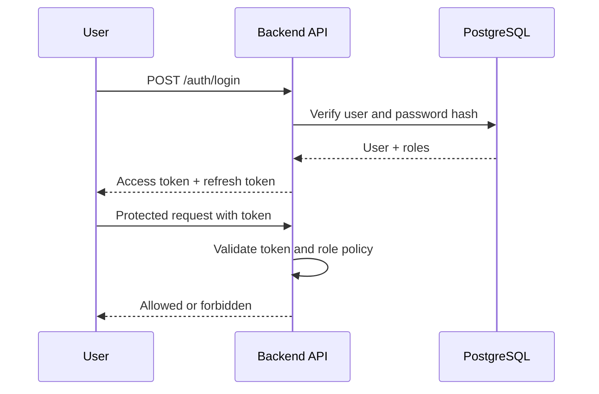

# Feature Spec: Authentication and Access Control

## Description

This feature authenticates users and enforces authorization for the three project roles: `student`, `organizer`, and `checkin_staff`. It protects admin pages, registration APIs, and the mobile check-in flow.

## Main Flow

1. User submits email/password credentials.
2. Backend verifies the account in `users`.
3. Backend issues a short-lived access token and a refresh token.
4. Each API request includes the access token.
5. Authorization middleware loads the user's roles and checks the endpoint policy.
6. Protected action proceeds only if the required role is present.

## Authorization Rules

| Role | Allowed actions |
| --- | --- |
| Student | Browse workshops, create own registrations, view own QR ticket, view own notifications |
| Organizer | Manage workshops, upload PDFs, view registration statistics, trigger summary regeneration |
| Check-in Staff | Access check-in mobile flow, validate QR, sync offline records |

## Key Design Decisions

- **Choice:** JWT access token plus refresh token.
  - **Why:** Works well for web and mobile clients and keeps the API stateless for most requests.
  - **Trade-offs / risks:** Token revocation is less immediate than server-side sessions unless refresh rotation and logout invalidation are implemented.
  - **Alternatives not chosen:** Server sessions were rejected because mobile/offline usage becomes less convenient.

- **Choice:** RBAC at the API boundary.
  - **Why:** The course brief defines stable role groups with clearly different permissions.
  - **Trade-offs / risks:** RBAC is less flexible if future rules depend on departments or event ownership.
  - **Alternatives not chosen:** ABAC was rejected because it adds policy complexity without a current need.

## Error Scenarios

- Invalid credentials: return `401 Unauthorized` with no role information.
- Disabled account: return `403 Forbidden`.
- Missing token: return `401 Unauthorized`.
- Valid token but insufficient role: return `403 Forbidden`.
- Expired token: client uses refresh token; if refresh also fails, require login again.

## Constraints

- Passwords must be stored as salted hashes, never plaintext.
- Access tokens should be short-lived to reduce risk after token leakage.
- Organizer and check-in staff endpoints must always be protected on the backend even if the UI also hides those options.
- Security-sensitive actions must write to `audit_logs`.

## Acceptance Criteria

- A student cannot access organizer endpoints.
- A check-in staff account cannot create or modify workshops.
- Organizer pages reject unauthenticated access.
- Token refresh issues a new access token without requiring the user to re-enter credentials.
- Audit log entries are created for login, logout, and admin actions.
