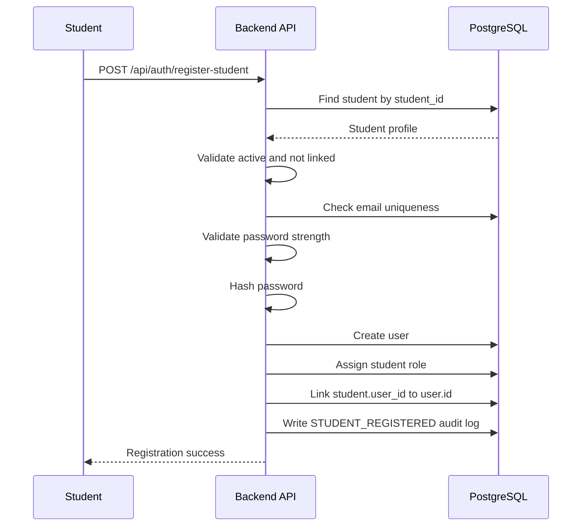
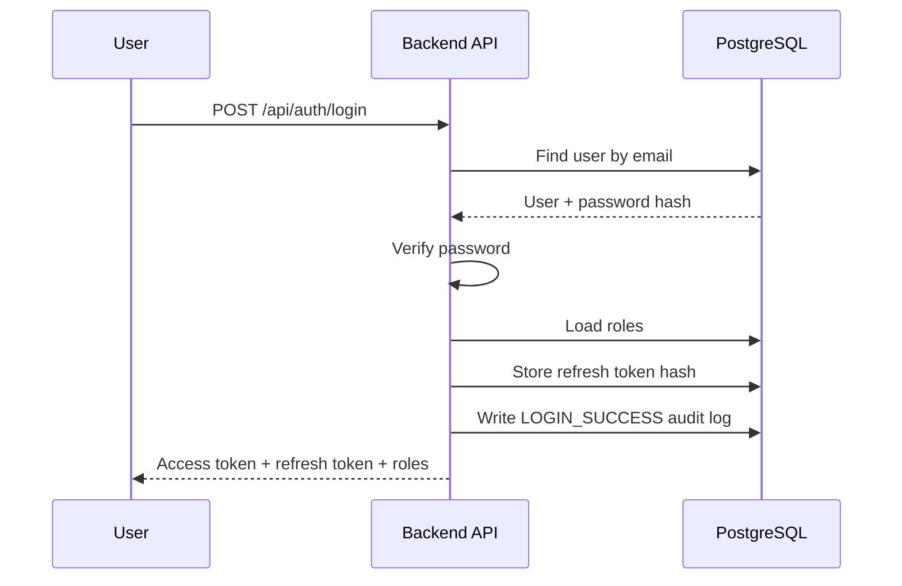
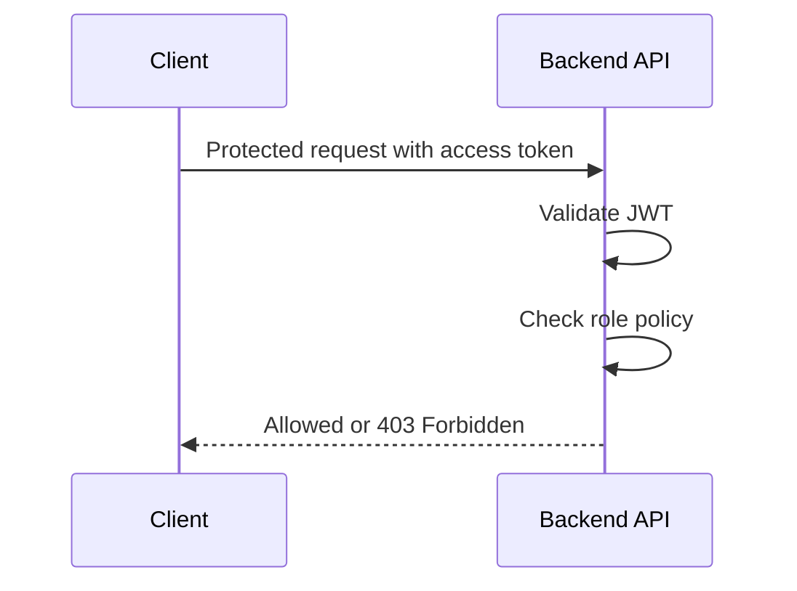
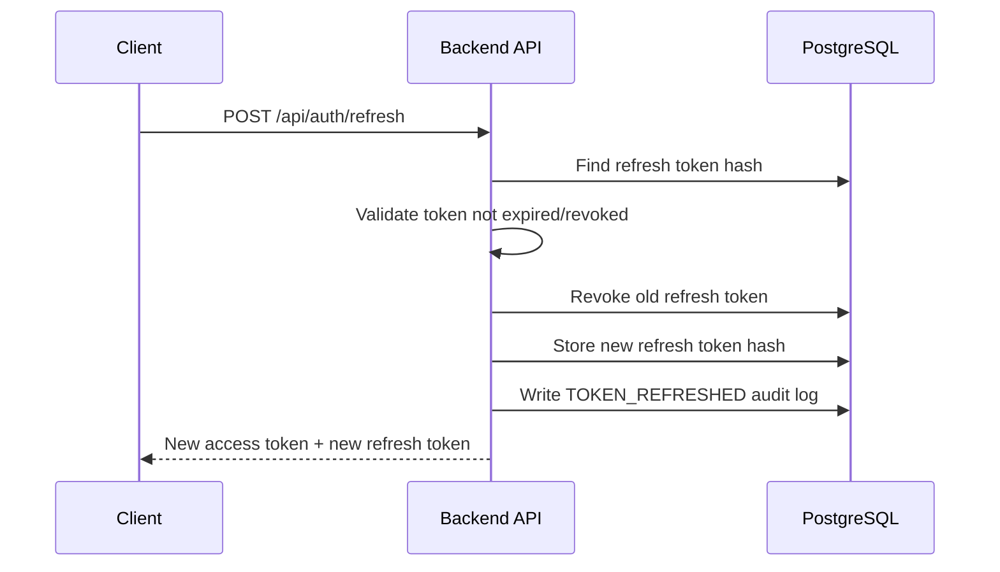
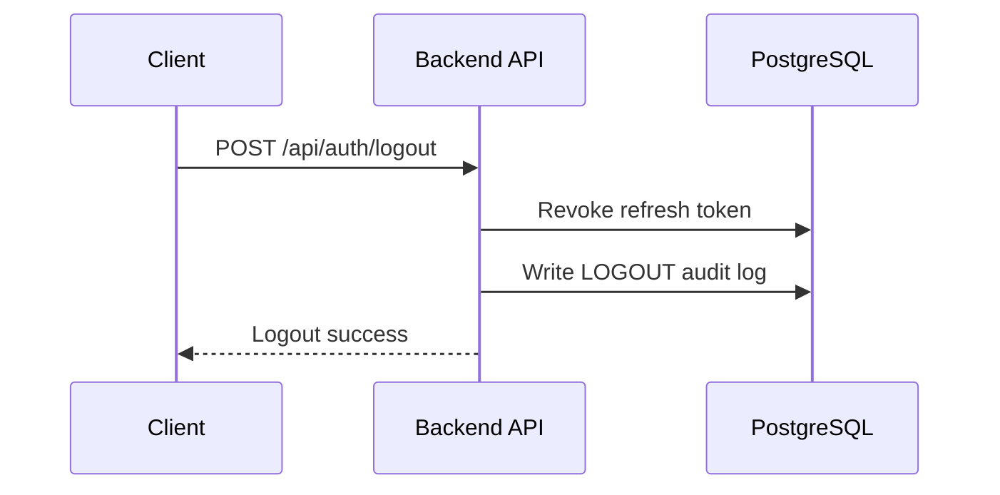

# Feature Spec: Authentication and Access Control

## Description

The Authentication and Access Control feature authenticates users and enforces authorization in UniHub Workshop.

The system supports the following roles:

- `student`
- `organizer`
- `checkin_staff`
- `system_operator` as an optional internal role

Authentication uses email/password login, JWT access tokens, and refresh tokens. Authorization uses RBAC at the Backend API boundary.

Frontend and mobile route guards may be used to improve user experience, but they are not security boundaries. The Backend API is always the source of truth for permission checks.

Student self-registration is supported only for students whose `student_id` already exists in the imported student roster from the legacy CSV system. Organizer, check-in staff, and system operator accounts are not created through public registration. They are created through seed data, admin tooling, or system-operator-controlled workflows.

Actors involved:

| Actor           | Description                                                                                             |
| --------------- | ------------------------------------------------------------------------------------------------------- |
| Student         | Uses the web app to browse workshops, register, view QR tickets, and view notifications                 |
| Organizer       | Uses the admin web app to manage workshops, upload PDFs, view statistics, and monitor processing status |
| Check-in Staff  | Uses the React Native mobile app to scan QR codes and synchronize offline check-in records              |
| System Operator | Optional internal role for viewing audit logs, import reports, and manual correction tasks              |
| Backend API     | Verifies credentials, issues tokens, and enforces role-based endpoint policies                          |
| PostgreSQL      | Stores users, roles, refresh tokens, student profiles, and audit logs                                   |

Data involved:

- `users`
- `roles`
- `user_roles`
- `students`
- `refresh_tokens`
- `audit_logs`

Detailed schema, fields, constraints, and indexes are documented in [`../database.md`](../database.md).

The `users` table stores login and authorization data. The `students` table stores academic/student profile data imported from the legacy CSV system. Organizers and check-in staff are users, but they are not students.

---

## Main Flow

### Main Flow 1: Student Account Registration

1. The student submits `studentId`, email, password, and full name to the Backend API.
2. The Backend API checks whether `studentId` exists in the `students` table imported from CSV.
3. The Backend API checks that the student profile is active.
4. The Backend API checks that the student profile is not already linked to another user.
5. The Backend API checks that the email is not already used by another account.
6. The Backend API validates password strength.
7. The Backend API hashes the password.
8. The Backend API creates a `users` record.
9. The Backend API assigns the `student` role through `user_roles`.
10. The Backend API links `students.user_id` to the newly created user.
11. The Backend API writes an audit log entry `STUDENT_REGISTERED`.
12. The Backend API returns registration success.



### Main Flow 2: Login

1. The user submits email and password to the Backend API.
2. The Backend API finds the user by email in the `users` table.
3. The Backend API checks the account status.
4. The Backend API verifies the submitted password against the stored `password_hash`.
5. The Backend API loads the user's roles from `roles` and `user_roles`.
6. The Backend API creates a short-lived JWT access token.
7. The Backend API creates a refresh token and stores only its hash in `refresh_tokens`.
8. The Backend API writes an audit log entry `LOGIN_SUCCESS`.
9. The Backend API returns the access token, refresh token, expiration time, user profile, and roles.



### Main Flow 3: Access Protected API

1. The client sends a request with the access token.
2. The Backend API validates the JWT signature and expiration.
3. The Backend API identifies the user and their roles.
4. The Backend API checks the endpoint policy.
5. If the user has the required role, the request proceeds.
6. If the user does not have the required role, the Backend API returns `403 Forbidden`.



### Main Flow 4: Refresh Token

1. The client sends a refresh token to the Backend API.
2. The Backend API hashes the refresh token and searches for it in `refresh_tokens`.
3. The Backend API checks that the refresh token is not expired and not revoked.
4. The Backend API revokes the old refresh token.
5. The Backend API creates a new access token and a new refresh token.
6. The Backend API stores only the hash of the new refresh token.
7. The Backend API writes an audit log entry `TOKEN_REFRESHED`.
8. The Backend API returns the new access token and new refresh token.



### Main Flow 5: Logout

1. The client sends the current refresh token to the Backend API.
2. The Backend API revokes the refresh token in `refresh_tokens`.
3. The Backend API writes an audit log entry `LOGOUT`.
4. The Backend API returns logout success.



---

## API Contract

### Student Registration

```http
POST /api/auth/register-student
```

Required role: Public.

Request body:

```json
{
  "studentId": "23123456",
  "email": "student1@university.edu.vn",
  "password": "Password123!",
  "fullName": "Student One"
}
```

Success response:

```json
{
  "success": true,
  "data": {
    "userId": "user-id",
    "email": "student1@university.edu.vn",
    "roles": ["student"]
  }
}
```

Rules:

- `studentId` must exist in the imported `students` table.
- The student profile must be active.
- The student profile must not already be linked to another user.
- The email must not already exist in `users`.
- The public registration endpoint can only create accounts with role `student`.
- Organizer, check-in staff, and system operator accounts cannot be created through this endpoint.

### Login

```http
POST /api/auth/login
```

Required role: Public.

Request body:

```json
{
  "email": "student1@university.edu.vn",
  "password": "Password123!"
}
```

Success response:

```json
{
  "success": true,
  "data": {
    "accessToken": "jwt-access-token",
    "refreshToken": "refresh-token",
    "expiresIn": 900,
    "user": {
      "id": "user-id",
      "email": "student1@university.edu.vn",
      "fullName": "Student One",
      "roles": ["student"]
    }
  }
}
```

### Refresh Token

```http
POST /api/auth/refresh
```

Required role: Valid refresh token.

Request body:

```json
{
  "refreshToken": "refresh-token"
}
```

Success response:

```json
{
  "success": true,
  "data": {
    "accessToken": "new-jwt-access-token",
    "refreshToken": "new-refresh-token",
    "expiresIn": 900
  }
}
```

### Logout

```http
POST /api/auth/logout
```

Required role: Authenticated.

Request body:

```json
{
  "refreshToken": "refresh-token"
}
```

Success response:

```json
{
  "success": true,
  "data": null
}
```

### Get Current User

```http
GET /api/auth/me
```

Required role: Authenticated.

Success response:

```json
{
  "success": true,
  "data": {
    "id": "user-id",
    "email": "student1@university.edu.vn",
    "fullName": "Student One",
    "roles": ["student"],
    "studentProfile": {
      "studentId": "23123456",
      "faculty": "Software Engineering",
      "status": "ACTIVE"
    }
  }
}
```

Rules:

- `studentProfile` is returned only if the user is linked to a student record.
- Organizer and check-in staff accounts may not have a student profile.

---

## Authorization Rules

| Capability                          | Student | Organizer | Check-in Staff | System Operator |
| ----------------------------------- | ------- | --------- | -------------- | --------------- |
| Browse workshop list/detail         | Yes     | Yes       | Limited        | Yes             |
| Register for workshop               | Yes     | No        | No             | No              |
| View own QR ticket                  | Yes     | No        | No             | No              |
| View own notifications              | Yes     | Yes       | Yes            | Yes             |
| Create/update/cancel workshop       | No      | Yes       | No             | No              |
| Upload PDF for AI summary           | No      | Yes       | No             | No              |
| View registration statistics        | No      | Yes       | No             | Yes             |
| View CSV import reports             | No      | Yes       | No             | Yes             |
| Validate QR / sync check-in records | No      | No        | Yes            | No              |
| View audit logs                     | No      | No        | No             | Yes             |
| Manual correction                   | No      | No        | No             | Yes, if enabled |

Example endpoint policies:

| Method | Endpoint                     | Required role       | Purpose                                                        |
| ------ | ---------------------------- | ------------------- | -------------------------------------------------------------- |
| POST   | `/api/auth/register-student` | Public              | Create a student account linked to an imported student profile |
| POST   | `/api/auth/login`            | Public              | Authenticate user and issue tokens                             |
| POST   | `/api/auth/refresh`          | Valid refresh token | Issue a new access token                                       |
| POST   | `/api/auth/logout`           | Authenticated       | Revoke refresh token                                           |
| GET    | `/api/auth/me`               | Authenticated       | Return current user profile and roles                          |
| POST   | `/api/registrations/**`      | `student`           | Register for workshops                                         |
| POST   | `/api/admin/workshops/**`    | `organizer`         | Manage workshops                                               |
| POST   | `/api/checkin/validate`      | `checkin_staff`     | Validate QR                                                    |
| POST   | `/api/checkin/sync`          | `checkin_staff`     | Sync offline check-in records                                  |
| GET    | `/api/admin/audit-logs`      | `system_operator`   | View audit logs                                                |

---

## Error Scenarios

| Scenario                                              | System Behavior                                         | HTTP Status | Error Code                      |
| ----------------------------------------------------- | ------------------------------------------------------- | ----------- | ------------------------------- |
| Student ID not found in imported CSV                  | Reject student registration                             | `404`       | `AUTH_STUDENT_NOT_FOUND`        |
| Student profile inactive                              | Reject student registration                             | `403`       | `AUTH_STUDENT_INACTIVE`         |
| Student profile already linked to another user        | Reject student registration                             | `409`       | `AUTH_STUDENT_ALREADY_LINKED`   |
| Email already exists                                  | Reject registration                                     | `409`       | `AUTH_EMAIL_ALREADY_EXISTS`     |
| Weak password                                         | Reject registration                                     | `400`       | `AUTH_WEAK_PASSWORD`            |
| Invalid email/password                                | Reject login without revealing whether the email exists | `401`       | `AUTH_INVALID_CREDENTIALS`      |
| Disabled account                                      | Reject login                                            | `403`       | `AUTH_ACCOUNT_DISABLED`         |
| Locked account                                        | Reject login                                            | `403`       | `AUTH_ACCOUNT_LOCKED`           |
| Missing access token                                  | Reject request                                          | `401`       | `AUTH_TOKEN_MISSING`            |
| Invalid access token                                  | Reject request                                          | `401`       | `AUTH_TOKEN_INVALID`            |
| Expired access token                                  | Client should use refresh token                         | `401`       | `AUTH_TOKEN_EXPIRED`            |
| Missing/invalid/expired refresh token                 | Require login again                                     | `401`       | `AUTH_REFRESH_TOKEN_INVALID`    |
| Revoked refresh token                                 | Require login again                                     | `401`       | `AUTH_REFRESH_TOKEN_REVOKED`    |
| Valid token but insufficient role                     | Reject request                                          | `403`       | `AUTH_FORBIDDEN`                |
| User has `student` role but no active student profile | Prevent workshop registration                           | `403`       | `AUTH_STUDENT_PROFILE_REQUIRED` |

---

## Constraints

### Security Constraints

- Passwords must never be stored as plaintext.
- Passwords must be stored as salted hashes.
- Raw refresh tokens must not be stored in the database; store only token hashes.
- JWT signing key must be stored in environment/configuration, not hard-coded.
- Access tokens should be short-lived, for example 15 minutes.
- Refresh tokens should live longer, for example 7–30 days depending on project policy.
- Refresh tokens should be rotated after each successful refresh.
- Backend must check roles on every protected endpoint.
- Frontend/mobile route guards must not replace backend authorization.
- Plaintext passwords, raw tokens, and secrets must never be logged.
- Login and registration endpoints should be rate-limited to reduce brute-force and abuse attempts.

### Data Constraints

- `users.email` must be unique.
- `roles.name` must be unique.
- `user_roles(user_id, role_id)` must be unique.
- `students.student_id` must be unique.
- A user may have one or more roles.
- A user may have at most one student profile.
- A student profile can be linked to at most one user account.
- A revoked refresh token must not be usable again.
- Audit logs must not contain plaintext passwords, raw tokens, or secrets.
- Detailed schema and database constraints are documented in [`../database.md`](../database.md).

### Authorization Constraints

- Backend authorization is mandatory for every protected API.
- UI route guards are only for user experience.
- Student-only APIs must require role `student`.
- Organizer-only APIs must require role `organizer`.
- Check-in APIs must require role `checkin_staff`.
- Audit log APIs must require role `system_operator`.
- The public student registration endpoint must not allow assigning organizer, check-in staff, or system operator roles.

### Audit Log Constraints

The system should write audit logs for:

| Action               | Notes                                                  |
| -------------------- | ------------------------------------------------------ |
| `STUDENT_REGISTERED` | Student account registration succeeded                 |
| `LOGIN_SUCCESS`      | Successful login                                       |
| `LOGIN_FAILED`       | Failed login attempt, without storing password         |
| `LOGOUT`             | User logout                                            |
| `TOKEN_REFRESHED`    | Token refresh succeeded                                |
| `ACCESS_DENIED`      | User attempted to access a forbidden endpoint          |
| `ADMIN_ACTION`       | Organizer/system operator performed a sensitive action |

Audit payload must not include plaintext passwords, raw tokens, or secrets.

---

## Acceptance Criteria

### Student Registration

- A student with a valid imported `student_id` can create an account.
- A `student_id` that does not exist in CSV-imported data cannot register.
- An inactive student profile cannot register.
- The same `student_id` cannot be used to create two accounts.
- The same email cannot be used to create two accounts.
- Public registration can only create accounts with role `student`.
- Organizer, check-in staff, and system operator roles cannot be obtained through public registration.
- Successful student registration writes a `STUDENT_REGISTERED` audit log.

### Authentication

- A valid user can log in with email and password.
- Login returns an access token, refresh token, expiration time, user profile, and roles.
- Invalid email/password returns `401 Unauthorized`.
- Disabled or locked accounts return `403 Forbidden`.
- Passwords are stored as salted hashes.
- Login writes a `LOGIN_SUCCESS` audit log.
- Failed login writes a `LOGIN_FAILED` audit log without storing password or token data.

### Token Refresh

- A valid refresh token returns a new access token.
- Expired, invalid, or revoked refresh tokens return `401 Unauthorized`.
- The old refresh token is revoked after rotation.
- Successful refresh writes a `TOKEN_REFRESHED` audit log.

### Logout

- Logout revokes the current refresh token.
- A revoked refresh token cannot be used again.
- Logout writes a `LOGOUT` audit log.

### Authorization

- A student cannot access organizer endpoints.
- A check-in staff account cannot create, update, or cancel workshops.
- Organizer pages/APIs reject unauthenticated access.
- Check-in endpoints reject users without the `checkin_staff` role.
- Backend authorization blocks forbidden actions even if the user manually calls the API with Postman.
- Access denied events on protected endpoints create audit logs.

---

## Implementation Notes

Recommended Java package placement:

```text
src/main/java/com/unihub/
├── presentation/
│   └── controller/auth/
│       └── AuthController.java
├── application/
│   └── auth/
│       ├── AuthCommandService.java
│       ├── RegisterStudentCommand.java
│       ├── LoginCommand.java
│       ├── RefreshTokenCommand.java
│       ├── LogoutCommand.java
│       └── TokenProvider.java
├── domain/
│   ├── user/
│   │   ├── User.java
│   │   ├── Role.java
│   │   ├── UserRepository.java
│   │   └── UserErrorCode.java
│   ├── student/
│   │   ├── Student.java
│   │   ├── StudentRepository.java
│   │   └── StudentErrorCode.java
│   └── auth/
│       ├── RefreshToken.java
│       ├── RefreshTokenRepository.java
│       └── AuthErrorCode.java
└── infrastructure/
    ├── security/
    │   └── jwt/
    │       └── JwtTokenProvider.java
    └── persistence/
        ├── user/
        │   └── UserJpaRepository.java
        ├── student/
        │   └── StudentJpaRepository.java
        └── auth/
            └── RefreshTokenJpaRepository.java
```

Layering rules:

- Controller receives HTTP DTOs and maps them to application commands.
- Application service coordinates student registration, login, refresh, logout, and token issuing.
- Domain model protects user/account/student-profile state.
- Infrastructure implements JWT, password hashing, and database persistence.
- Controllers must not contain password verification, registration rule checks, or role policy logic directly.
