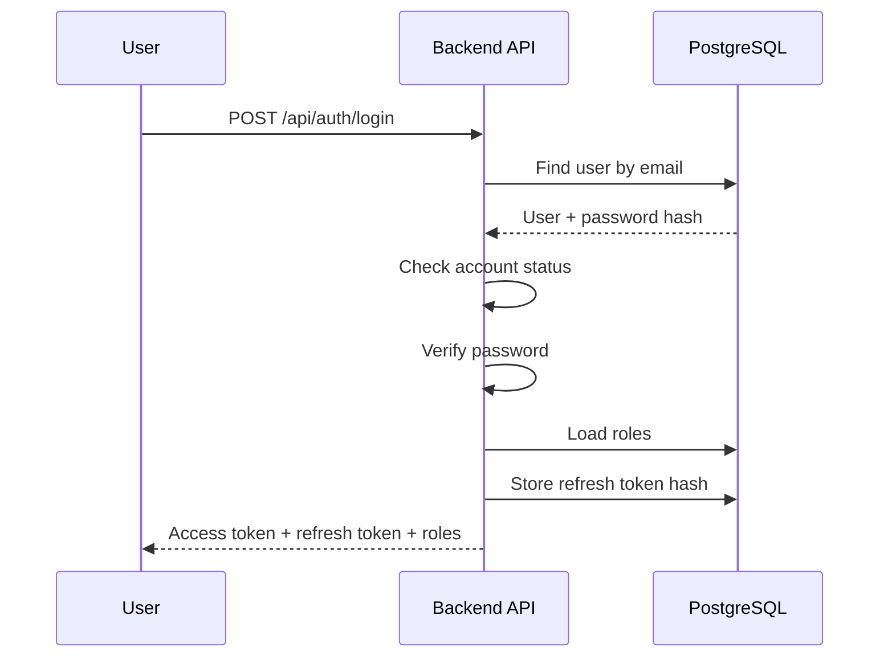
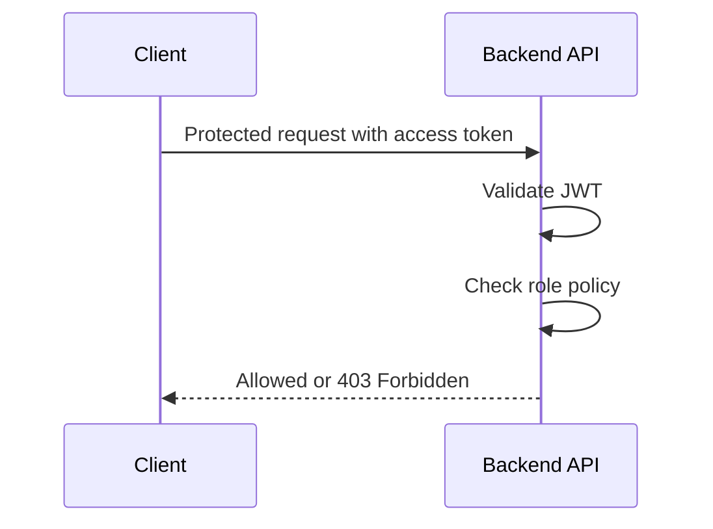
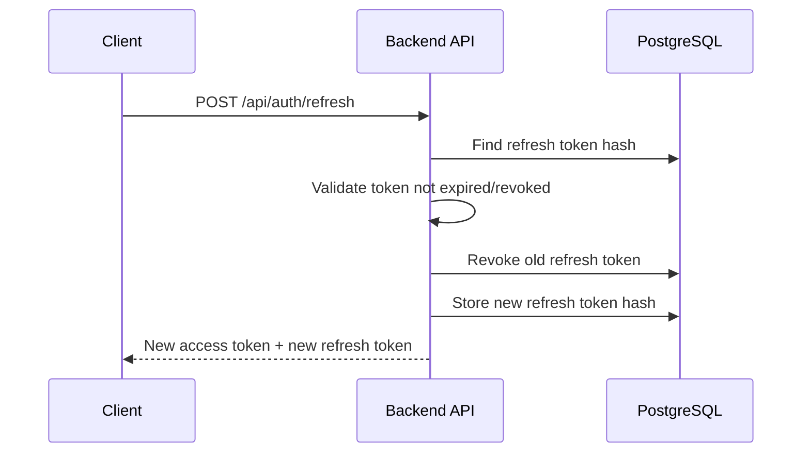
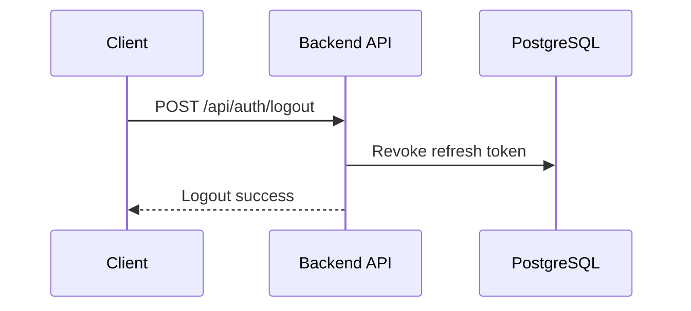
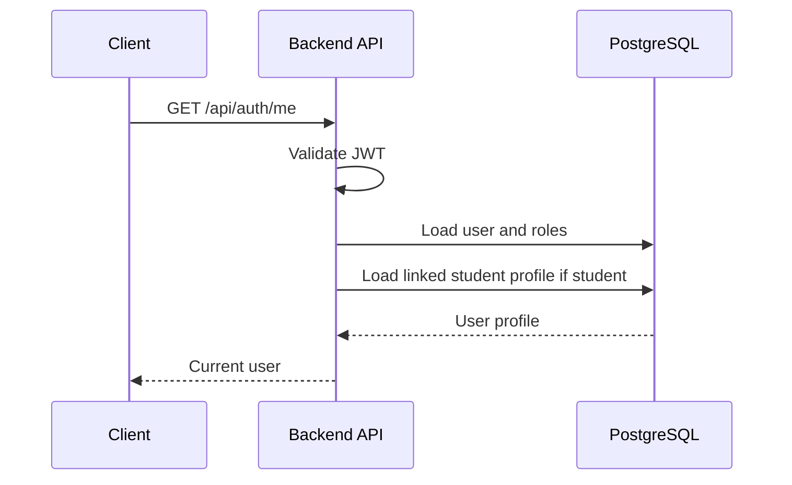

# Feature Spec: Authentication and Access Control

## Description

The Authentication and Access Control feature authenticates users and enforces authorization in UniHub Workshop.

The system supports the following roles:

- `student`
- `organizer`
- `checkin_staff`

Authentication uses email/password login, JWT access tokens, and refresh tokens. Authorization uses RBAC at the Backend API boundary.

Frontend and mobile route guards may be used to improve user experience, but they are not security boundaries. The Backend API is always the source of truth for permission checks.

For the MVP, public student account registration is not implemented. Student, organizer, and check-in staff accounts are prepared through seed data or controlled setup. Student eligibility for workshop registration is verified against the imported `students` table.

Actors involved:

| Actor          | Description                                                                                             |
| -------------- | ------------------------------------------------------------------------------------------------------- |
| Student        | Uses the web app to browse workshops, register, view QR tickets, and view notifications                 |
| Organizer      | Uses the admin web app to manage workshops, upload PDFs, view statistics, and monitor processing status |
| Check-in Staff | Uses the React Native mobile app to scan QR codes and synchronize offline check-in records              |
| Backend API    | Verifies credentials, issues tokens, and enforces role-based endpoint policies                          |
| PostgreSQL     | Stores users, roles, refresh tokens, and linked student profiles                                        |

Data involved:

- `users`
- `roles`
- `user_roles`
- `students`
- `refresh_tokens`

Detailed schema, fields, constraints, and indexes are documented in [`../database.md`](../database.md).

The `users` table stores login and authorization data. The `students` table stores academic/student profile data imported from the legacy CSV system. Organizers and check-in staff are users, but they are not students.

---

## Main Flow

### Main Flow 1: Login

1. The user submits email and password to the Backend API.
2. The Backend API finds the user by email in the `users` table.
3. The Backend API checks the account status.
4. The Backend API verifies the submitted password against the stored `password_hash`.
5. The Backend API loads the user's roles from `roles` and `user_roles`.
6. The Backend API creates a short-lived JWT access token.
7. The Backend API creates a refresh token and stores only its hash in `refresh_tokens`.
8. The Backend API returns the access token, refresh token, expiration time, user profile, and roles.



### Main Flow 2: Access Protected API

1. The client sends a request with the access token.
2. The Backend API validates the JWT signature and expiration.
3. The Backend API identifies the user and their roles.
4. The Backend API checks the endpoint policy.
5. If the user has the required role, the request proceeds.
6. If the user does not have the required role, the Backend API returns `403 Forbidden`.



### Main Flow 3: Refresh Token

1. The client sends a refresh token to the Backend API.
2. The Backend API hashes the refresh token and searches for it in `refresh_tokens`.
3. The Backend API checks that the refresh token is not expired and not revoked.
4. The Backend API revokes the old refresh token.
5. The Backend API creates a new access token and a new refresh token.
6. The Backend API stores only the hash of the new refresh token.
7. The Backend API returns the new access token and new refresh token.



### Main Flow 4: Logout

1. The client sends the current refresh token to the Backend API.
2. The Backend API revokes the refresh token in `refresh_tokens`.
3. The Backend API returns logout success.



### Main Flow 5: Get Current User

1. The client sends a request with the access token.
2. The Backend API validates the JWT.
3. The Backend API loads the current user and roles.
4. If the user has role `student`, the Backend API also loads the linked student profile if available.
5. The Backend API returns current user information.



---

## API Contract

### Login

```http
POST /api/auth/login
```

Required role: Public.

Request body:

```json
{
  "email": "student1@university.edu.vn",
  "password": "Password123!"
}
```

Success response:

```json
{
  "success": true,
  "data": {
    "accessToken": "jwt-access-token",
    "refreshToken": "refresh-token",
    "expiresIn": 900,
    "user": {
      "roles": ["student"]
    }
  }
}
```

Rules:

- The email must belong to an existing user account.
- The account must be active.
- The password must match the stored password hash.
- The response must not expose password hash or internal security fields.

### Refresh Token

```http
POST /api/auth/refresh
```

Required role: Valid refresh token.

Request body:

```json
{
  "refreshToken": "refresh-token"
}
```

Success response:

```json
{
  "success": true,
  "data": {
    "accessToken": "new-jwt-access-token",
    "refreshToken": "new-refresh-token",
    "expiresIn": 900
  }
}
```

Rules:

- Refresh token must be valid, not expired, and not revoked.
- Refresh token should be rotated after successful refresh.
- Old refresh token should be revoked after rotation.

### Logout

```http
POST /api/auth/logout
```

Required role: Authenticated.

Request body:

```json
{
  "refreshToken": "refresh-token"
}
```

Success response:

```json
{
  "success": true,
  "data": null
}
```

Rules:

- The provided refresh token is revoked.
- Already-issued access token may remain valid until expiration.
- The revoked refresh token must not be usable again.

### Get Current User

```http
GET /api/auth/me
```

Required role: Authenticated.

Success response for student:

```json
{
  "success": true,
  "data": {
    "id": "user-id",
    "email": "student1@university.edu.vn",
    "fullName": "Student One",
    "roles": ["student"],
    "studentProfile": {
      "studentId": "23123456",
      "faculty": "Software Engineering",
      "status": "ACTIVE"
    }
  }
}
```

Success response for organizer:

```json
{
  "success": true,
  "data": {
    "id": "organizer-user-id",
    "email": "organizer@university.edu.vn",
    "fullName": "Organizer One",
    "roles": ["organizer"],
    "studentProfile": null
  }
}
```

Rules:

- `studentProfile` is returned only if the user is linked to a student record.
- Organizer and check-in staff accounts may not have a student profile.

---

## Authorization Rules

| Capability                          | Student | Organizer | Check-in Staff |
| ----------------------------------- | ------- | --------- | -------------- |
| Browse workshop list/detail         | Yes     | Yes       | Limited        |
| Register for workshop               | Yes     | No        | No             |
| View own QR ticket                  | Yes     | No        | No             |
| View own notifications              | Yes     | Yes       | Yes            |
| Create/update/cancel workshop       | No      | Yes       | No             |
| Upload PDF for AI summary           | No      | Yes       | No             |
| View registration statistics        | No      | Yes       | No             |
| View CSV import reports             | No      | Yes       | No             |
| Validate QR / sync check-in records | No      | No        | Yes            |

Example endpoint policies:

| Method | Endpoint                  | Required role       | Purpose                               |
| ------ | ------------------------- | ------------------- | ------------------------------------- |
| POST   | `/api/auth/login`         | Public              | Authenticate user and issue tokens    |
| POST   | `/api/auth/refresh`       | Valid refresh token | Issue a new access token              |
| POST   | `/api/auth/logout`        | Authenticated       | Revoke refresh token                  |
| GET    | `/api/auth/me`            | Authenticated       | Return current user profile and roles |
| POST   | `/api/registrations/**`   | `student`           | Register for workshops                |
| POST   | `/api/admin/workshops/**` | `organizer`         | Manage workshops                      |
| POST   | `/api/checkin/validate`   | `checkin_staff`     | Validate QR                           |
| POST   | `/api/checkin/sync`       | `checkin_staff`     | Sync offline check-in records         |

---

## Error Scenarios

| Scenario                          | System Behavior                                         | HTTP Status | Error Code                   |
| --------------------------------- | ------------------------------------------------------- | ----------- | ---------------------------- |
| Invalid email/password            | Reject login without revealing whether the email exists | `401`       | `AUTH_INVALID_CREDENTIALS`   |
| Disabled account                  | Reject login                                            | `403`       | `AUTH_ACCOUNT_DISABLED`      |
| Locked account                    | Reject login                                            | `403`       | `AUTH_ACCOUNT_LOCKED`        |
| Missing access token              | Reject request                                          | `401`       | `AUTH_TOKEN_MISSING`         |
| Invalid access token              | Reject request                                          | `401`       | `AUTH_TOKEN_INVALID`         |
| Expired access token              | Client should use refresh token                         | `401`       | `AUTH_TOKEN_EXPIRED`         |
| Missing refresh token             | Reject refresh request                                  | `401`       | `AUTH_REFRESH_TOKEN_MISSING` |
| Invalid refresh token             | Require login again                                     | `401`       | `AUTH_REFRESH_TOKEN_INVALID` |
| Expired refresh token             | Require login again                                     | `401`       | `AUTH_REFRESH_TOKEN_EXPIRED` |
| Revoked refresh token             | Require login again                                     | `401`       | `AUTH_REFRESH_TOKEN_REVOKED` |
| Valid token but insufficient role | Reject request                                          | `403`       | `AUTH_FORBIDDEN`             |

---

## Constraints

### Security Constraints

- Passwords must never be stored as plaintext.
- Passwords must be stored as salted hashes.
- Raw refresh tokens must not be stored in the database; store only token hashes.
- JWT signing key must be stored in environment/configuration, not hard-coded.
- Access tokens should be short-lived, for example 15 minutes.
- Refresh tokens should live longer, for example 7–30 days depending on project policy.
- Refresh tokens should be rotated after each successful refresh.
- Backend must check roles on every protected endpoint.
- Frontend/mobile route guards must not replace backend authorization.
- Plaintext passwords, raw tokens, and secrets must never be logged.
- Login endpoint should be rate-limited to reduce brute-force attempts.

### Data Constraints

- `users.email` must be unique.
- `roles.name` must be unique.
- `user_roles(user_id, role_id)` must be unique.
- `students.student_id` must be unique.
- A user may have one or more roles.
- A user may have at most one linked student profile.
- A revoked refresh token must not be usable again.
- Detailed schema and database constraints are documented in [`../database.md`](../database.md).

### Authorization Constraints

- Backend authorization is mandatory for every protected API.
- UI route guards are only for user experience.
- Student-only APIs must require role `student`.
- Organizer-only APIs must require role `organizer`.
- Check-in APIs must require role `checkin_staff`.
- Public endpoints must not allow role escalation.

### MVP Scope Constraints

- Public student account registration is not part of the MVP.
- Student accounts are prepared through seed data or controlled setup.
- Organizer and check-in staff accounts are prepared through seed data or controlled setup.
- Student eligibility for workshop registration is checked in the Registration feature using the imported `students` table.

---

## Acceptance Criteria

### Authentication

- A valid user can log in with email and password.
- Login returns an access token, refresh token, expiration time, user profile, and roles.
- Invalid email/password returns `401 Unauthorized`.
- Disabled or locked accounts return `403 Forbidden`.
- Passwords are stored as salted hashes.
- Raw refresh tokens are not stored in the database.

### Token Refresh

- A valid refresh token returns a new access token.
- Expired, invalid, or revoked refresh tokens return `401 Unauthorized`.
- The old refresh token is revoked after rotation.
- A revoked refresh token cannot be used again.

### Logout

- Logout revokes the current refresh token.
- A revoked refresh token cannot be used again.
- Logging out does not require deleting the user account.

### Current User

- Authenticated users can call `/api/auth/me`.
- `/api/auth/me` returns user ID, email, full name, and roles.
- Student users may receive linked student profile information.
- Organizer and check-in staff users may have `studentProfile: null`.

### Authorization

- A student cannot access organizer endpoints.
- A check-in staff account cannot create, update, or cancel workshops.
- Organizer pages/APIs reject unauthenticated access.
- Check-in endpoints reject users without the `checkin_staff` role.
- Backend authorization blocks forbidden actions even if the user manually calls the API with Postman.

---
