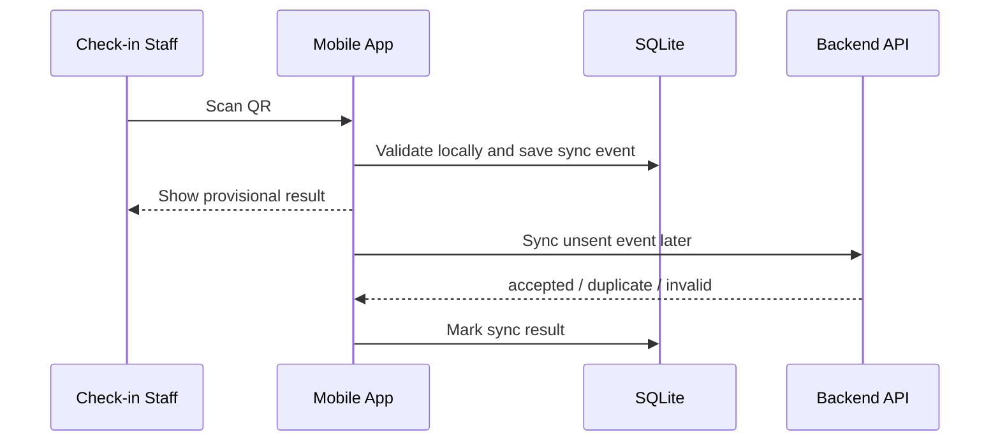

# Feature Spec: QR Check-in and Offline Synchronization

## Description

This feature allows check-in staff to scan student QR codes at workshop entrances using a mobile app, including in areas with unstable connectivity. It must support provisional offline validation, durable local storage, and safe synchronization once the network returns.

## Main Flow

### Online check-in

1. Staff scans a student QR code.
2. Mobile app sends the QR payload and session context to the backend.
3. Backend verifies the QR ticket, registration state, session identity, and duplicate check-in.
4. Backend creates a `checkin_record` and returns success.

### Offline check-in

1. Before the event, the mobile app downloads session metadata and local validation data.
2. While offline, staff scans the QR code.
3. The mobile app validates as much as possible locally and stores a provisional event in SQLite.
4. When the network returns, the app syncs unsent events to the backend.
5. Backend upserts each event by `sync_event_id` and `registration_id`.

## Key Design Decisions

- **Choice:** Local SQLite queue for offline events.
  - **Why:** Unsynced check-ins must survive app restarts and temporary power loss.
  - **Trade-offs / risks:** The app must manage local schema migrations and protected storage.
  - **Alternatives not chosen:** In-memory queues were rejected because data could be lost.

- **Choice:** Backend idempotency by `sync_event_id` plus uniqueness on `registration_id`.
  - **Why:** Sync retries and duplicate scans are expected.
  - **Trade-offs / risks:** Device clock and event creation logic must stay deterministic enough for audit review.
  - **Alternatives not chosen:** Trusting the mobile app to prevent duplicates alone was rejected because multiple devices may scan the same QR.

## Error Scenarios

- QR code is malformed: reject immediately and do not create a record.
- Registration is not confirmed: reject check-in.
- QR belongs to another session: reject and show session mismatch.
- Duplicate check-in during sync: backend returns `duplicate`; local event is marked resolved without creating a second record.
- Sync interrupted: event remains pending in SQLite and retries later.

## Constraints

- Check-in must be fast enough for door traffic and should not depend on AI, payment, or notification services.
- Offline data must be encrypted or otherwise protected by device-level security where possible.
- Local cache must be refreshed before the event to reduce offline validation errors.
- Backend remains the source of truth for final attendance status.

## Acceptance Criteria

- Staff can check in students online in real time.
- Staff can continue scanning offline and keep records after app restart.
- Syncing the same offline event twice does not create duplicate attendance.
- The system detects when a student was already checked in.
- Invalid or session-mismatched QR codes are rejected clearly.
