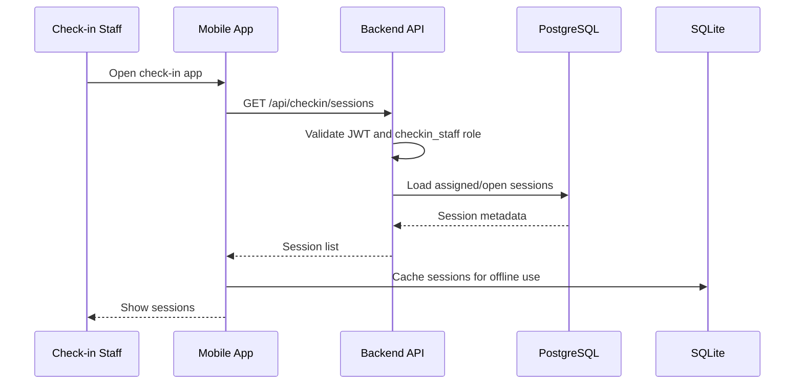
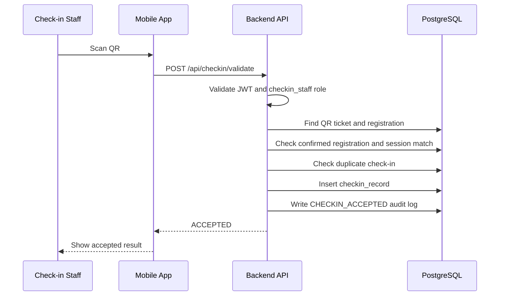
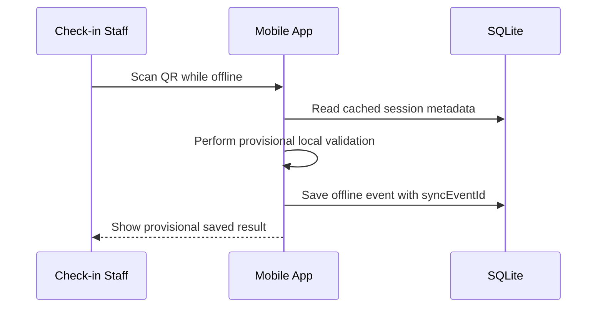
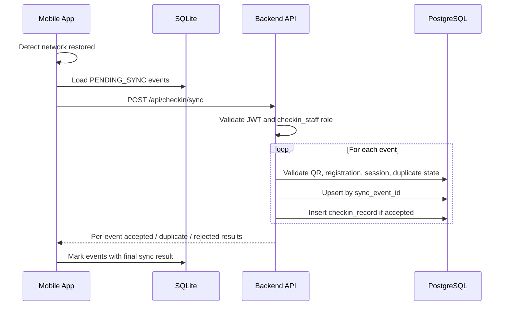
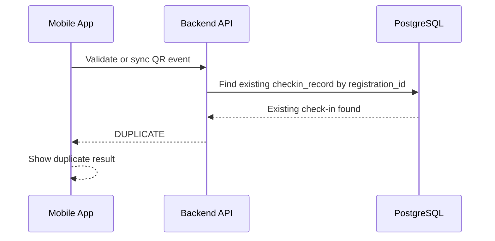

# Feature Spec: QR Check-in and Offline Synchronization

## Description

The QR Check-in and Offline Synchronization feature allows check-in staff to verify student attendance at workshop entrances using the React Native mobile app.

The feature must support both online and offline operation:

- When the device is online, the mobile app sends the QR payload to the Backend API for immediate validation.
- When the device is offline, the mobile app performs provisional local validation and stores check-in events in SQLite.
- When connectivity returns, the mobile app synchronizes queued events to the Backend API.
- The backend remains the final source of truth for attendance status.

Offline check-in results shown on the mobile app are provisional. A check-in event becomes final only after backend validation returns `ACCEPTED`, `DUPLICATE`, or `REJECTED`.

Actors involved:

| Actor                   | Description                                                                              |
| ----------------------- | ---------------------------------------------------------------------------------------- |
| Check-in Staff          | Scans QR codes and synchronizes offline events                                           |
| Student                 | Presents a QR ticket at the workshop entrance                                            |
| React Native Mobile App | Scans QR codes, stores cached session data, saves offline events, and syncs with backend |
| SQLite Local Database   | Stores cached sessions and unsynced offline check-in events on the device                |
| Backend API             | Validates QR tickets, checks registration state, and records attendance                  |
| PostgreSQL              | Stores registrations, QR tickets, check-in records, and session data                     |
| Redis                   | Optional support for rate limiting or sync throttling                                    |

Data involved:

- `checkin_records`
- `qr_tickets`
- `registrations`
- `workshop_sessions`
- `audit_logs`
- local SQLite `cached_sessions`
- local SQLite `offline_checkin_events`

Detailed schema, fields, constraints, and indexes are documented in [`../database.md`](../database.md).

---

## Main Flow

### Main Flow 1: Load Assigned Sessions for Check-in

1. Check-in staff logs in to the React Native mobile app.
2. The mobile app calls the Backend API to load assigned or available check-in sessions.
3. The Backend API validates the access token and checks role `checkin_staff`.
4. The Backend API returns session metadata needed for check-in.
5. The mobile app stores session metadata in SQLite for offline use.
6. The mobile app shows the available check-in sessions to staff.



### Main Flow 2: Online QR Check-in

1. Check-in staff selects the active workshop session in the mobile app.
2. Staff scans the student's QR code.
3. The mobile app sends `sessionId`, `qrToken`, and `scannedAt` to the Backend API.
4. The Backend API validates the access token and checks role `checkin_staff`.
5. The Backend API verifies the QR ticket.
6. The Backend API checks that the related registration is `CONFIRMED`.
7. The Backend API checks that the QR ticket belongs to the selected session.
8. The Backend API checks that the registration has not already been checked in.
9. The Backend API creates a `checkin_records` row.
10. The Backend API writes an audit log entry.
11. The Backend API returns `ACCEPTED`.



### Main Flow 3: Offline QR Scan and Local Provisional Save

1. Check-in staff selects the active session while the app is offline.
2. Staff scans the student's QR code.
3. The mobile app checks cached session data where possible.
4. The mobile app creates a local `syncEventId`.
5. The mobile app stores the scanned QR event in SQLite with status `PENDING_SYNC`.
6. The mobile app shows a provisional result to staff.
7. The event remains in SQLite until synchronization succeeds.



### Main Flow 4: Offline Event Synchronization

1. The mobile app detects that network connectivity has returned.
2. The mobile app reads unsynced events from SQLite.
3. The mobile app sends the queued events to the Backend API.
4. The Backend API validates the access token and checks role `checkin_staff`.
5. For each event, the Backend API verifies QR ticket, registration status, selected session, and duplicate check-in state.
6. The Backend API processes each event idempotently using `syncEventId`.
7. The Backend API creates a `checkin_records` row if the event is valid and not duplicate.
8. The Backend API returns per-event results: `ACCEPTED`, `DUPLICATE`, or `REJECTED`.
9. The mobile app updates local SQLite sync status for each event.



### Main Flow 5: Duplicate Check-in Handling

1. A QR code is scanned for a registration that already has a successful check-in.
2. The Backend API detects an existing `checkin_records` row for that registration.
3. The Backend API does not create a new attendance record.
4. The Backend API returns `DUPLICATE`.
5. The mobile app shows a clear duplicate result to staff.



---

## API Contract

### Load Check-in Sessions

```http
GET /api/checkin/sessions
```

Required role: `checkin_staff`.

Success response:

```json
{
  "success": true,
  "data": [
    {
      "sessionId": "s-101",
      "workshopTitle": "Career Skills Workshop",
      "roomName": "A101",
      "startAt": "2026-05-10T09:00:00Z",
      "endAt": "2026-05-10T11:00:00Z",
      "checkinOpen": true
    }
  ]
}
```

Rules:

- Only check-in staff can load check-in sessions.
- Returned data should be enough for offline session selection and basic validation.
- Sensitive QR secrets should not be exposed in this response unless explicitly required and protected.

### Online QR Validation

```http
POST /api/checkin/validate
```

Required role: `checkin_staff`.

Request body:

```json
{
  "sessionId": "s-101",
  "qrToken": "qr-encoded-token",
  "scannedAt": "2026-05-01T08:10:00Z"
}
```

Success response: accepted

```json
{
  "success": true,
  "data": {
    "result": "ACCEPTED",
    "registrationId": "r-001",
    "studentName": "Student One",
    "studentId": "23123456",
    "checkedInAt": "2026-05-01T08:10:00Z"
  }
}
```

Success response: duplicate

```json
{
  "success": true,
  "data": {
    "result": "DUPLICATE",
    "registrationId": "r-001",
    "studentName": "Student One",
    "studentId": "23123456",
    "previousCheckedInAt": "2026-05-01T08:05:00Z"
  }
}
```

Rules:

- `qrToken` must be valid and not revoked.
- Registration must be `CONFIRMED`.
- Registration must belong to the selected session.
- One registration can have at most one successful check-in.

### Offline Sync

```http
POST /api/checkin/sync
```

Required role: `checkin_staff`.

Request body:

```json
{
  "events": [
    {
      "syncEventId": "sync-001",
      "sessionId": "s-101",
      "qrToken": "qr-encoded-token",
      "scannedAt": "2026-05-01T08:10:00Z",
      "deviceId": "device-001"
    }
  ]
}
```

Success response:

```json
{
  "success": true,
  "data": {
    "results": [
      {
        "syncEventId": "sync-001",
        "result": "ACCEPTED",
        "registrationId": "r-001",
        "studentId": "23123456",
        "checkedInAt": "2026-05-01T08:10:00Z"
      }
    ]
  }
}
```

Possible per-event results:

| Result           | Meaning                                                         |
| ---------------- | --------------------------------------------------------------- |
| `ACCEPTED`       | Event is valid and attendance was recorded                      |
| `DUPLICATE`      | Registration was already checked in                             |
| `REJECTED`       | Event is invalid, mismatched, expired, revoked, or unauthorized |
| `ALREADY_SYNCED` | Same `syncEventId` was already processed                        |

Rules:

- Sync must be idempotent by `syncEventId`.
- A retry of the same event must not create duplicate attendance.
- If two devices scan the same registration, backend accepts the first valid event and returns `DUPLICATE` for later events.
- The backend final result overrides provisional local validation.

---

## Authorization Rules

| Capability                        | Student | Organizer       | Check-in Staff | System Operator |
| --------------------------------- | ------- | --------------- | -------------- | --------------- |
| Load check-in sessions            | No      | No              | Yes            | Yes, if enabled |
| Validate QR online                | No      | No              | Yes            | No              |
| Save offline scan locally         | No      | No              | Yes            | No              |
| Sync offline check-ins            | No      | No              | Yes            | No              |
| View check-in results for session | No      | Yes, if enabled | Yes, limited   | Yes, if enabled |
| Manually correct check-in         | No      | No              | No             | Yes, if enabled |

Example endpoint policies:

| Method | Endpoint                                            | Required role                    | Purpose                                |
| ------ | --------------------------------------------------- | -------------------------------- | -------------------------------------- |
| GET    | `/api/checkin/sessions`                             | `checkin_staff`                  | Load check-in sessions for mobile app  |
| POST   | `/api/checkin/validate`                             | `checkin_staff`                  | Validate QR and record check-in online |
| POST   | `/api/checkin/sync`                                 | `checkin_staff`                  | Synchronize offline check-in events    |
| GET    | `/api/admin/sessions/{sessionId}/checkins`          | `organizer` or `system_operator` | Optional admin check-in report         |
| POST   | `/api/admin/checkins/{checkinId}/manual-correction` | `system_operator`                | Optional internal correction flow      |

---

## Error Scenarios

| Scenario                                             | System Behavior                                       | HTTP Status               | Error Code                           |
| ---------------------------------------------------- | ----------------------------------------------------- | ------------------------- | ------------------------------------ |
| Missing or invalid access token                      | Reject request                                        | `401`                     | `AUTH_TOKEN_INVALID`                 |
| User does not have `checkin_staff` role              | Reject request                                        | `403`                     | `AUTH_FORBIDDEN`                     |
| Malformed QR token                                   | Reject event                                          | `400`                     | `CHECKIN_INVALID_QR`                 |
| QR token not found                                   | Reject event                                          | `404`                     | `CHECKIN_QR_NOT_FOUND`               |
| QR ticket revoked                                    | Reject event                                          | `409`                     | `CHECKIN_QR_REVOKED`                 |
| QR ticket expired                                    | Reject event                                          | `409`                     | `CHECKIN_QR_EXPIRED`                 |
| Registration not found                               | Reject event                                          | `404`                     | `CHECKIN_REGISTRATION_NOT_FOUND`     |
| Registration not confirmed                           | Reject event                                          | `409`                     | `CHECKIN_REGISTRATION_NOT_CONFIRMED` |
| QR belongs to another session                        | Reject with mismatch result                           | `409`                     | `CHECKIN_SESSION_MISMATCH`           |
| Session not open for check-in                        | Reject event                                          | `409`                     | `CHECKIN_SESSION_NOT_OPEN`           |
| Duplicate check-in                                   | Return duplicate result without creating a new record | `200`                     | `CHECKIN_DUPLICATE`                  |
| Same sync event sent twice                           | Return previous result or `ALREADY_SYNCED`            | `200`                     | `CHECKIN_EVENT_ALREADY_SYNCED`       |
| Sync payload contains mixed valid and invalid events | Process independently and return per-event results    | `200`                     | `CHECKIN_PARTIAL_SYNC_RESULT`        |
| Sync interrupted due to network loss                 | Keep event pending in SQLite and retry later          | Client-side pending state | `CHECKIN_SYNC_PENDING`               |
| Local cache stale                                    | Backend final validation overrides local result       | `200` or `409`            | `CHECKIN_CACHE_STALE`                |
| Database write fails                                 | Do not mark event synced locally; retry later         | `500`                     | `CHECKIN_RECORD_FAILED`              |

---

## Constraints

### Business Constraints

- Only users with role `checkin_staff` can validate QR codes and sync offline check-in events.
- A registration must be `CONFIRMED` before it can be checked in.
- QR ticket must belong to the selected workshop session.
- One registration can have at most one successful check-in.
- Offline check-in is provisional until backend synchronization succeeds.
- Backend is the final source of truth for attendance state.
- Check-in does not depend on payment, AI summary, or notification services at scan time.

### Offline and Sync Constraints

- The mobile app must store offline check-in events durably in SQLite.
- Offline events must survive app restart.
- Each offline event must have a unique `syncEventId`.
- Sync must be idempotent by `syncEventId`.
- If the same event is retried, backend must not create duplicate attendance.
- If multiple devices scan the same registration, backend accepts the first valid check-in and returns `DUPLICATE` for later events.
- Local session cache should be refreshed before the event starts.
- Stale local cache must not override backend validation.

### Data Constraints

- `checkin_records.registration_id` must be unique for successful check-ins.
- `checkin_records.sync_event_id` must be unique when provided.
- `qr_tickets.registration_id` must be unique.
- QR token or QR secret must not be guessable.
- Detailed schema and database constraints are documented in [`../database.md`](../database.md).

### Security Constraints

- QR tokens should be signed, random, or otherwise tamper-resistant.
- Raw QR secrets must not be logged.
- Check-in endpoints must require backend RBAC checks.
- Device-local offline data should be protected using available device security where possible.
- Lost or compromised devices should be handled operationally by revoking staff access if needed.
- Audit logs must not contain raw QR secrets or sensitive tokens.

### Performance Constraints

- Online check-in validation should be fast enough for door traffic.
- The mobile app should show immediate feedback after a scan.
- Sync should process events in batches.
- A large sync batch should return per-event results instead of failing the entire batch when only some events are invalid.
- Check-in APIs should not call AI, notification, or payment providers in the request path.

### Audit Constraints

The system should write audit logs for:

| Action                      | Notes                                                |
| --------------------------- | ---------------------------------------------------- |
| `CHECKIN_ACCEPTED`          | Valid check-in recorded                              |
| `CHECKIN_DUPLICATE`         | Duplicate check-in attempt detected                  |
| `CHECKIN_REJECTED`          | Invalid or mismatched QR rejected                    |
| `CHECKIN_SYNC_COMPLETED`    | Offline sync batch completed                         |
| `CHECKIN_ACCESS_DENIED`     | Non-staff attempted check-in operation               |
| `CHECKIN_MANUAL_CORRECTION` | System operator corrected check-in state, if enabled |

Audit payload must not contain raw QR secrets, plaintext tokens, or sensitive credentials.

---

## Acceptance Criteria

### Online Check-in

- Check-in staff can scan a valid QR online and receive `ACCEPTED`.
- A valid online check-in creates exactly one `checkin_records` row.
- A registration that is not `CONFIRMED` is rejected.
- A QR ticket belonging to another session is rejected.
- A revoked, expired, malformed, or unknown QR token is rejected clearly.
- Online check-in remains independent from payment, notification, and AI services.

### Offline Check-in

- Check-in staff can scan QR codes while offline.
- Offline scan events are saved in SQLite with status `PENDING_SYNC`.
- Offline events survive app restart.
- The mobile app shows provisional feedback when offline.
- Local cache can be refreshed before the event.
- Backend validation overrides local provisional validation after sync.

### Synchronization

- When connectivity returns, the mobile app syncs pending events to the backend.
- Sync returns per-event results: `ACCEPTED`, `DUPLICATE`, `REJECTED`, or `ALREADY_SYNCED`.
- Retrying the same sync event does not create duplicate attendance.
- If two devices scan the same registration, only the first valid event creates attendance.
- Invalid events do not block valid events in the same sync batch.
- Events that fail due to network interruption remain pending locally and can be retried.

### Authorization

- Student accounts cannot call check-in validation or sync APIs.
- Organizer accounts cannot create check-in records through check-in staff endpoints.
- Check-in staff accounts can only access check-in flows.
- Backend authorization blocks forbidden check-in actions even if the user manually calls the API with Postman.

### Audit

- Accepted check-ins create `CHECKIN_ACCEPTED` audit logs.
- Duplicate attempts create `CHECKIN_DUPLICATE` audit logs or equivalent trace records.
- Rejected QR scans create `CHECKIN_REJECTED` audit logs.
- Access denied attempts create audit logs.
- Audit logs do not store raw QR secrets.

---

## Implementation Notes

Recommended Java package placement:

```text
src/main/java/com/unihub/
├── presentation/
│   └── controller/checkin/
│       └── CheckinController.java
├── application/
│   └── checkin/
│       ├── CheckinCommandService.java
│       ├── CheckinQueryService.java
│       ├── ValidateQrCommand.java
│       ├── SyncCheckinEventsCommand.java
│       ├── CheckinEventResult.java
│       └── CheckinSessionQuery.java
├── domain/
│   ├── checkin/
│   │   ├── CheckinRecord.java
│   │   ├── CheckinResult.java
│   │   ├── CheckinPolicy.java
│   │   ├── CheckinRepository.java
│   │   └── CheckinErrorCode.java
│   ├── qrticket/
│   │   ├── QrTicket.java
│   │   ├── QrTicketVerifier.java
│   │   └── QrTicketRepository.java
│   └── registration/
│       ├── Registration.java
│       └── RegistrationRepository.java
└── infrastructure/
    ├── persistence/
    │   ├── checkin/
    │   │   └── CheckinJpaRepository.java
    │   ├── qrticket/
    │   │   └── QrTicketJpaRepository.java
    │   └── registration/
    │       └── RegistrationJpaRepository.java
    └── redis/
        └── CheckinRateLimitStore.java
```

Recommended React Native local storage structure:

```text
mobile-app/
└── local-db/
    ├── cached_sessions
    └── offline_checkin_events
```

Suggested local SQLite tables:

```text
cached_sessions
- session_id
- workshop_title
- room_name
- start_at
- end_at
- checkin_open
- cached_at

offline_checkin_events
- sync_event_id
- session_id
- qr_token
- scanned_at
- device_id
- local_status
- server_result
- synced_at
- error_code
```

Layering rules:

- Controller receives HTTP DTOs and maps them to application commands.
- Application service coordinates online validation, offline sync, and transaction boundaries.
- Domain model protects check-in rules, duplicate detection, QR validity, and registration status requirements.
- Infrastructure implements persistence, QR lookup, and optional Redis rate limiting.
- React Native local SQLite stores provisional offline events only.
- Backend and PostgreSQL remain the source of truth for final attendance.
- Controllers must not contain QR validation or duplicate check-in logic directly.
