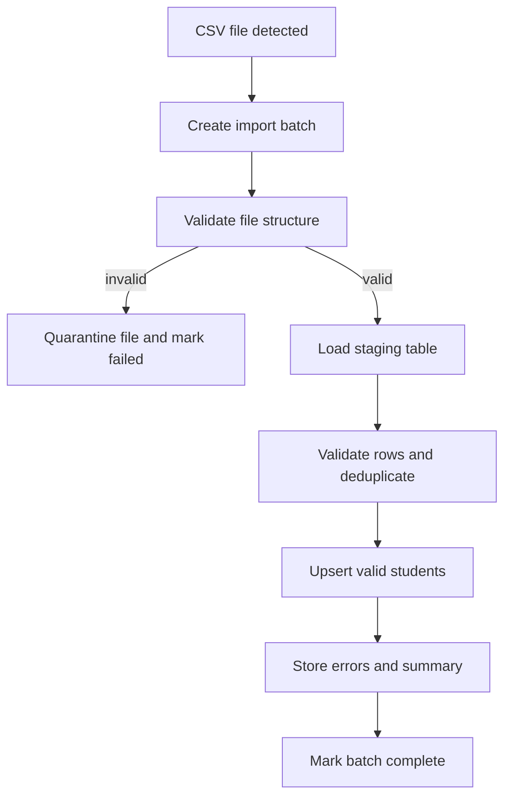

# Feature Spec: Nightly Student CSV Import

## Description

This feature imports student roster data from the legacy Student Management System using nightly CSV exports. It updates the local student directory used for registration eligibility while keeping the live system stable even when files are invalid or duplicated.

## Main Flow

1. CSV import worker detects a new nightly CSV file.
2. Worker creates a `csv_import_batch` audit record.
3. Worker validates file format, header names, encoding, and checksum.
4. Worker loads rows into a staging table.
5. Worker validates required fields and deduplicates rows by `student_id`.
6. Worker upserts valid rows into `students`.
7. Worker records row-level errors and marks the batch `success`, `partial_success`, or `failed`.

## Key Design Decisions

- **Choice:** Staging-table import before production upsert.
  - **Why:** It isolates bad data from the live student directory and supports row-level validation reports.
  - **Trade-offs / risks:** More schema and worker logic than direct import.
  - **Alternatives not chosen:** Direct upsert was rejected because invalid files could partially corrupt live data.

- **Choice:** Batch audit with checksum and error report.
  - **Why:** Operators need traceability for nightly imports and duplicate file detection.
  - **Trade-offs / risks:** Slightly more storage for import history.
  - **Alternatives not chosen:** Logging only to console was rejected because it is not sufficient for reporting and debugging.

## Error Scenarios

- File missing on schedule: mark batch as missed and alert organizers/admins if that alerting feature is implemented.
- Header mismatch: reject the file before row import.
- Duplicate student IDs in the same file: keep the latest valid row by deterministic rule and record a warning.
- Invalid rows mixed with valid rows: import valid rows and report the invalid ones.
- Database failure mid-import: roll back the current import transaction and leave previous student data intact.

## Constraints

- Import must not interrupt workshop browsing or check-in.
- Existing valid student records must remain usable if a nightly file fails.
- The import process should be idempotent for the same file checksum.
- Student identity used by registration must come from the latest successful import batch, not from partially failed raw files.

## Acceptance Criteria

- Valid nightly CSV files update student records successfully.
- Invalid files are quarantined and do not overwrite existing data.
- Duplicate rows are handled deterministically and reported.
- Registration can still use the last successful student dataset if the newest import fails.
- Each import run has a batch history entry with status and error counts.
