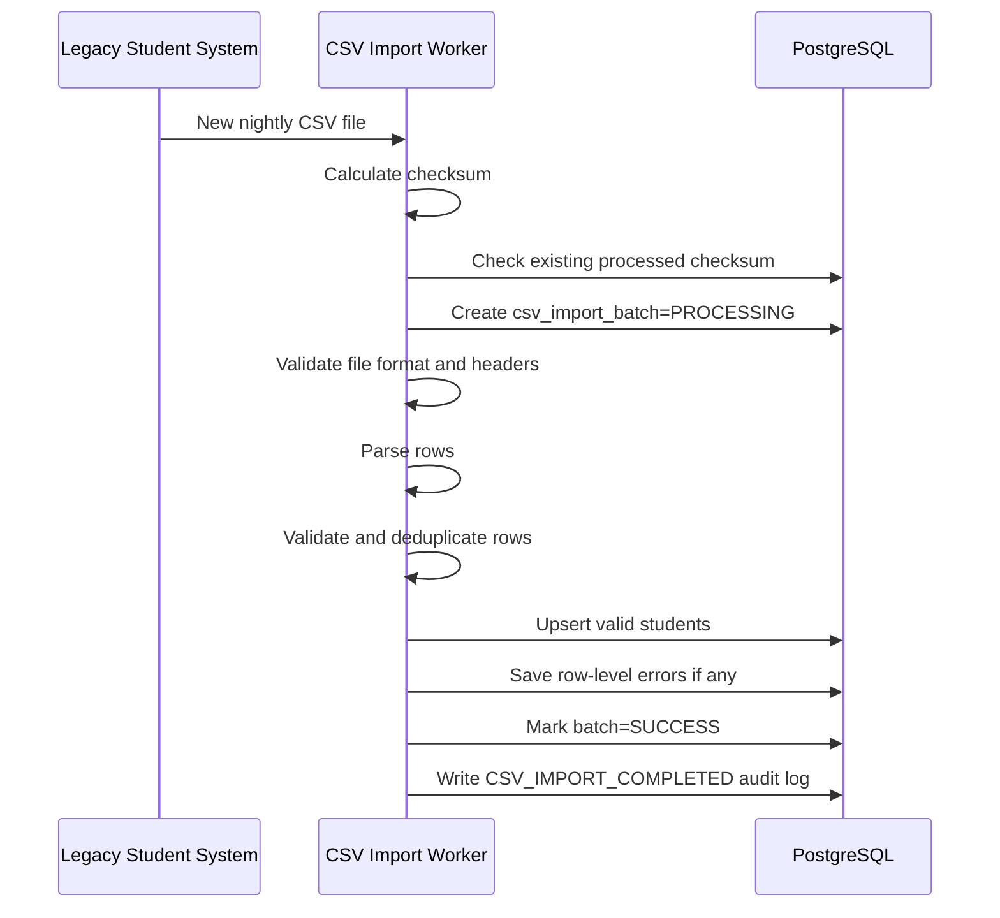
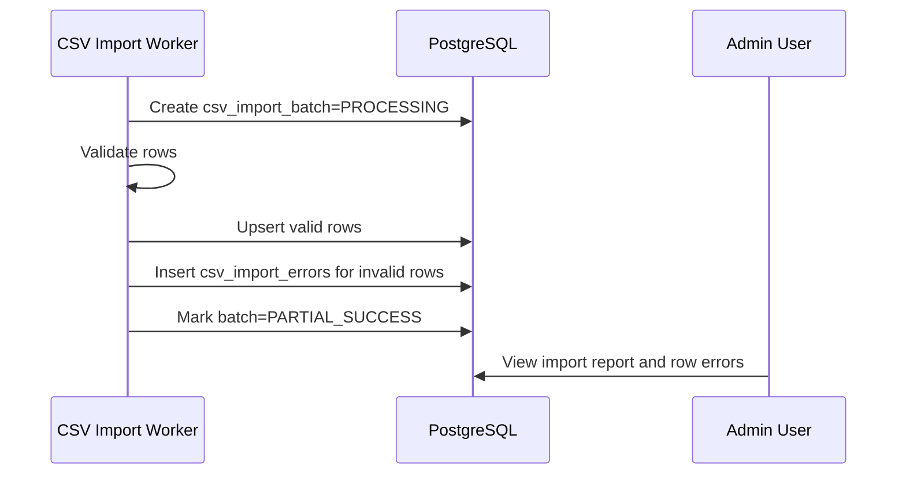
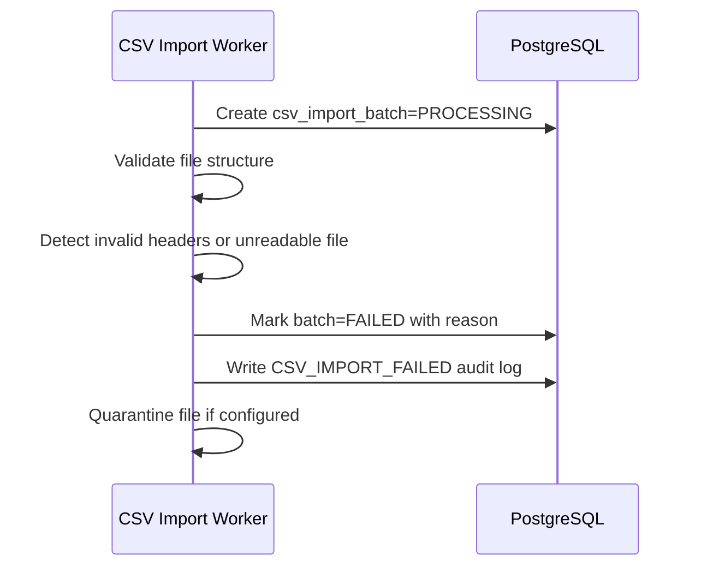
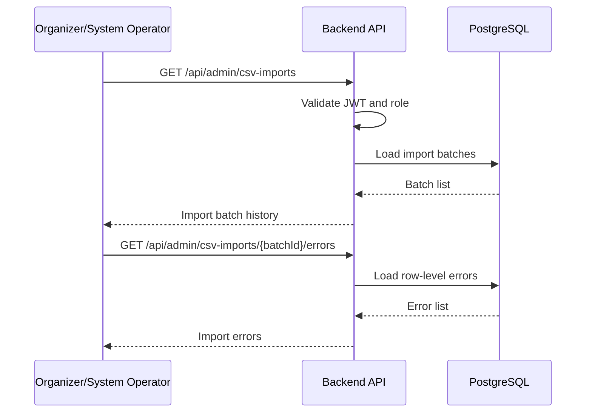
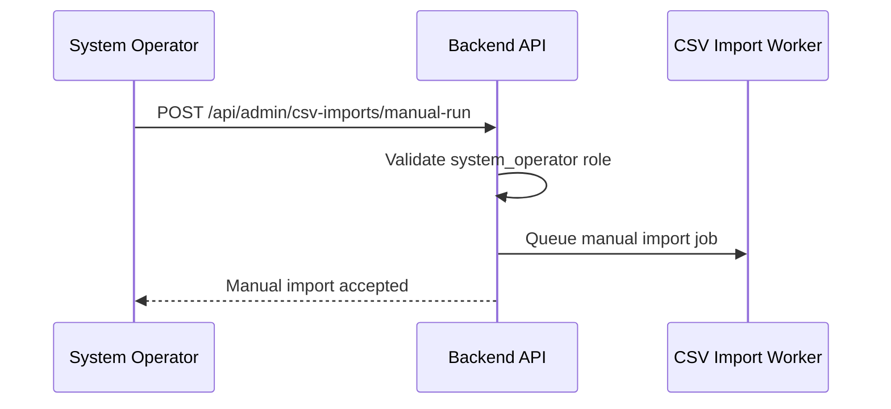

# Feature Spec: Nightly Student CSV Import

## Description

The Nightly Student CSV Import feature imports student roster data from the legacy Student Management System using nightly CSV exports.

The imported student roster is used by UniHub Workshop to determine whether a student is eligible to create an account and register for workshops. The system must keep the live application stable even when a CSV file is missing, invalid, duplicated, or partially corrupted.

The import process must be safe and auditable:

- Valid rows update the local `students` table.
- Invalid rows are recorded as row-level errors.
- Invalid files are quarantined and must not overwrite existing valid student data.
- The system can continue using the last successful student dataset if the latest import fails.
- Each import attempt produces an import batch record with status, timestamps, counts, and error details.

Actors involved:

| Actor                 | Description                                                                                                  |
| --------------------- | ------------------------------------------------------------------------------------------------------------ |
| Legacy Student System | Produces nightly CSV files containing student roster data                                                    |
| CSV Import Worker     | Detects, validates, imports, and audits CSV files                                                            |
| Backend API           | Exposes import history and error reports to authorized users                                                 |
| PostgreSQL            | Stores students, import batches, row-level errors, and audit logs                                            |
| Organizer             | May view import reports if allowed by project policy                                                         |
| System Operator       | Reviews import reports, errors, and failed batches                                                           |
| Student               | Indirectly affected because account registration and workshop registration depend on imported student status |

Data involved:

- `students`
- `csv_import_batches`
- `csv_import_errors`
- `audit_logs`

Detailed schema, fields, constraints, and indexes are documented in [`../database.md`](../database.md).

---

## Main Flow

### Main Flow 1: Nightly CSV Import Success

1. The legacy Student Management System exports a nightly CSV file.
2. The CSV Import Worker detects the new file in the configured file drop location.
3. The worker calculates or reads the file checksum.
4. The worker checks whether the same file checksum has already been processed.
5. The worker creates a `csv_import_batches` record with status `PROCESSING`.
6. The worker validates file format, encoding, delimiter, and required headers.
7. The worker loads rows into a staging process or staging table.
8. The worker validates required fields for each row.
9. The worker deduplicates rows deterministically by `student_id`.
10. The worker upserts valid rows into the `students` table.
11. The worker records row-level errors into `csv_import_errors`.
12. The worker marks the batch as `SUCCESS` if all rows are valid.
13. The worker writes audit log `CSV_IMPORT_COMPLETED`.



### Main Flow 2: Partial Success Import

1. The worker detects a structurally valid CSV file.
2. The worker creates a `csv_import_batches` record with status `PROCESSING`.
3. The worker validates each row.
4. Some rows are valid and some rows contain errors.
5. The worker upserts valid rows into `students`.
6. The worker stores invalid row details in `csv_import_errors`.
7. The worker marks the batch as `PARTIAL_SUCCESS`.
8. Authorized users can view row-level errors from the admin report.



### Main Flow 3: Invalid File Quarantine

1. The worker detects a new file.
2. The worker creates a `csv_import_batches` record with status `PROCESSING`.
3. The worker validates file structure.
4. The file fails structural validation because of invalid headers, wrong encoding, wrong delimiter, unreadable content, or missing required columns.
5. The worker does not import any row into `students`.
6. The worker marks the batch as `FAILED`.
7. The worker stores the failure reason.
8. The worker moves or marks the file as quarantined if quarantine storage is implemented.
9. The system continues using the previous valid student data.



### Main Flow 4: View Import History and Errors

1. Organizer or system operator opens the import report page.
2. Client calls the Backend API.
3. Backend API validates access token and role.
4. Backend API loads import batch history from PostgreSQL.
5. User selects a batch.
6. Backend API loads row-level errors for that batch.
7. Client displays batch status, row counts, error counts, and error details.



### Main Flow 5: Manual Import Run

1. System operator requests a manual import run.
2. Backend API validates role `system_operator`.
3. Backend API validates the target file or import source.
4. Backend API queues or triggers the CSV Import Worker.
5. Worker processes the file using the same validation and import rules as nightly import.
6. Backend API returns an accepted response.



---

## API Contract

### List Import Batches

```http
GET /api/admin/csv-imports
```

Required role: `organizer` or `system_operator`.

Success response:

```json
{
  "success": true,
  "data": [
    {
      "batchId": "b-001",
      "fileName": "students_2026_05_01.csv",
      "checksum": "sha256-file-checksum",
      "status": "PARTIAL_SUCCESS",
      "startedAt": "2026-05-01T00:05:00Z",
      "finishedAt": "2026-05-01T00:06:30Z",
      "totalRows": 12000,
      "successCount": 11988,
      "errorCount": 12
    }
  ]
}
```

Rules:

- Organizer may view import reports if project policy allows it.
- System operator can view import reports.
- Student and check-in staff cannot view import reports.

### Get Import Batch Detail

```http
GET /api/admin/csv-imports/{batchId}
```

Required role: `organizer` or `system_operator`.

Success response:

```json
{
  "success": true,
  "data": {
    "batchId": "b-001",
    "fileName": "students_2026_05_01.csv",
    "checksum": "sha256-file-checksum",
    "status": "PARTIAL_SUCCESS",
    "startedAt": "2026-05-01T00:05:00Z",
    "finishedAt": "2026-05-01T00:06:30Z",
    "totalRows": 12000,
    "successCount": 11988,
    "errorCount": 12,
    "failureReason": null
  }
}
```

### Get Import Batch Errors

```http
GET /api/admin/csv-imports/{batchId}/errors
```

Required role: `organizer` or `system_operator`.

Success response:

```json
{
  "success": true,
  "data": [
    {
      "rowNumber": 15,
      "studentId": "23123456",
      "fieldName": "email",
      "errorCode": "CSV_INVALID_EMAIL",
      "errorMessage": "Email format is invalid"
    },
    {
      "rowNumber": 72,
      "studentId": null,
      "fieldName": "student_id",
      "errorCode": "CSV_REQUIRED_FIELD_MISSING",
      "errorMessage": "student_id is required"
    }
  ]
}
```

Rules:

- Row-level errors must be tied to an import batch.
- Error reports should not expose unnecessary sensitive data.

### Trigger Manual Import

```http
POST /api/admin/csv-imports/manual-run
```

Required role: `system_operator`.

Request body:

```json
{
  "fileName": "students_2026_05_01.csv"
}
```

Success response:

```json
{
  "success": true,
  "data": {
    "status": "ACCEPTED",
    "message": "Manual CSV import has been queued."
  }
}
```

Rules:

- Manual import is optional.
- If implemented, only `system_operator` can trigger it.
- Manual import must follow the same validation, deduplication, and audit rules as nightly import.

---

## Authorization Rules

| Capability                            | Student | Organizer       | Check-in Staff | System Operator                                    |
| ------------------------------------- | ------- | --------------- | -------------- | -------------------------------------------------- |
| View import batch list                | No      | Yes, if enabled | No             | Yes                                                |
| View import batch detail              | No      | Yes, if enabled | No             | Yes                                                |
| View row-level import errors          | No      | Yes, if enabled | No             | Yes                                                |
| Trigger manual import                 | No      | No              | No             | Yes                                                |
| Modify imported student data directly | No      | No              | No             | No, unless manual correction is explicitly enabled |

Example endpoint policies:

| Method | Endpoint                                  | Required role                    | Purpose                        |
| ------ | ----------------------------------------- | -------------------------------- | ------------------------------ |
| GET    | `/api/admin/csv-imports`                  | `organizer` or `system_operator` | List import batches            |
| GET    | `/api/admin/csv-imports/{batchId}`        | `organizer` or `system_operator` | View import batch detail       |
| GET    | `/api/admin/csv-imports/{batchId}/errors` | `organizer` or `system_operator` | View row-level import errors   |
| POST   | `/api/admin/csv-imports/manual-run`       | `system_operator`                | Trigger optional manual import |

---

## Error Scenarios

| Scenario                                   | System Behavior                                            | HTTP Status          | Error Code                           |
| ------------------------------------------ | ---------------------------------------------------------- | -------------------- | ------------------------------------ |
| Nightly file missing on schedule           | Create missed/failed batch or alert operator               | `200` for report API | `CSV_IMPORT_MISSED`                  |
| File already processed by checksum         | Skip duplicate import and return existing batch reference  | `200`                | `CSV_IMPORT_ALREADY_PROCESSED`       |
| File unreadable                            | Mark batch `FAILED` and quarantine file                    | `422`                | `CSV_IMPORT_FILE_UNREADABLE`         |
| Unsupported encoding                       | Mark batch `FAILED`                                        | `422`                | `CSV_IMPORT_INVALID_ENCODING`        |
| Header mismatch                            | Reject file before row import                              | `422`                | `CSV_IMPORT_INVALID_HEADER`          |
| Required column missing                    | Reject file before row import                              | `422`                | `CSV_IMPORT_REQUIRED_COLUMN_MISSING` |
| Invalid row data                           | Import valid rows and record row error                     | `200`                | `CSV_IMPORT_ROW_INVALID`             |
| Duplicate student IDs inside the same file | Apply deterministic deduplication and record warning/error | `200`                | `CSV_IMPORT_DUPLICATE_ROWS`          |
| Mixed valid and invalid rows               | Import valid rows and report invalid ones                  | `200`                | `CSV_IMPORT_PARTIAL`                 |
| Database failure before commit             | Roll back batch changes and keep previous data             | `500`                | `CSV_IMPORT_FAILED`                  |
| Unauthorized report access                 | Reject request                                             | `403`                | `AUTH_FORBIDDEN`                     |
| Import batch not found                     | Reject request                                             | `404`                | `CSV_IMPORT_BATCH_NOT_FOUND`         |

---

## Constraints

### Business Constraints

- The legacy Student Management System is the upstream source for student roster data.
- CSV import updates the local `students` table.
- Registration eligibility depends on imported student status.
- Existing valid student records must remain usable if the latest import fails.
- Invalid files must not overwrite or corrupt existing student data.
- Partial row errors must not cancel the entire batch unless the file structure itself is invalid.
- Import reports must be available for troubleshooting.

### File Validation Constraints

- CSV file must use the configured encoding.
- CSV file must contain required headers.
- CSV file must contain required fields such as `student_id` and `full_name`.
- Header validation happens before row import.
- Structurally invalid files must fail before modifying `students`.
- File checksum should be stored to support idempotency.
- Same checksum should not be imported twice as a new batch.

### Row Validation and Deduplication Constraints

- `student_id` is the stable unique identifier for student records.
- Rows missing required fields are invalid.
- Rows with invalid status values are invalid.
- Duplicate `student_id` rows in the same file must be resolved deterministically.
- The selected deduplication rule must be documented; recommended rule: keep the last valid row for the same `student_id` within the file and record a warning.
- Valid rows are upserted into `students`.
- Invalid rows are written to `csv_import_errors`.

### Data Constraints

- `students.student_id` must be unique.
- `csv_import_batches.checksum` should be unique if idempotent import by checksum is required.
- `csv_import_errors.batch_id` must reference a valid import batch.
- Import batch status must be one of `PROCESSING`, `SUCCESS`, `PARTIAL_SUCCESS`, `FAILED`, or `MISSED`.
- Detailed schema and database constraints are documented in [`../database.md`](../database.md).

### Availability Constraints

- CSV import must not interrupt workshop browsing.
- CSV import must not interrupt check-in.
- CSV import failure must not make registration APIs unavailable.
- Registration should continue using the latest valid student data if the newest import fails.
- Import should run in a worker, not in the user-facing request path.

### Authorization Constraints

- Only authorized roles can view import reports.
- Only `system_operator` can trigger manual import if the feature is implemented.
- No frontend user should directly edit the `students` table unless a protected manual correction workflow is explicitly implemented.
- Backend authorization is mandatory for all import report APIs.

### Audit Constraints

The system should write audit logs for:

| Action                        | Notes                                      |
| ----------------------------- | ------------------------------------------ |
| `CSV_IMPORT_STARTED`          | Import batch started                       |
| `CSV_IMPORT_COMPLETED`        | Import batch completed successfully        |
| `CSV_IMPORT_PARTIAL_SUCCESS`  | Import completed with row-level errors     |
| `CSV_IMPORT_FAILED`           | Import failed due to file or system error  |
| `CSV_IMPORT_MISSED`           | Expected nightly file missing              |
| `CSV_IMPORT_MANUAL_TRIGGERED` | Manual import triggered by system operator |

Audit payload should include batch ID, file name, checksum, counts, and status, but should not include unnecessary sensitive student data.

---

## Acceptance Criteria

### Successful Import

- A valid nightly CSV file creates a new import batch.
- Valid rows are upserted into `students`.
- Batch status becomes `SUCCESS` when all rows are valid.
- Import batch stores file name, checksum, start time, finish time, and row counts.
- Audit log `CSV_IMPORT_COMPLETED` is created.

### Partial Success

- A structurally valid file with some invalid rows still imports valid rows.
- Invalid rows are written to `csv_import_errors`.
- Batch status becomes `PARTIAL_SUCCESS`.
- Import report shows total row count, success count, and error count.
- Invalid row details can be viewed by authorized users.

### Invalid File Handling

- File with invalid headers is rejected before modifying `students`.
- Unreadable or unsupported file is marked `FAILED`.
- Invalid files are quarantined or marked for review.
- Existing student data remains usable when import fails.
- Registration can still use the latest successful student dataset.

### Idempotency and Deduplication

- Reprocessing the same file checksum does not create a duplicate import effect.
- Duplicate `student_id` rows are resolved deterministically.
- Duplicate rows are reported in import errors or warnings.
- `students.student_id` remains unique after import.

### Authorization and Reporting

- Organizer can view import reports only if enabled by project policy.
- System operator can view import reports and row-level errors.
- Student and check-in staff accounts cannot access import reports.
- Only system operator can trigger manual import if implemented.
- Unauthorized report access returns `403 Forbidden`.

### Stability

- CSV import does not interrupt workshop browsing.
- CSV import does not interrupt check-in.
- CSV import does not block user-facing APIs.
- Database failure during import rolls back partial changes for that transaction.
- Every import attempt has a batch history entry with final status.

---

## Implementation Notes

Recommended Java package placement:

```text
src/main/java/com/unihub/
├── presentation/
│   └── controller/csvimport/
│       └── CsvImportController.java
├── application/
│   └── csvimport/
│       ├── CsvImportCommandService.java
│       ├── CsvImportQueryService.java
│       ├── RunCsvImportCommand.java
│       ├── GetImportBatchesQuery.java
│       ├── GetImportErrorsQuery.java
│       ├── CsvImportJob.java
│       └── CsvImportJobPublisher.java
├── domain/
│   ├── csvimport/
│   │   ├── CsvImportBatch.java
│   │   ├── CsvImportStatus.java
│   │   ├── CsvImportError.java
│   │   ├── CsvImportRepository.java
│   │   ├── CsvImportPolicy.java
│   │   └── CsvImportErrorCode.java
│   └── student/
│       ├── Student.java
│       ├── StudentRepository.java
│       └── StudentStatus.java
└── infrastructure/
    ├── csv/
    │   ├── CsvFileDetector.java
    │   ├── CsvParser.java
    │   └── CsvImportWorker.java
    └── persistence/
        ├── csvimport/
        │   └── CsvImportJpaRepository.java
        └── student/
            └── StudentJpaRepository.java
```

Recommended import statuses:

```text
PROCESSING
SUCCESS
PARTIAL_SUCCESS
FAILED
MISSED
```

Recommended row-level validation errors:

```text
CSV_REQUIRED_FIELD_MISSING
CSV_INVALID_STUDENT_ID
CSV_INVALID_EMAIL
CSV_INVALID_STATUS
CSV_DUPLICATE_STUDENT_ID
CSV_INVALID_ROW_FORMAT
```

Layering rules:

- CSV Import Worker detects and parses files outside the request path.
- Application service coordinates import use cases, batch records, and transaction boundaries.
- Domain model protects import status transitions and validation policies.
- Infrastructure implements file detection, CSV parsing, and persistence.
- API controller only exposes import reports and optional manual import trigger.
- Controllers must not contain CSV parsing or row validation logic directly.
- Failed import must not corrupt the current `students` data.
