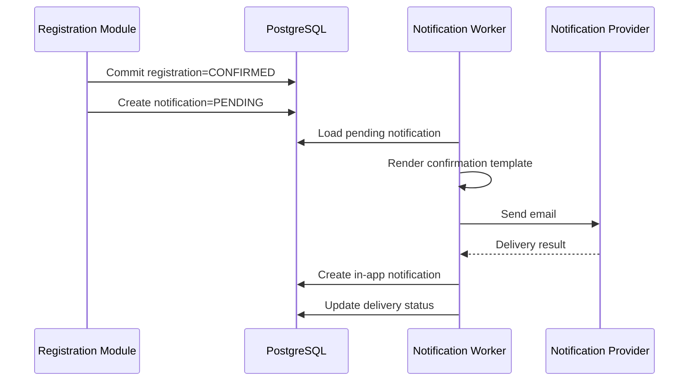
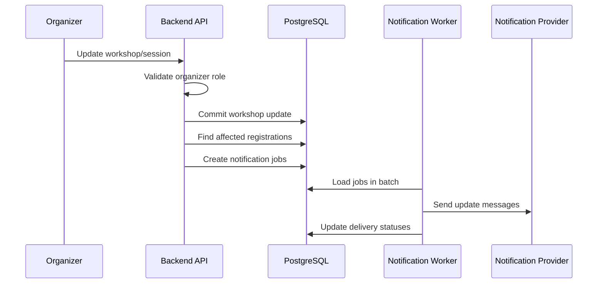
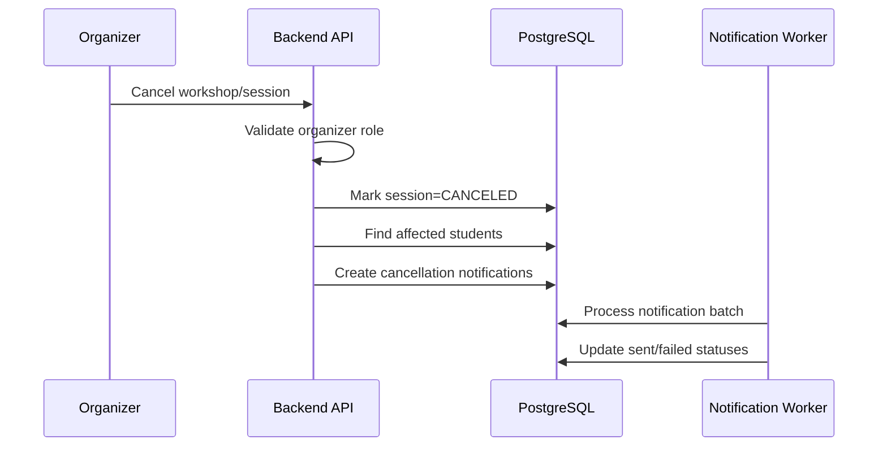
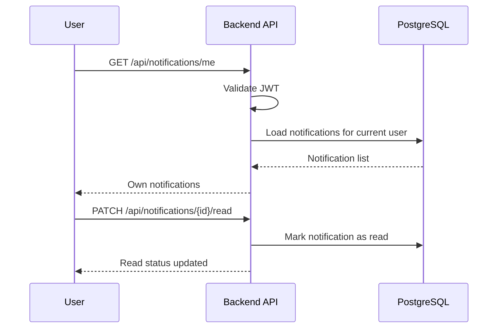
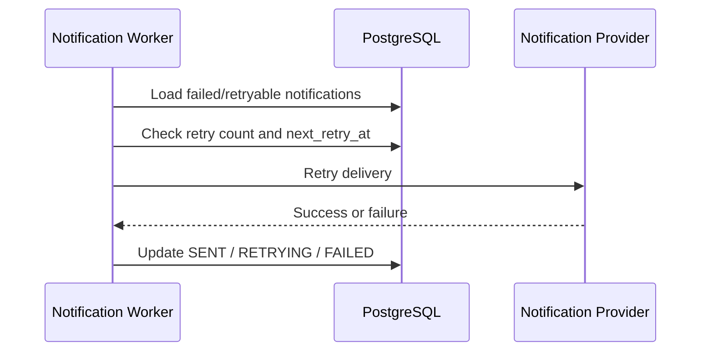

# Feature Spec: Notification Delivery

## Description

The Notification Delivery feature sends registration, payment, workshop update, and workshop cancellation notifications through email and in-app channels.

The feature must be asynchronous and extensible:

- Notification failure must not roll back confirmed registration, payment confirmation, or workshop updates.
- The registration, payment, and workshop modules should only emit notification requests or domain events.
- The Notification Worker is responsible for rendering templates, dispatching messages, recording delivery status, and retrying failures.
- Provider-specific details must be hidden behind notification provider adapters.
- Future channels such as Telegram can be added without changing registration or payment state logic.

Actors involved:

| Actor                          | Description                                                                                       |
| ------------------------------ | ------------------------------------------------------------------------------------------------- |
| Student                        | Receives registration, payment, schedule, and cancellation notifications                          |
| Organizer                      | Triggers workshop update or cancellation notifications through admin actions                      |
| Backend API                    | Creates notification records or publishes notification jobs after business events                 |
| Notification Worker            | Renders templates, dispatches messages, updates delivery status, and retries failed notifications |
| Notification Provider Adapters | Send email, in-app, and future channel messages                                                   |
| PostgreSQL                     | Stores notifications, delivery status, retry count, and audit logs                                |
| System Operator                | Optional role for viewing failed deliveries and triggering retry jobs                             |

Data involved:

- `notifications`
- `users`
- `students`
- `registrations`
- `workshops`
- `workshop_sessions`
- `audit_logs`

Detailed schema, fields, constraints, and indexes are documented in [`../database.md`](../database.md).

---

## Main Flow

### Main Flow 1: Registration Confirmation Notification

1. A registration becomes `CONFIRMED`.
2. The Registration Module commits the registration transaction.
3. The Backend API or application event publisher creates notification records or publishes a notification job.
4. The Notification Worker loads the notification job.
5. The worker resolves the recipient, workshop title, session time, room, and QR access instructions.
6. The worker renders email and in-app templates.
7. The worker dispatches the email through the notification provider adapter.
8. The worker creates or updates the in-app notification record.
9. The worker updates delivery status per channel.
10. If delivery fails, the worker schedules retry without affecting the confirmed registration.



### Main Flow 2: Workshop Update Notification

1. Organizer updates workshop details such as title, room, time, or speaker.
2. Backend API validates organizer role and update permission.
3. Workshop Module commits the workshop update.
4. Backend API identifies affected registered students.
5. Backend API creates notification jobs for affected students.
6. Notification Worker processes jobs in batches.
7. Worker sends update notifications through configured channels.
8. Worker stores delivery status and retry metadata.



### Main Flow 3: Workshop Cancellation Notification

1. Organizer cancels a workshop or session.
2. Backend API validates organizer role and cancellation permission.
3. Workshop Module marks the workshop/session as `CANCELED`.
4. Backend API identifies affected confirmed or pending students.
5. Backend API creates cancellation notification jobs.
6. Notification Worker sends cancellation messages in batches.
7. Worker updates delivery status for each recipient and channel.
8. Failed deliveries remain retryable.



### Main Flow 4: User Views In-app Notifications

1. Authenticated user opens the notification page.
2. Client calls `GET /api/notifications/me`.
3. Backend API validates the access token.
4. Backend API loads notifications for the current user only.
5. Backend API returns notification list.
6. User may mark a notification as read.
7. Backend API updates the read status.



### Main Flow 5: Retry Failed Notifications

1. Notification Worker or System Operator finds notifications with status `FAILED` or `RETRYING`.
2. Worker checks retry count and next retry time.
3. Worker retries delivery through the provider adapter.
4. If retry succeeds, worker marks the channel delivery as `SENT`.
5. If retry fails and retry limit is not reached, worker schedules another retry.
6. If retry limit is reached, worker marks the notification as `FAILED`.



---

## API Contract

### List My Notifications

```http
GET /api/notifications/me
```

Required role: Authenticated.

Success response:

```json
{
  "success": true,
  "data": [
    {
      "id": "n-001",
      "title": "Registration confirmed",
      "message": "Your registration for Career Skills Workshop has been confirmed.",
      "channel": "IN_APP",
      "status": "SENT",
      "read": false,
      "createdAt": "2026-05-01T08:10:00Z"
    }
  ]
}
```

Rules:

- User can only view their own notifications.
- Notifications should be sorted by newest first.
- Pagination should be supported if notification count grows.

### Mark Notification as Read

```http
PATCH /api/notifications/{notificationId}/read
```

Required role: Authenticated.

Success response:

```json
{
  "success": true,
  "data": {
    "notificationId": "n-001",
    "read": true,
    "readAt": "2026-05-01T08:20:00Z"
  }
}
```

Rules:

- User can only mark their own notification as read.
- Marking an already-read notification is idempotent.

### Retry Failed Notifications

```http
POST /api/admin/notifications/retry-failed
```

Required role: `system_operator`.

Request body:

```json
{
  "notificationId": "n-001"
}
```

Success response:

```json
{
  "success": true,
  "data": {
    "notificationId": "n-001",
    "status": "RETRYING",
    "message": "Notification retry has been queued."
  }
}
```

Rules:

- This endpoint is optional.
- Only `system_operator` can trigger manual retry.
- Worker retry policy should still enforce max retry count.

---

## Authorization Rules

| Capability                                      | Student           | Organizer                    | Check-in Staff | System Operator |
| ----------------------------------------------- | ----------------- | ---------------------------- | -------------- | --------------- |
| View own notifications                          | Yes               | Yes                          | Yes            | Yes             |
| Mark own notification as read                   | Yes               | Yes                          | Yes            | Yes             |
| Trigger registration confirmation notifications | No, indirect only | No                           | No             | No              |
| Trigger workshop update notifications           | No                | Yes, through workshop update | No             | No              |
| Trigger workshop cancellation notifications     | No                | Yes, through cancellation    | No             | No              |
| Retry failed notifications manually             | No                | No                           | No             | Yes             |
| View another user's notifications               | No                | No                           | No             | Yes, if enabled |

Example endpoint policies:

| Method | Endpoint                                   | Required role     | Purpose                                        |
| ------ | ------------------------------------------ | ----------------- | ---------------------------------------------- |
| GET    | `/api/notifications/me`                    | Authenticated     | List current user's notifications              |
| PATCH  | `/api/notifications/{notificationId}/read` | Authenticated     | Mark own notification as read                  |
| POST   | `/api/admin/notifications/retry-failed`    | `system_operator` | Optional manual retry for failed notifications |

---

## Error Scenarios

| Scenario                                       | System Behavior                                                  | HTTP Status             | Error Code                      |
| ---------------------------------------------- | ---------------------------------------------------------------- | ----------------------- | ------------------------------- |
| Missing or invalid access token                | Reject request                                                   | `401`                   | `AUTH_TOKEN_INVALID`            |
| User tries to view another user's notification | Reject request                                                   | `403`                   | `NOTIFY_ACCESS_DENIED`          |
| Notification not found                         | Reject request                                                   | `404`                   | `NOTIFY_NOT_FOUND`              |
| Email provider timeout                         | Mark as `RETRYING` and schedule retry                            | `202` for async status  | `NOTIFY_RETRY_SCHEDULED`        |
| Email provider unavailable                     | Mark as `RETRYING` or `FAILED` after retry limit                 | `202` or `503`          | `NOTIFY_PROVIDER_UNAVAILABLE`   |
| Invalid email address                          | Mark email delivery as `FAILED`                                  | `200` for worker result | `NOTIFY_INVALID_EMAIL`          |
| In-app notification insert fails               | Retry through worker                                             | `202`                   | `NOTIFY_RETRY_SCHEDULED`        |
| Duplicate worker execution                     | Deduplicate by notification ID, event ID, recipient, and channel | `200`                   | `NOTIFY_DUPLICATE`              |
| Template missing                               | Mark notification failed                                         | `500`                   | `NOTIFY_TEMPLATE_MISSING`       |
| Template rendering failed                      | Mark notification failed or retry if transient                   | `500`                   | `NOTIFY_TEMPLATE_RENDER_FAILED` |
| Provider throttling                            | Retry with backoff                                               | `202`                   | `NOTIFY_PROVIDER_THROTTLED`     |
| Retry limit exceeded                           | Mark notification as `FAILED`                                    | `200` for worker result | `NOTIFY_RETRY_EXHAUSTED`        |

---

## Constraints

### Business Constraints

- Notification delivery must be asynchronous for slow or failure-prone providers.
- Notification failure must never roll back a confirmed registration, payment confirmation, or workshop update.
- Registration, payment, and workshop modules should not directly call provider-specific APIs.
- Templates should include relevant event information such as workshop title, time, room, and QR access instructions where applicable.
- Workshop update and cancellation notifications should be sent to affected students.
- Notification status should be visible for troubleshooting.
- Future channels such as Telegram should be addable through provider adapters.

### Delivery Constraints

- Delivery status must be tracked per recipient and per channel.
- Recommended notification statuses: `PENDING`, `SENT`, `FAILED`, `RETRYING`, `READ`.
- Worker must support retries with backoff.
- Retry count must be limited.
- Duplicate worker execution must not create duplicate user-facing notifications.
- Organizer-triggered mass updates should be processed in batches to avoid provider throttling.
- Provider failures should affect only notification delivery, not core business state.

### Data Constraints

- A notification must reference a recipient user.
- A notification should store template key, channel, delivery status, retry count, and timestamps.
- A notification should be deduplicated by event ID, recipient, and channel if event ID exists.
- In-app notification read state must be stored.
- Detailed schema and database constraints are documented in [`../database.md`](../database.md).

### Authorization Constraints

- Users can only view and mark their own notifications.
- Backend authorization is mandatory for notification APIs.
- UI route guards are only for user experience.
- Only `system_operator` can manually retry failed notifications if the retry endpoint is implemented.
- Organizer can trigger notifications only indirectly through authorized workshop update or cancellation actions.

### Adapter Constraints

- Notification provider calls must go through a provider adapter.
- Core domain logic must not depend on SMTP, email vendor SDKs, or Telegram APIs.
- Adding a new channel should require a new adapter and template, not changes to registration state logic.
- Provider-specific response codes must be mapped to application-level delivery statuses.

### Audit Constraints

The system should write audit logs for:

| Action                         | Notes                           |
| ------------------------------ | ------------------------------- |
| `NOTIFICATION_CREATED`         | Notification record/job created |
| `NOTIFICATION_SENT`            | Delivery succeeded              |
| `NOTIFICATION_FAILED`          | Delivery failed                 |
| `NOTIFICATION_RETRY_SCHEDULED` | Retry scheduled                 |
| `NOTIFICATION_RETRY_EXHAUSTED` | Retry limit reached             |
| `NOTIFICATION_MANUAL_RETRY`    | System operator requested retry |

Audit payload must not contain email provider secrets, raw tokens, passwords, or sensitive credentials.

---

## Acceptance Criteria

### Registration and Payment Notifications

- A confirmed registration creates notification records/jobs.
- Student receives registration confirmation through in-app notification.
- Student receives registration confirmation through email if email channel is enabled.
- Paid registration confirmation is sent only after payment success.
- Notification failure does not roll back confirmed registration.
- Notification failure does not remove QR ticket.

### Workshop Update and Cancellation Notifications

- Workshop update creates notifications for affected registered students.
- Workshop cancellation creates notifications for affected students.
- Notification content includes workshop title, session time, and room when applicable.
- Organizer-triggered mass notifications are processed asynchronously.
- Provider throttling delays delivery but does not break the workshop update operation.

### In-app Notification UX

- Authenticated users can list their own notifications.
- Users cannot view another user's notifications.
- Users can mark their own notifications as read.
- Marking an already-read notification is safe and idempotent.

### Retry and Failure Handling

- Email provider timeout schedules retry.
- Retry count increases after failed attempts.
- Retry limit eventually marks the notification as `FAILED`.
- Duplicate worker execution does not create duplicate in-app notifications.
- Manual retry by `system_operator` is possible if implemented.

### Extensibility

- A new notification channel can be added through a provider adapter.
- Adding a new provider does not require changing registration state transition logic.
- Mock provider can be used for local development or tests.

### Audit

- Notification creation is auditable.
- Delivery success and failure are traceable.
- Manual retry actions are auditable.
- Audit logs do not store provider secrets or sensitive tokens.

---

## Implementation Notes

Recommended Java package placement:

```text
src/main/java/com/unihub/
├── presentation/
│   └── controller/notification/
│       └── NotificationController.java
├── application/
│   └── notification/
│       ├── NotificationCommandService.java
│       ├── NotificationQueryService.java
│       ├── CreateNotificationCommand.java
│       ├── MarkNotificationReadCommand.java
│       ├── RetryNotificationCommand.java
│       ├── NotificationJob.java
│       ├── NotificationJobPublisher.java
│       └── NotificationProvider.java
├── domain/
│   └── notification/
│       ├── Notification.java
│       ├── NotificationChannel.java
│       ├── NotificationStatus.java
│       ├── NotificationTemplate.java
│       ├── NotificationRepository.java
│       └── NotificationErrorCode.java
└── infrastructure/
    ├── persistence/
    │   └── notification/
    │       └── NotificationJpaRepository.java
    └── notification/
        ├── EmailNotificationProvider.java
        ├── InAppNotificationProvider.java
        ├── MockNotificationProvider.java
        └── TelegramNotificationProvider.java
```

Recommended notification statuses:

```text
PENDING
SENT
FAILED
RETRYING
READ
```

Recommended event/template keys:

```text
REGISTRATION_CONFIRMED
PAYMENT_SUCCEEDED
PAYMENT_FAILED
WORKSHOP_UPDATED
WORKSHOP_CANCELED
CHECKIN_ACCEPTED
```

Layering rules:

- Registration, payment, workshop, and check-in modules emit events or create notification requests.
- Notification application service creates notification records and jobs.
- Notification Worker renders templates and dispatches messages.
- Infrastructure implements provider-specific adapters.
- Domain model protects notification status transitions and retry limits.
- Controllers must not call email providers directly.
- Core business modules must not depend on email, Telegram, or provider-specific SDKs.
- Notification failure must not roll back core business transactions.
