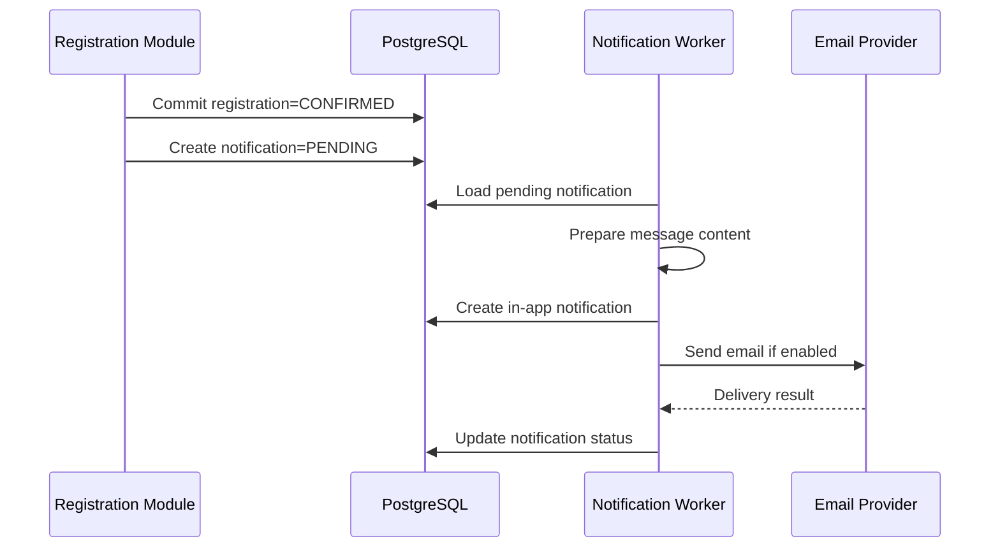
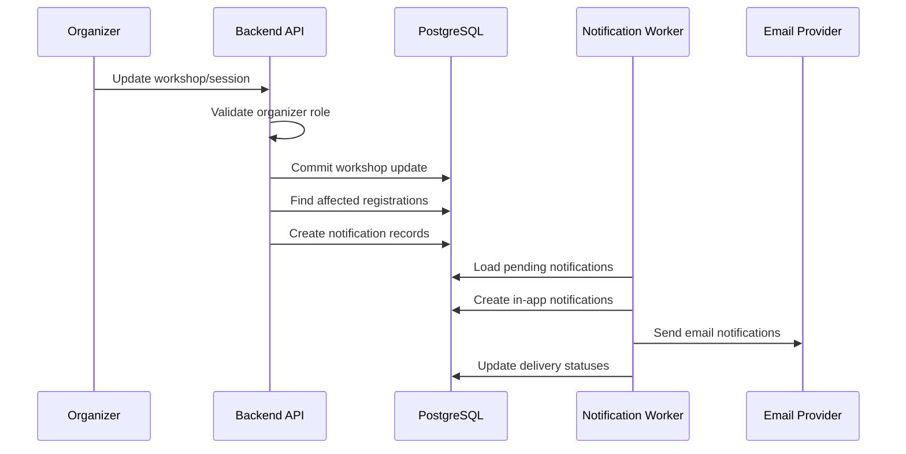
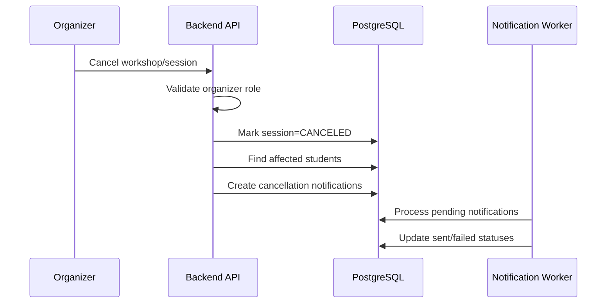
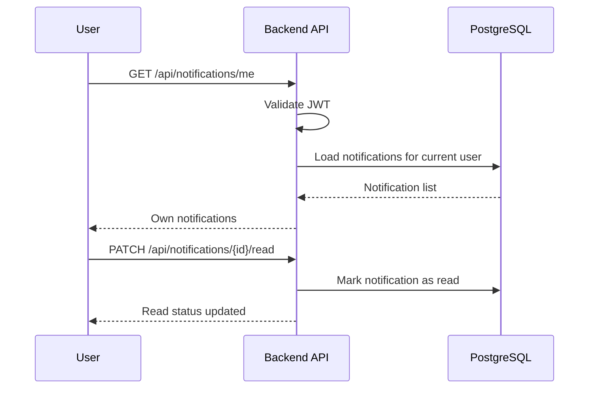

# Feature Spec: Notification Delivery

## Description

The Notification Delivery feature sends registration, payment, workshop update, and workshop cancellation notifications to users.

The MVP supports two notification channels:

- in-app notifications,
- email notifications.

Notification delivery must be asynchronous because email providers can be slow or temporarily unavailable. Notification failure must not roll back confirmed registration, payment confirmation, or workshop updates.

Actors involved:

| Actor                 | Description                                                                       |
| --------------------- | --------------------------------------------------------------------------------- |
| Student               | Receives registration, payment, schedule, and cancellation notifications          |
| Organizer             | Triggers workshop update or cancellation notifications through admin actions      |
| Backend API           | Creates notification records or publishes notification jobs after business events |
| Notification Worker   | Sends notifications and updates delivery status                                   |
| Notification Provider | Sends email notifications                                                         |
| PostgreSQL            | Stores notifications and delivery status                                          |

Data involved:

- `notifications`
- `users`
- `registrations`
- `workshops`
- `workshop_sessions`

Detailed schema, fields, constraints, and indexes are documented in [`../database.md`](../database.md).

---

## Main Flow

### Main Flow 1: Registration Confirmation Notification

1. A registration becomes `CONFIRMED`.
2. The Registration Module commits the registration transaction.
3. The Backend API or application service creates notification records.
4. The Notification Worker loads pending notification records.
5. The worker resolves the recipient, workshop title, session time, room, and QR access instructions.
6. The worker creates an in-app notification.
7. The worker sends an email notification if email channel is enabled.
8. The worker updates delivery status.
9. If email delivery fails, the worker marks the notification as `FAILED` or `RETRYING` without affecting the confirmed registration.



### Main Flow 2: Workshop Update Notification

1. Organizer updates workshop details such as title, room, time, or speaker.
2. Backend API validates organizer role.
3. Workshop Module commits the workshop update.
4. Backend API identifies affected registered students.
5. Backend API creates notification records for affected students.
6. Notification Worker processes the notifications asynchronously.
7. Worker creates in-app notifications and sends email notifications if enabled.
8. Worker stores delivery status.



### Main Flow 3: Workshop Cancellation Notification

1. Organizer cancels a workshop or session.
2. Backend API validates organizer role.
3. Workshop Module marks the workshop or session as `CANCELED`.
4. Backend API identifies affected students.
5. Backend API creates cancellation notification records.
6. Notification Worker processes notifications asynchronously.
7. Worker updates delivery status for each notification.



### Main Flow 4: User Views In-app Notifications

1. Authenticated user opens the notification page.
2. Client calls `GET /api/notifications/me`.
3. Backend API validates the access token.
4. Backend API loads notifications for the current user only.
5. Backend API returns notification list.
6. User may mark a notification as read.
7. Backend API updates the read status.



---

## API Contract

### List My Notifications

```http
GET /api/notifications/me
```

Required role: Authenticated.

Success response:

```json
{
  "success": true,
  "data": [
    {
      "id": "n-001",
      "title": "Registration confirmed",
      "message": "Your registration for Career Skills Workshop has been confirmed.",
      "channel": "IN_APP",
      "status": "SENT",
      "read": false,
      "createdAt": "2026-05-01T08:10:00Z"
    }
  ]
}
```

Rules:

- User can only view their own notifications.
- Notifications should be sorted by newest first.
- Pagination may be supported if notification count grows.

### Mark Notification as Read

```http
PATCH /api/notifications/{notificationId}/read
```

Required role: Authenticated.

Success response:

```json
{
  "success": true,
  "data": {
    "notificationId": "n-001",
    "read": true,
    "readAt": "2026-05-01T08:20:00Z"
  }
}
```

Rules:

- User can only mark their own notification as read.
- Marking an already-read notification is idempotent.

---

## Authorization Rules

| Capability                                      | Student            | Organizer                    | Check-in Staff |
| ----------------------------------------------- | ------------------ | ---------------------------- | -------------- |
| View own notifications                          | Yes                | Yes                          | Yes            |
| Mark own notification as read                   | Yes                | Yes                          | Yes            |
| Receive registration confirmation notifications | Yes                | No                           | No             |
| Receive workshop update notifications           | Yes, if registered | Yes, if relevant             | No             |
| Receive workshop cancellation notifications     | Yes, if registered | Yes, if relevant             | No             |
| Trigger workshop update notifications           | No                 | Yes, through workshop update | No             |
| Trigger workshop cancellation notifications     | No                 | Yes, through cancellation    | No             |

Example endpoint policies:

| Method | Endpoint                                   | Required role | Purpose                           |
| ------ | ------------------------------------------ | ------------- | --------------------------------- |
| GET    | `/api/notifications/me`                    | Authenticated | List current user's notifications |
| PATCH  | `/api/notifications/{notificationId}/read` | Authenticated | Mark own notification as read     |

---

## Error Scenarios

| Scenario                                       | System Behavior                                     | HTTP Status             | Error Code                      |
| ---------------------------------------------- | --------------------------------------------------- | ----------------------- | ------------------------------- |
| Missing or invalid access token                | Reject request                                      | `401`                   | `AUTH_TOKEN_INVALID`            |
| User tries to view another user's notification | Reject request                                      | `403`                   | `NOTIFY_ACCESS_DENIED`          |
| Notification not found                         | Reject request                                      | `404`                   | `NOTIFY_NOT_FOUND`              |
| Email provider timeout                         | Mark email delivery as `FAILED` or `RETRYING`       | `202` for async status  | `NOTIFY_PROVIDER_TIMEOUT`       |
| Email provider unavailable                     | Mark email delivery as `FAILED` or `RETRYING`       | `202` or `503`          | `NOTIFY_PROVIDER_UNAVAILABLE`   |
| Invalid email address                          | Mark email delivery as `FAILED`                     | `200` for worker result | `NOTIFY_INVALID_EMAIL`          |
| In-app notification insert fails               | Mark notification as failed and retry if configured | `202`                   | `NOTIFY_IN_APP_FAILED`          |
| Duplicate worker execution                     | Do not create duplicate user-facing notifications   | `200`                   | `NOTIFY_DUPLICATE`              |
| Template missing                               | Mark notification failed                            | `500`                   | `NOTIFY_TEMPLATE_MISSING`       |
| Template rendering failed                      | Mark notification failed                            | `500`                   | `NOTIFY_TEMPLATE_RENDER_FAILED` |

---

## Constraints

### Business Constraints

- Notification delivery must be asynchronous.
- Notification failure must never roll back confirmed registration, payment confirmation, or workshop update.
- Registration, payment, and workshop modules should not directly call email provider APIs.
- Notification content should include relevant event information such as workshop title, time, room, and QR access instructions where applicable.
- Workshop update and cancellation notifications should be sent to affected students.

### Delivery Constraints

- The MVP supports in-app and email notifications.
- Delivery status must be tracked.
- Recommended notification statuses: `PENDING`, `SENT`, `FAILED`, `RETRYING`, `READ`.
- Duplicate worker execution must not create duplicate user-facing notifications.
- Organizer-triggered mass updates should be processed asynchronously to avoid slow admin requests.
- Provider failures should affect only notification delivery, not core business state.

### Data Constraints

- A notification must reference a recipient user.
- A notification should store channel, title, message, status, read state, and timestamps.
- A notification should be deduplicated by event ID, recipient, and channel if event ID exists.
- In-app notification read state must be stored.
- Detailed schema and database constraints are documented in [`../database.md`](../database.md).

### Authorization Constraints

- Users can only view and mark their own notifications.
- Backend authorization is mandatory for notification APIs.
- UI route guards are only for user experience.
- Organizer can trigger notifications only indirectly through authorized workshop update or cancellation actions.

---

## Acceptance Criteria

### Registration and Payment Notifications

- A confirmed registration creates notification records.
- Student receives registration confirmation through in-app notification.
- Student receives registration confirmation through email if email channel is enabled.
- Paid registration confirmation is sent only after payment success.
- Notification failure does not roll back confirmed registration.
- Notification failure does not remove QR ticket.

### Workshop Update and Cancellation Notifications

- Workshop update creates notifications for affected registered students.
- Workshop cancellation creates notifications for affected students.
- Notification content includes workshop title, session time, and room when applicable.
- Organizer-triggered mass notifications are processed asynchronously.
- Email provider failure delays or fails email delivery but does not break the workshop update operation.

### In-app Notification UX

- Authenticated users can list their own notifications.
- Users cannot view another user's notifications.
- Users can mark their own notifications as read.
- Marking an already-read notification is safe and idempotent.

### Failure Handling

- Email provider timeout does not block registration or workshop update.
- Duplicate worker execution does not create duplicate in-app notifications.
- Failed notification delivery is stored with failure status.
- Notification failure does not affect payment, registration, check-in, or workshop browsing.

### Authorization

- Student users can only view their own notifications.
- Organizer users can only view their own notifications.
- Check-in staff users can only view their own notifications.
- Backend authorization blocks forbidden notification access even if the user manually calls the API with Postman.
