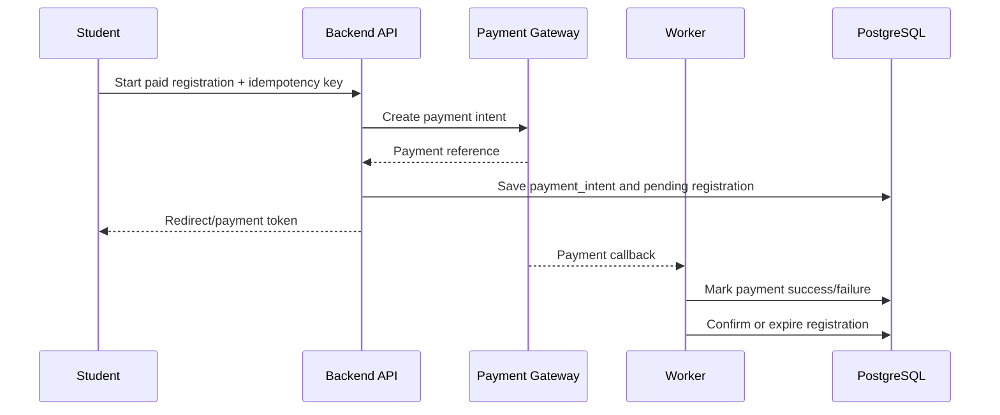

# Feature Spec: Paid Registration and Payment Processing

## Description

This feature manages payment intent creation, external gateway interaction, callback reconciliation, timeout handling, and double-charge prevention for paid workshop registrations.

## Main Flow

1. Student starts paid registration with an idempotency key.
2. Backend checks whether the payment circuit breaker is closed.
3. Backend creates or reuses a `payment_intent` linked to a `PENDING_PAYMENT` registration.
4. Backend sends the payment request to the gateway and returns a redirect URL or payment token.
5. Gateway later confirms success or failure through callback/webhook or simulated reconciliation.
6. Worker updates the payment intent and registration state.
7. On success, the worker generates a QR ticket and queues notifications.

## Payment State Model

`CREATED -> PENDING -> SUCCEEDED | FAILED | EXPIRED`

Registration state relation:

- `PENDING_PAYMENT` while payment is unresolved
- `CONFIRMED` after `SUCCEEDED`
- `EXPIRED` if reservation timeout passes
- `FAILED` or `CANCELLED` if payment is rejected or manually aborted

## Key Design Decisions

- **Choice:** Idempotency key on payment initiation.
  - **Why:** Network retries and page refreshes must not create duplicate charges.
  - **Trade-offs / risks:** Client and API must preserve the same key across retries.
  - **Alternatives not chosen:** Deduplication by amount and timestamp was rejected because it is unsafe.

- **Choice:** Circuit breaker around the payment gateway.
  - **Why:** Persistent provider failure should not consume API threads or affect browsing features.
  - **Trade-offs / risks:** New paid attempts may be temporarily rejected during recovery.
  - **Alternatives not chosen:** Unlimited retries in the request path were rejected because they amplify outages.

- **Choice:** Async callback reconciliation in a worker.
  - **Why:** Gateway confirmation is not guaranteed to arrive within the student's original request.
  - **Trade-offs / risks:** Final confirmation can be slightly delayed.
  - **Alternatives not chosen:** Synchronous waiting for gateway finalization was rejected because it increases latency and timeout risk.

## Error Scenarios

- Gateway timeout before response: keep the registration pending, schedule reconciliation, and show `payment pending`.
- Duplicate callback: ignore using unique gateway reference and idempotent state transition rules.
- Circuit breaker open: reject new paid attempts quickly with a clear message while keeping workshop browsing available.
- Student closes the browser before callback: worker still finalizes the result and sends notification later.

## Constraints

- No successful payment may create more than one confirmed registration.
- Payment gateway failure must not block workshop browsing or free registration.
- Reservation expiry must release seats automatically.
- All payment state changes must be auditable.

## Acceptance Criteria

- Repeating the same paid initiation request with the same idempotency key does not create a second payment intent.
- Duplicate gateway callbacks do not duplicate confirmation or charge handling.
- When the payment gateway is unstable, the system still serves workshop browsing normally.
- Successful payment leads to confirmed registration, QR issuance, and notifications.
- Expired or failed payment returns the seat to availability.
