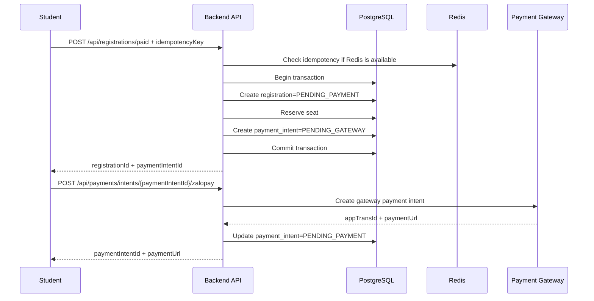
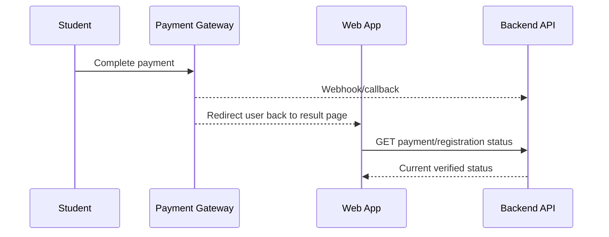
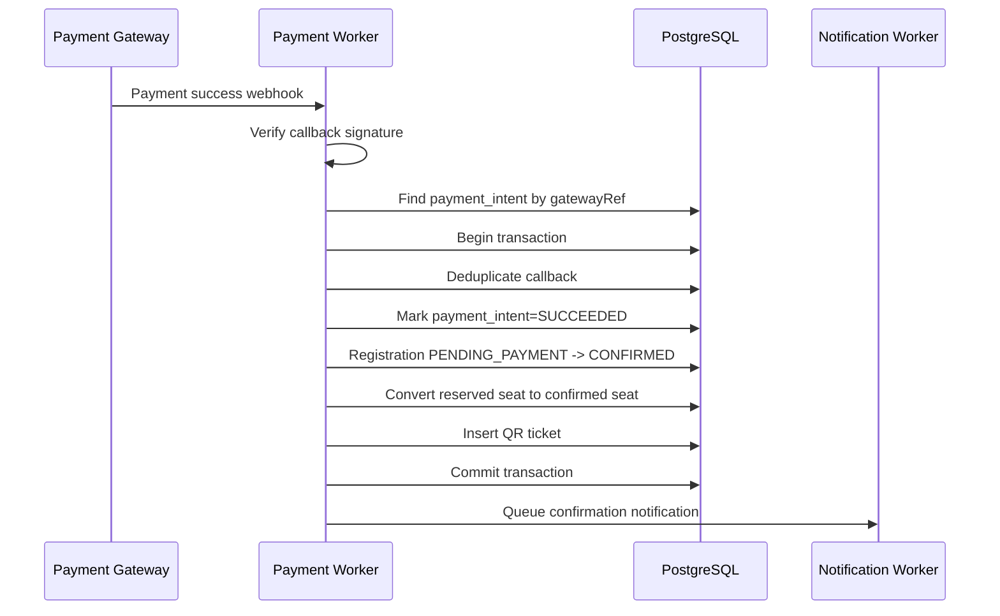
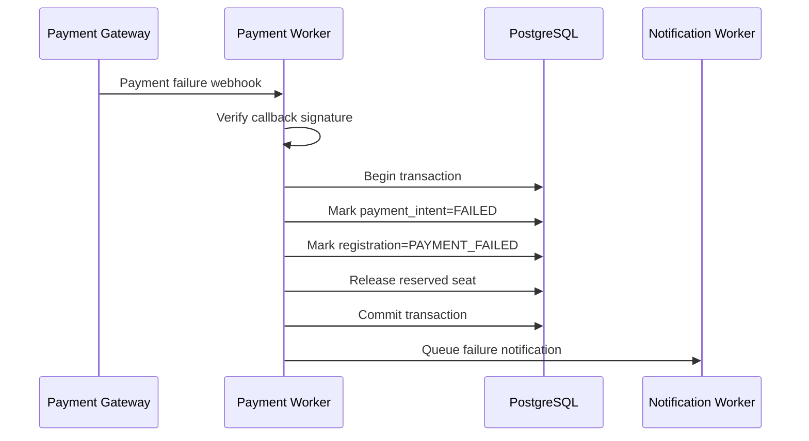
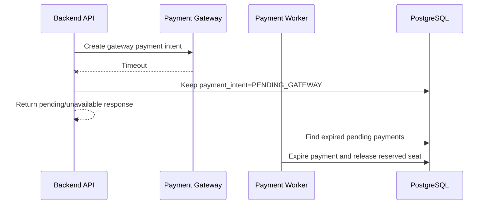
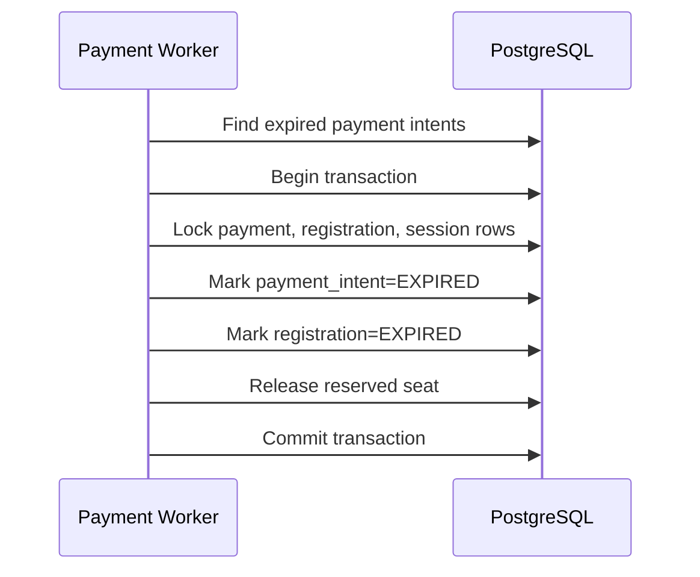

# Feature Spec: Paid Registration and Payment Processing

## Description

The Paid Registration and Payment Processing feature manages payment intent creation, external payment gateway interaction, callback/webhook handling, timeout handling, and double-charge prevention for paid workshop registrations.

This feature is responsible for payment-related state transitions. Seat reservation and registration creation are coordinated with the Registration feature. A paid registration starts in `PENDING_PAYMENT` state and becomes `CONFIRMED` only after a verified successful payment.

Payment processing must be resilient:

- Client retries must not create duplicated payment intents.
- Gateway callbacks may be duplicated and must be handled idempotently.
- Gateway timeout must not leave the system in an unrecoverable state.
- Payment gateway failure must not block workshop browsing or free registration.
- The database transaction must not stay open while calling the external payment gateway.

Actors involved:

| Actor               | Description                                                                        |
| ------------------- | ---------------------------------------------------------------------------------- |
| Student             | Initiates paid registration and completes payment through the gateway              |
| Backend API         | Creates local payment intents, enforces idempotency, and returns payment URL/token |
| Payment Gateway     | Processes the actual payment and sends callback/webhook events                     |
| Payment Worker      | Handles callbacks, timeout cleanup, and payment state updates                      |
| PostgreSQL          | Stores payment intents, registration states, and QR tickets                        |
| Redis               | Supports short-lived idempotency cache if implemented                              |
| Notification Worker | Sends confirmation or payment failure notifications asynchronously                 |

Data involved:

- `payment_intents`
- `registrations`
- `workshop_sessions`
- `qr_tickets`
- `notifications`

Detailed schema, fields, constraints, and indexes are documented in [`../database.md`](../database.md).

---

## Main Flow

### Main Flow 1: Create Payment Intent for Pending Registration

1. Student starts paid registration from the web app.
2. Registration flow creates a local `PENDING_PAYMENT` registration and reserves a seat through `POST /api/registrations/paid`.
3. Registration flow creates a local `payment_intents` record with status `PENDING_GATEWAY`.
4. Backend commits the database transaction before calling the external gateway.
5. Student calls `POST /api/payments/intents/{paymentIntentId}/zalopay` to request a ZaloPay checkout URL for the existing local payment intent.
6. Backend calls the payment gateway through a `PaymentProvider` adapter.
7. Payment gateway returns a gateway reference and payment URL/token.
8. Backend updates the local `payment_intents` record with the gateway reference and status `PENDING_PAYMENT`.
9. Backend returns the payment URL/token to the student.

Important rule: the database transaction that creates the pending registration and local payment intent must not remain open while calling the external payment gateway.



### Main Flow 2: Student Completes Payment

1. Student is redirected to the payment gateway or opens the gateway payment screen.
2. Student completes payment.
3. Payment gateway records payment success or failure.
4. Gateway sends callback/webhook to the backend.
5. The student may also return to the web app, but the backend must rely on verified callback/webhook or backend status check for final state.



### Main Flow 3: Payment Success Callback Confirms Registration

1. Payment gateway sends a success callback/webhook.
2. Backend or Payment Worker verifies callback signature or shared secret.
3. Worker finds the local `payment_intents` record by gateway reference.
4. Worker checks whether the callback was already processed.
5. Worker starts a database transaction.
6. Worker marks payment intent as `SUCCEEDED`.
7. Worker changes registration from `PENDING_PAYMENT` to `CONFIRMED`.
8. Worker converts the reserved seat into a confirmed seat.
9. Worker creates a QR ticket for the confirmed registration.
10. Worker commits the transaction.
11. Worker queues confirmation notifications asynchronously.



### Main Flow 4: Payment Failure Callback

1. Payment gateway sends a failure callback/webhook.
2. Backend or Payment Worker verifies callback signature.
3. Worker finds the local `payment_intents` record.
4. Worker starts a database transaction.
5. Worker marks payment intent as `FAILED`.
6. Worker marks registration as `PAYMENT_FAILED` or keeps it pending until expiration depending on policy.
7. Worker releases the reserved seat if the registration is finalized as failed.
8. Worker commits the transaction.
9. Worker queues failure notification if needed.



### Main Flow 5: Gateway Timeout Handling

1. Backend calls the payment gateway to create a payment intent.
2. Gateway request times out before a gateway reference is returned.
3. Backend keeps the local `payment_intents` record as `PENDING_GATEWAY`.
4. Backend returns a pending or temporary unavailable response depending on policy.
5. Payment Worker later checks expired pending payments.
6. If payment is not completed before expiration, worker expires the payment and releases the reserved seat.



### Main Flow 6: Expired Payment Cleanup

1. Payment Worker periodically finds expired payment intents or registrations in `PENDING_PAYMENT`.
2. Worker starts a database transaction.
3. Worker locks related payment, registration, and session rows.
4. Worker marks payment intent as `EXPIRED`.
5. Worker marks registration as `EXPIRED`.
6. Worker releases the reserved seat.
7. Worker commits the transaction.



---

## API Contract

### Create Pending Paid Registration

```http
POST /api/registrations/paid
```

Required role: `student`.

Request body:

```json
{
  "sessionId": "s-102",
  "idempotencyKey": "paid-reg-req-123"
}
```

Success response:

```json
{
  "success": true,
  "data": {
    "paymentIntentId": "pi-001",
    "registrationId": "r-002",
    "workshopId": "w-001",
    "sessionId": "s-102",
    "registrationStatus": "PENDING_PAYMENT",
    "paymentStatus": "PENDING_GATEWAY",
    "amount": 199000,
    "currency": "VND",
    "expiresAt": "2026-05-01T12:30:00Z"
  }
}
```

Rules:

- Student can only create a paid registration for their own pending paid session.
- Request must include an idempotency key.
- Repeating the same request with the same idempotency key must return the same payment intent result.
- Reusing the same idempotency key with different request data must be rejected.
- If the student already has a valid pending paid registration for the same session, the API should return the existing payment intent instead of creating another.

### Create ZaloPay URL for Existing Payment Intent

```http
POST /api/payments/intents/{paymentIntentId}/zalopay
```

Required role: `student`.

Success response:

```json
{
  "success": true,
  "data": {
    "paymentIntentId": "pi-001",
    "provider": "ZALOPAY",
    "paymentUrl": "https://gateway.example/pay/abc",
    "appTransId": "250514_123456789",
    "status": "PENDING_PAYMENT",
    "expiresAt": "2026-05-01T12:30:00Z"
  }
}
```

Rules:

- Student can only create a ZaloPay URL for their own payment intent.
- If the payment intent already has a reusable ZaloPay checkout URL, the API may return the existing URL instead of creating a new provider order.
- The database transaction that creates the local registration and local payment intent must already be committed before this external gateway call happens.

### Get Payment Status

```http
GET /api/payments/{paymentIntentId}/status
```

Required role: `student`.

Success response:

```json
{
  "success": true,
  "data": {
    "paymentIntentId": "pi-001",
    "registrationId": "r-002",
    "status": "SUCCEEDED",
    "registrationStatus": "CONFIRMED",
    "qrTicketId": "qr-001",
    "qrAvailable": true
  }
}
```

Rules:

- Student can only view payment status for their own registration/payment.
- Confirmed payment status should reflect verified backend state, not only client redirect status.

### Payment Callback / Webhook

```http
POST /api/payments/zalopay/callback
```

Required role: Gateway signature or shared secret.

Request body example:

```json
{
  "gatewayRef": "gw-abc",
  "paymentStatus": "SUCCEEDED",
  "amount": 100000,
  "currency": "VND",
  "paidAt": "2026-05-01T12:15:00Z",
  "signature": "gateway-signature"
}
```

Success response:

```json
{
  "return_code": 1,
  "return_message": "success"
}
```

Rules:

- Callback must be authenticated using gateway signature, shared secret, or equivalent verification.
- Duplicate callback must be accepted safely and handled idempotently.
- Invalid callback signature must be rejected.
- Callback amount and currency must match the local payment intent.
- Callback must not trust client-side redirect as proof of payment.

---

## Authorization Rules

| Capability                                 | Student | Organizer | Check-in Staff |
| ------------------------------------------ | ------- | --------- | -------------- |
| Create payment intent for own registration | Yes     | No        | No             |
| View own payment status                    | Yes     | No        | No             |
| Receive gateway callback                   | No      | No        | No             |

Example endpoint policies:

| Method | Endpoint                                 | Required role                   | Purpose                          |
| ------ | ---------------------------------------- | ------------------------------- | -------------------------------- |
| POST   | `/api/registrations/paid`                | `student`                       | Create or reuse a paid registration and local payment intent |
| POST   | `/api/payments/intents/{paymentIntentId}/zalopay` | `student`             | Create or reuse a ZaloPay checkout URL |
| GET    | `/api/payments/{paymentIntentId}/status` | `student`                       | View own payment status          |
| POST   | `/api/payments/zalopay/callback`         | Gateway signature/shared secret | Receive gateway callback         |

---

## Error Scenarios

| Scenario                                        | System Behavior                                                  | HTTP Status            | Error Code                           |
| ----------------------------------------------- | ---------------------------------------------------------------- | ---------------------- | ------------------------------------ |
| Missing or invalid access token                 | Reject request                                                   | `401`                  | `AUTH_TOKEN_INVALID`                 |
| User does not have `student` role               | Reject request                                                   | `403`                  | `AUTH_FORBIDDEN`                     |
| Registration not found                          | Reject request                                                   | `404`                  | `PAYMENT_REGISTRATION_NOT_FOUND`     |
| Registration belongs to another student         | Reject request                                                   | `403`                  | `PAYMENT_ACCESS_DENIED`              |
| Registration is not paid session                | Reject request                                                   | `400`                  | `PAYMENT_NOT_REQUIRED`               |
| Registration is not `PENDING_PAYMENT`           | Reject or return current state                                   | `409`                  | `PAYMENT_INVALID_REGISTRATION_STATE` |
| Missing idempotency key                         | Reject request                                                   | `400`                  | `PAYMENT_IDEMPOTENCY_KEY_REQUIRED`   |
| Same idempotency key reused with same data      | Return existing payment intent                                   | `200`                  | `PAYMENT_IDEMPOTENT_REPLAY`          |
| Same idempotency key reused with different data | Reject request                                                   | `409`                  | `PAYMENT_IDEMPOTENCY_KEY_CONFLICT`   |
| Gateway timeout before response                 | Keep registration pending until payment completion or expiration | `202`                  | `PAYMENT_PENDING`                    |
| Gateway returns failure during intent creation  | Mark intent failed or return error                               | `502`                  | `PAYMENT_GATEWAY_CREATE_FAILED`      |
| Invalid callback signature                      | Reject callback                                                  | `401`                  | `PAYMENT_INVALID_SIGNATURE`          |
| Callback gateway reference not found            | Reject callback                                                  | `404`                  | `PAYMENT_GATEWAY_REF_NOT_FOUND`      |
| Callback amount mismatch                        | Reject callback                                                  | `409`                  | `PAYMENT_AMOUNT_MISMATCH`            |
| Callback currency mismatch                      | Reject callback                                                  | `409`                  | `PAYMENT_CURRENCY_MISMATCH`          |
| Duplicate callback                              | Return success and do not repeat state transition                | `200`                  | `PAYMENT_DUPLICATE_CALLBACK`         |
| Student closes browser before redirect          | Worker still finalizes via callback                              | `200` for status check | `PAYMENT_ASYNC_FINALIZED`            |
| Payment expires before completion               | Mark payment and registration expired, release seat              | `409`                  | `PAYMENT_EXPIRED`                    |
| Database failure during confirmation            | Retry safely; do not duplicate confirmation                      | `500`                  | `PAYMENT_CONFIRMATION_FAILED`        |

---

## Constraints

### Business Constraints

- Paid registration must start as `PENDING_PAYMENT`.
- A registration becomes `CONFIRMED` only after verified successful payment.
- QR ticket must not be created before payment success.
- Failed or expired payment must not create a valid QR ticket.
- Payment gateway failure must not block workshop browsing or free registration.
- Student closing the browser must not prevent backend finalization if gateway callback arrives.

### Idempotency and Double-Charge Constraints

- Every payment intent creation request must include an idempotency key.
- `payment_intents.idempotency_key` must be unique.
- Same idempotency key with same request data must return the same payment intent.
- Same idempotency key with different request data must be rejected.
- Gateway callback processing must be idempotent.
- Duplicate callback must not create duplicate QR tickets.
- Duplicate callback must not increment confirmed seat count more than once.
- One successful payment must confirm at most one registration.

### Consistency Constraints

- PostgreSQL is the source of truth for payment and registration state.
- Payment success must atomically update payment intent, registration state, seat counters, and QR ticket.
- Payment failure or expiration must atomically update payment intent, registration state, and reserved seat availability.
- The database transaction must not stay open while calling the external payment gateway.
- External gateway status must be mapped to internal payment statuses consistently.
- Callback amount and currency must match the local payment intent.

### Resilience Constraints

- Payment provider calls must go through a `PaymentProvider` adapter.
- Timeout during gateway intent creation should keep the local payment in pending state until callback or expiration.
- Payment provider outage should degrade only paid registration.
- Free registration and workshop browsing should continue during payment incidents.

### Data Constraints

- `payment_intents.registration_id` must reference a valid registration.
- `payment_intents.idempotency_key` must be unique.
- `payment_intents.gateway_ref` should be unique when present.
- `qr_tickets.registration_id` must be unique.
- Detailed schema and database constraints are documented in [`../database.md`](../database.md).

### Authorization Constraints

- Student can create payment intent only for their own pending paid registration.
- Webhook endpoint must be protected by gateway signature, shared secret, or equivalent verification.
- Organizer and check-in staff cannot create payment intents for students.
- Frontend payment result page must not be treated as proof of payment.

---

## Acceptance Criteria

### Payment Intent Creation

- Student can create a payment intent for their own pending paid registration.
- Creating a payment intent returns payment URL/token and expiration time.
- Repeating the same request with the same idempotency key returns the same payment intent.
- Reusing the same idempotency key with different request data is rejected.
- Payment gateway intent creation does not happen inside an open database transaction.

### Payment Success

- Verified payment success changes payment intent to `SUCCEEDED`.
- Verified payment success changes registration to `CONFIRMED`.
- Verified payment success creates one QR ticket.
- Verified payment success queues confirmation notification.
- Duplicate success callback does not duplicate QR ticket or confirmed seat count.

### Payment Failure and Expiration

- Payment failure marks payment intent as `FAILED`.
- Failed payment does not create a QR ticket.
- Expired payment marks registration as `EXPIRED`.
- Expired payment releases reserved seat.
- A student can start a new registration/payment flow after expiration if seats are available.

### Callback and Timeout Handling

- Callback signature is verified before processing.
- Invalid callback signature is rejected.
- Amount and currency mismatch are rejected.
- Duplicate callback returns success but does not repeat state transition.
- Gateway timeout does not create duplicate payment intent.
- Pending payments eventually become confirmed, failed, or expired.

### Failure Isolation

- Payment gateway outage does not break workshop browsing.
- Payment gateway outage does not break free registration.
- Student closing browser does not prevent backend finalization if callback arrives.
- Notification failure does not roll back payment confirmation.

### Authorization

- Student cannot create payment intent for another student's registration.
- Organizer and check-in staff cannot create payment intents.
- Webhook endpoint accepts only verified gateway callbacks.
