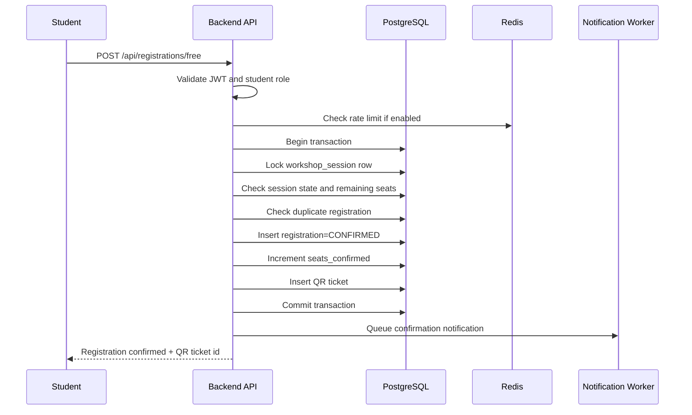
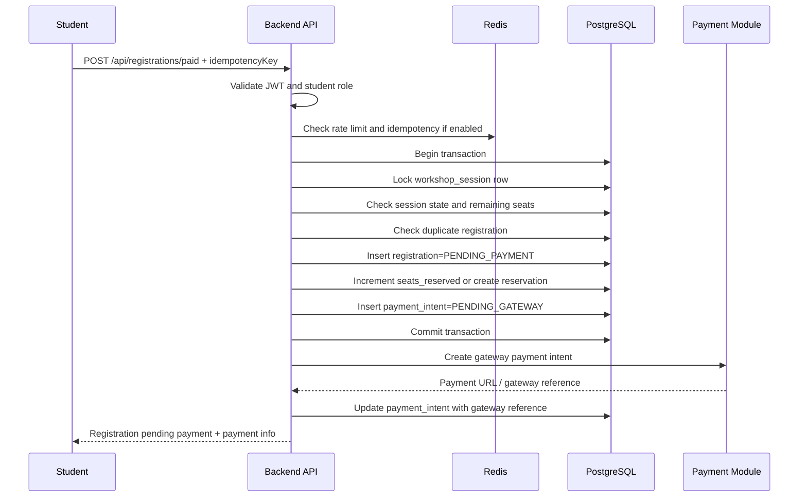
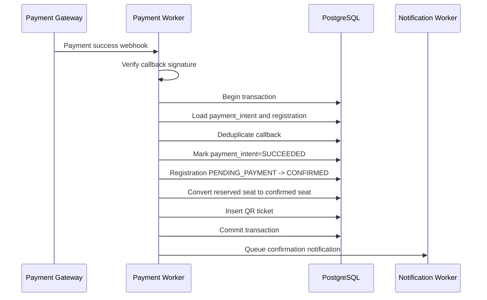
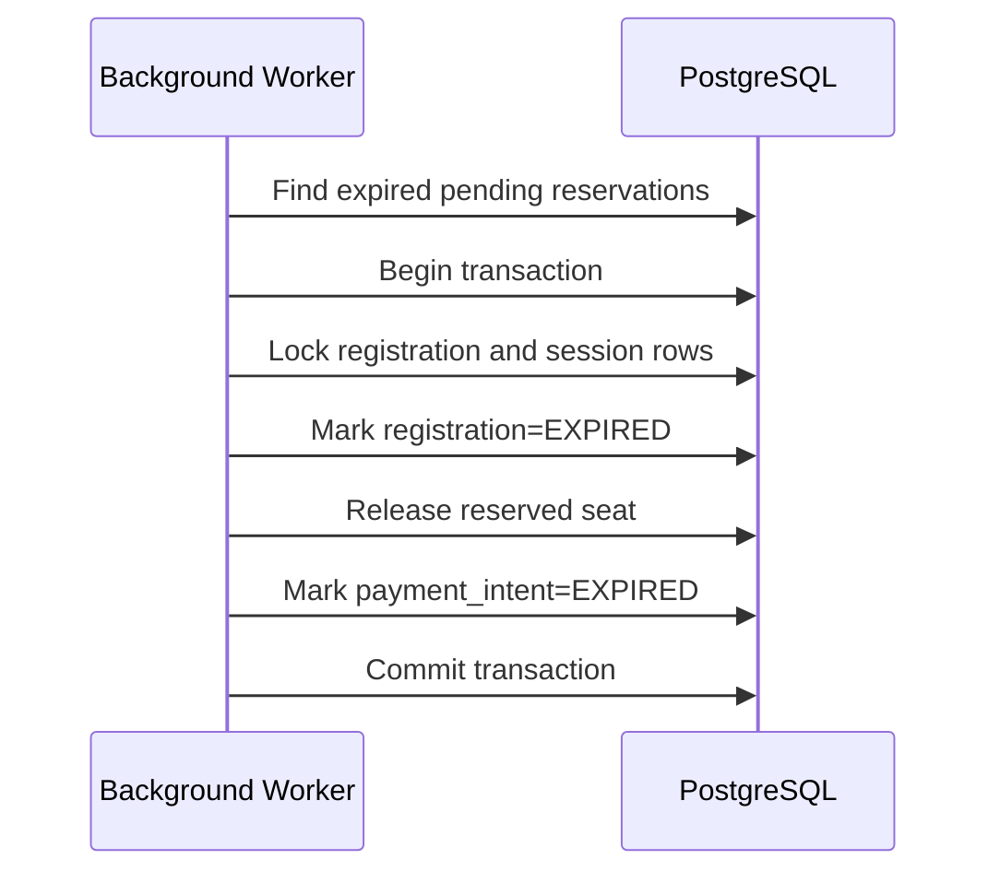
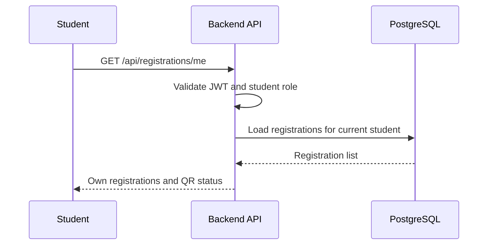

# Feature Spec: Registration and Seat Allocation

## Description

The Registration and Seat Allocation feature handles workshop registration for both free and paid workshop sessions.

Its primary responsibility is correctness under concurrency:

- A student must not register for the same session more than once.
- The system must not confirm more registrations than the session capacity.
- QR tickets must be issued only after a registration is confirmed.
- Paid registrations must hold seats temporarily while waiting for payment.
- Expired paid reservations must release seats back to the session.

This feature uses PostgreSQL as the source of truth for registration and seat state. Redis may be used for short-lived idempotency and rate limiting, but PostgreSQL constraints and transactions are responsible for final correctness.

Actors involved:

| Actor               | Description                                                                             |
| ------------------- | --------------------------------------------------------------------------------------- |
| Student             | Registers for free or paid workshop sessions and receives QR tickets after confirmation |
| Backend API         | Validates authentication, student eligibility, session state, and seat availability     |
| PostgreSQL          | Stores sessions, registrations, payment intents, QR tickets, and seat counters          |
| Redis               | Supports rate limiting and short-lived idempotency checks if implemented                |
| Payment Module      | Creates and confirms payment intents for paid registrations                             |
| Notification Worker | Sends confirmation or payment-related notifications asynchronously                      |
| Background Worker   | Cleans up expired reservations and releases seats                                       |

Data involved:

- `students`
- `workshops`
- `workshop_sessions`
- `registrations`
- `payment_intents`
- `qr_tickets`
- `notifications`

Detailed schema, fields, constraints, and indexes are documented in [`../database.md`](../database.md).

---

## Main Flow

### Main Flow 1: Free Registration

1. The student clicks register for a free workshop session.
2. The client sends the selected `sessionId` to the Backend API.
3. The Backend API validates the access token and checks that the user has role `student`.
4. The Backend API checks that the user is linked to an active student profile.
5. The Backend API starts a database transaction.
6. The Backend API locks the target `workshop_sessions` row.
7. The Backend API checks that the session exists, is open for registration, is not canceled, and has remaining seats.
8. The Backend API checks that the student does not already have a registration for the same session.
9. The Backend API creates a `registrations` record with status `CONFIRMED`.
10. The Backend API increments the session confirmed seat counter.
11. The Backend API creates a `qr_tickets` record for the confirmed registration.
12. The Backend API commits the transaction.
13. The Backend API queues notification jobs asynchronously.
14. The Backend API returns confirmed registration information and QR ticket reference.



### Main Flow 2: Paid Registration Initiation

1. The student clicks register for a paid workshop session.
2. The client sends the selected `sessionId` and a required `idempotencyKey` to the Backend API.
3. The Backend API validates the access token and checks that the user has role `student`.
4. The Backend API checks that the user is linked to an active student profile.
5. The Backend API checks rate limiting and short-lived idempotency state if Redis is available.
6. The Backend API starts a database transaction.
7. The Backend API locks the target `workshop_sessions` row.
8. The Backend API checks that the session exists, is open for registration, is not canceled, and has remaining seats.
9. The Backend API checks that the student does not already have a registration for the same session.
10. The Backend API creates a `registrations` record with status `PENDING_PAYMENT`.
11. The Backend API increments the session reserved seat counter or creates an equivalent reservation record.
12. The Backend API creates a local `payment_intents` record with status `PENDING_GATEWAY`.
13. The Backend API commits the transaction.
14. The Payment Module creates a payment intent with the payment gateway.
15. The Backend API updates the local `payment_intents` record with the gateway reference.
16. The Backend API returns a pending registration state and payment intent information.

Important rule: the database transaction must not stay open while calling the external payment gateway.



### Main Flow 3: Payment Success Confirms Registration

1. The payment gateway sends a successful payment callback/webhook.
2. The Payment Module validates the callback signature and gateway reference.
3. The Payment Module loads the related `payment_intents` and `registrations` records.
4. The Backend API or worker starts a database transaction.
5. The system verifies that the payment intent has not already been processed.
6. The system updates payment intent status to `SUCCEEDED`.
7. The system changes registration status from `PENDING_PAYMENT` to `CONFIRMED`.
8. The system converts the reserved seat into a confirmed seat.
9. The system creates a QR ticket for the registration.
10. The system commits the transaction.
11. The Notification Worker sends confirmation notifications asynchronously.



### Main Flow 4: Expired Paid Reservation Cleanup

1. A background worker periodically finds expired `PENDING_PAYMENT` registrations or payment intents.
2. The worker starts a database transaction.
3. The worker locks the related session and registration rows.
4. If the registration is still `PENDING_PAYMENT`, the worker marks it as `EXPIRED`.
5. The worker releases the reserved seat.
6. The worker marks the payment intent as `EXPIRED` if applicable.
7. The worker commits the transaction.
8. The released seat becomes available for other students.



### Main Flow 5: View My Registrations and QR Ticket

1. The student opens the registration history page.
2. The client calls the Backend API with an access token.
3. The Backend API validates role `student`.
4. The Backend API returns only registrations owned by the current student.
5. If a registration is `CONFIRMED`, the API may include QR ticket metadata.
6. If a registration is not confirmed, the API does not expose a valid QR ticket.



---

## API Contract

### Register for a Free Session

```http
POST /api/registrations/free
```

Required role: `student`.

Request body:

```json
{
  "sessionId": "s-101"
}
```

Success response:

```json
{
  "success": true,
  "data": {
    "registrationId": "r-001",
    "sessionId": "s-101",
    "status": "CONFIRMED",
    "qrTicketId": "qr-001"
  }
}
```

Rules:

- The session must be free.
- The session must be open for registration.
- The student must have an active student profile.
- The student must not already be registered for the session.
- The session must have available capacity.
- QR ticket is created immediately after successful confirmation.

### Register for a Paid Session

```http
POST /api/registrations/paid
```

Required role: `student`.

Request body:

```json
{
  "sessionId": "s-102",
  "idempotencyKey": "paid-reg-req-123"
}
```

Success response:

```json
{
  "success": true,
  "data": {
    "registrationId": "r-002",
    "sessionId": "s-102",
    "status": "PENDING_PAYMENT",
    "paymentIntentId": "pi-001",
    "paymentUrl": "https://payment.example/checkout/pi-001",
    "expiresAt": "2026-05-01T12:30:00Z"
  }
}
```

Rules:

- The session must be paid.
- The request must include an idempotency key.
- The registration stays `PENDING_PAYMENT` until payment succeeds.
- The reserved seat must expire if payment is not completed before `expiresAt`.
- QR ticket must not be created while registration is still `PENDING_PAYMENT`.

### List My Registrations

```http
GET /api/registrations/me
```

Required role: `student`.

Success response:

```json
{
  "success": true,
  "data": [
    {
      "registrationId": "r-001",
      "sessionId": "s-101",
      "workshopTitle": "Career Skills Workshop",
      "status": "CONFIRMED",
      "qrTicketId": "qr-001",
      "startAt": "2026-05-10T09:00:00Z",
      "roomName": "A101"
    },
    {
      "registrationId": "r-002",
      "sessionId": "s-102",
      "workshopTitle": "Advanced Interview Workshop",
      "status": "PENDING_PAYMENT",
      "paymentIntentId": "pi-001",
      "expiresAt": "2026-05-01T12:30:00Z"
    }
  ]
}
```

Rules:

- A student can only view their own registrations.
- Organizer and check-in staff cannot use this endpoint.

### Get Registration Detail

```http
GET /api/registrations/{registrationId}
```

Required role: `student`.

Success response:

```json
{
  "success": true,
  "data": {
    "registrationId": "r-001",
    "sessionId": "s-101",
    "workshopTitle": "Career Skills Workshop",
    "status": "CONFIRMED",
    "qrTicketId": "qr-001",
    "createdAt": "2026-05-01T10:00:00Z"
  }
}
```

Rules:

- Student can only access their own registration.

### Get QR Ticket for Registration

```http
GET /api/registrations/{registrationId}/qr
```

Required role: `student`.

Success response:

```json
{
  "success": true,
  "data": {
    "registrationId": "r-001",
    "qrTicketId": "qr-001",
    "qrPayload": "signed-or-randomized-qr-payload",
    "issuedAt": "2026-05-01T10:01:00Z"
  }
}
```

Rules:

- QR ticket is returned only for `CONFIRMED` registrations.
- QR ticket must not be returned for `PENDING_PAYMENT`, `EXPIRED`, `CANCELED`, or `FAILED` registrations.
- Student can only retrieve QR ticket for their own registration.

---

## Authorization Rules

| Capability                            | Student | Organizer | Check-in Staff |
| ------------------------------------- | ------- | --------- | -------------- |
| Register for free session             | Yes     | No        | No             |
| Register for paid session             | Yes     | No        | No             |
| View own registrations                | Yes     | No        | No             |
| View own QR ticket                    | Yes     | No        | No             |
| Access another student's registration | No      | No        | No             |

Example endpoint policies:

| Method | Endpoint                                 | Required role | Purpose                                    |
| ------ | ---------------------------------------- | ------------- | ------------------------------------------ |
| POST   | `/api/registrations/free`                | `student`     | Register for a free session                |
| POST   | `/api/registrations/paid`                | `student`     | Start paid registration and payment intent |
| GET    | `/api/registrations/me`                  | `student`     | List current student's registrations       |
| GET    | `/api/registrations/{registrationId}`    | `student`     | Get own registration detail                |
| GET    | `/api/registrations/{registrationId}/qr` | `student`     | Get QR ticket for confirmed registration   |

---

## Error Scenarios

| Scenario                                           | System Behavior                                               | HTTP Status    | Error Code                     |
| -------------------------------------------------- | ------------------------------------------------------------- | -------------- | ------------------------------ |
| Missing or invalid access token                    | Reject request                                                | `401`          | `AUTH_TOKEN_INVALID`           |
| User does not have `student` role                  | Reject request                                                | `403`          | `AUTH_FORBIDDEN`               |
| Student profile missing or inactive                | Reject registration                                           | `403`          | `REG_STUDENT_NOT_ELIGIBLE`     |
| Session not found                                  | Reject request                                                | `404`          | `REG_SESSION_NOT_FOUND`        |
| Workshop/session canceled                          | Reject registration                                           | `409`          | `REG_SESSION_CANCELED`         |
| Registration window not open                       | Reject registration                                           | `409`          | `REGISTRATION_NOT_OPEN`        |
| Session is full                                    | Reject registration                                           | `409`          | `REG_SESSION_FULL`             |
| Duplicate registration                             | Return existing registration or reject consistently           | `200` or `409` | `REG_ALREADY_EXISTS`           |
| Free endpoint used for paid session                | Reject request                                                | `400`          | `REG_PAYMENT_REQUIRED`         |
| Paid endpoint used for free session                | Reject request                                                | `400`          | `REG_PAYMENT_NOT_REQUIRED`     |
| Missing idempotency key for paid registration      | Reject request                                                | `400`          | `REG_IDEMPOTENCY_KEY_REQUIRED` |
| Idempotency key reused with different request data | Reject request                                                | `409`          | `REG_IDEMPOTENCY_KEY_CONFLICT` |
| Payment gateway intent creation failed             | Keep local pending record or mark failed                      | `502`          | `PAYMENT_GATEWAY_UNAVAILABLE`  |
| Reservation expired before payment                 | Mark registration `EXPIRED` and release seat                  | `409`          | `REG_RESERVATION_EXPIRED`      |
| QR requested for unconfirmed registration          | Reject request                                                | `409`          | `REG_QR_NOT_AVAILABLE`         |
| Registration belongs to another student            | Reject request                                                | `403`          | `REG_ACCESS_DENIED`            |
| Concurrent request tries to take last seat         | One request succeeds, others fail after lock/constraint check | `409`          | `REG_SESSION_FULL`             |

---

## Constraints

### Business Constraints

- Only users with role `student` can register for workshop sessions.
- A student must have an active student profile before registration.
- One student can have at most one registration per workshop session.
- A workshop session must be open for registration before students can register.
- Canceled sessions must not accept new registrations.
- Free registration creates a `CONFIRMED` registration immediately.
- Paid registration creates a `PENDING_PAYMENT` registration first.
- Paid registration must reserve a seat temporarily while waiting for payment.
- Paid reservation must expire if payment is not completed before the expiration time.
- QR tickets are created only for `CONFIRMED` registrations.
- Notification failure must not roll back a successful registration.

### Consistency Constraints

- PostgreSQL is the source of truth for registration and seat state.
- Confirmed seats must never exceed `seat_capacity`.
- Reserved seats plus confirmed seats must not exceed `seat_capacity`.
- Registration creation and seat counter updates must be done atomically.
- Free registration must complete inside one database transaction.
- Paid registration must create the local pending registration and local payment intent inside a database transaction before calling the external payment gateway.
- The database transaction must not stay open while calling the external payment gateway.
- Payment success must atomically confirm registration, convert reserved seat to confirmed seat, and create QR ticket.
- Expiration cleanup must atomically mark registration expired and release the reserved seat.

### Data Constraints

- `registrations(student_id, session_id)` must be unique.
- `qr_tickets.registration_id` must be unique.
- `payment_intents.idempotency_key` must be unique.
- `payment_intents.gateway_ref` should be unique when available.
- Detailed schema and database constraints are documented in [`../database.md`](../database.md).

### Authorization Constraints

- Backend authorization is mandatory for all registration endpoints.
- Student route guards in the frontend are only for user experience.
- A student can only view their own registrations and QR tickets.
- Organizer and check-in staff accounts cannot register for workshops.

### Performance and Concurrency Constraints

- Registration endpoints may be protected by rate limiting.
- The system must remain correct under concurrent registration attempts.
- High contention on one session may reduce throughput, but correctness is more important than accepting every request quickly.
- Read-heavy workshop browsing should not block registration transactions.
- Notification, email, and AI workers must not block registration completion.

---

## Acceptance Criteria

### Free Registration

- A student with an active profile can register for an open free session.
- Free registration returns status `CONFIRMED`.
- Free registration creates a QR ticket immediately after confirmation.
- Free registration queues confirmation notification asynchronously.
- Notification failure does not roll back the confirmed registration.

### Paid Registration

- A student with an active profile can start registration for a paid session.
- Paid registration returns status `PENDING_PAYMENT`.
- Paid registration creates a payment intent.
- Paid registration does not create a QR ticket before payment success.
- Payment success changes registration status to `CONFIRMED`.
- Payment success creates a QR ticket.
- Payment failure or expiration does not produce a valid QR ticket.

### Seat Allocation Correctness

- The system never confirms more registrations than the session capacity.
- Reserved plus confirmed seats never exceed the session capacity.
- Concurrent requests for the last seat result in only one successful registration.
- Row-level locking, equivalent concurrency control, and database constraints protect final correctness.
- A student cannot register twice for the same session.

### Idempotency and Retry

- Repeating the same paid registration request with the same idempotency key returns the same pending result.
- Reusing the same idempotency key with different request data is rejected.
- Duplicate payment success callbacks do not create duplicate QR tickets or duplicate confirmed seats.

### Reservation Expiration

- Expired pending paid registrations are marked `EXPIRED`.
- Expired paid reservations release their reserved seats.
- A student whose reservation expired must start a new registration/payment flow.
- QR ticket retrieval for expired registration returns an error.

### Authorization and Ownership

- A student cannot access another student's registration detail.
- A student cannot access another student's QR ticket.
- Organizer and check-in staff accounts cannot register for workshops.
- Backend authorization blocks forbidden registration actions even if the user manually calls the API with Postman.
