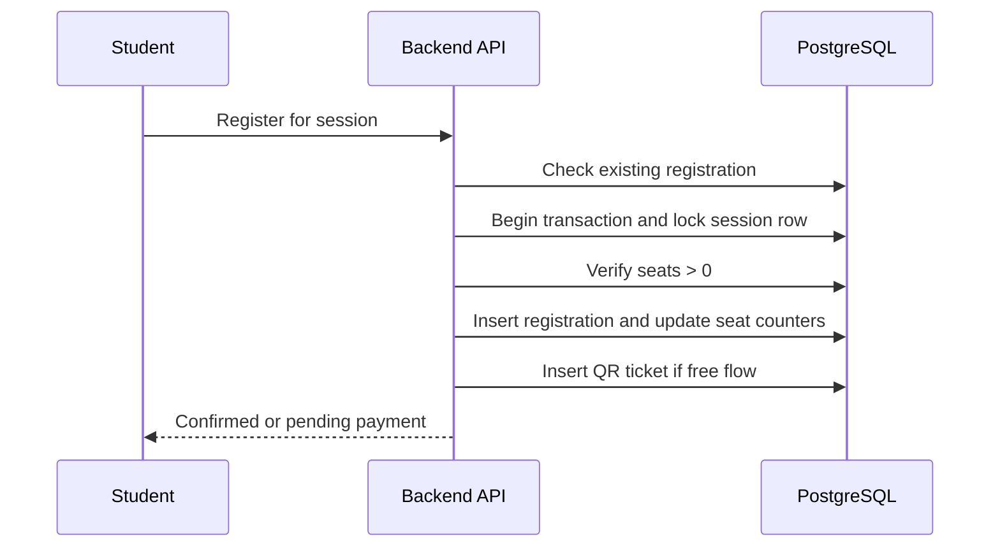

# Feature Spec: Registration and Seat Allocation

## Description

This feature handles workshop registration for both free and paid sessions. Its primary responsibility is correctness under concurrency: no duplicate registration for the same student and no overbooking when many students register simultaneously.

## Main Flow

### Free registration

1. Student opens a workshop session and clicks `Register`.
2. Backend authenticates the student and checks role, student eligibility, and duplicate registration.
3. Backend begins a transaction and locks the target `workshop_session` row.
4. Backend verifies available seats.
5. Backend creates a `CONFIRMED` registration, increments `seats_confirmed`, generates a QR ticket, and commits.
6. Backend queues confirmation notifications.

### Paid registration handoff

1. Student clicks `Register` for a paid session.
2. Backend creates a `PENDING_PAYMENT` registration and temporary seat reservation.
3. Payment flow continues in the payment module.
4. The registration becomes `CONFIRMED` only after payment success.

## Key Design Decisions

- **Choice:** Use database transactions with row-level lock for seat allocation.
  - **Why:** It guarantees that only one transaction can consume the last seat at commit time.
  - **Trade-offs / risks:** High demand on one session serializes seat allocation for that session.
  - **Alternatives not chosen:** Optimistic updates without locks were rejected because they are harder to make correct under extreme contention.

- **Choice:** Temporary seat reservation for paid registration.
  - **Why:** A student should not lose a seat immediately after entering the payment flow.
  - **Trade-offs / risks:** Reserved seats can temporarily reduce visible availability for others.
  - **Alternatives not chosen:** Allocating the seat only after payment success was rejected because users could pay and still lose the seat.

## Error Scenarios

- Duplicate registration attempt for the same student and session: return the existing registration state.
- No seats left: return `409 Conflict` with `session_full`.
- Student record missing from imported roster: reject registration until student data is imported.
- Reservation expires before payment completes: mark registration `EXPIRED` and release the seat.

## Constraints

- One student can have at most one registration per workshop session.
- QR code must be created only for confirmed registrations.
- Free registration should complete in a single transaction without waiting on notification delivery.
- Registration logic must remain correct if notification, AI, or CSV import workers are busy.

## Acceptance Criteria

- The system never confirms more seats than the session capacity.
- A student cannot register twice for the same session.
- Free registration returns a confirmed result and QR ticket immediately.
- Paid registration returns a pending state until the payment module confirms success.
- When a paid reservation expires, the seat becomes available again.
