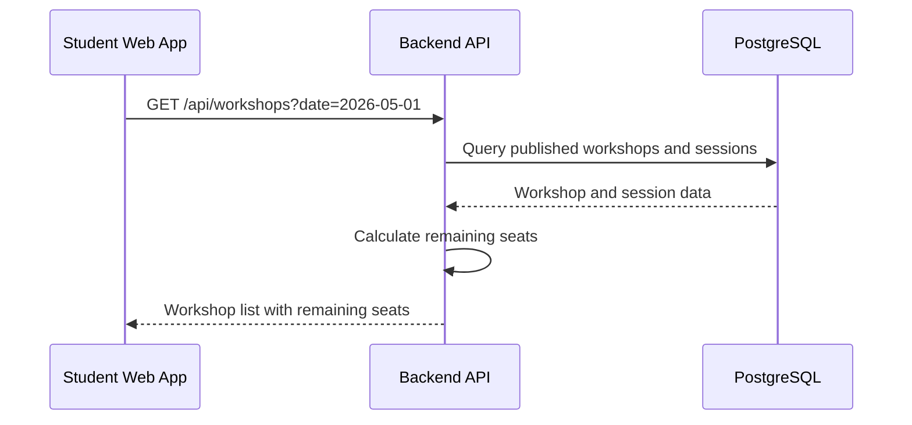
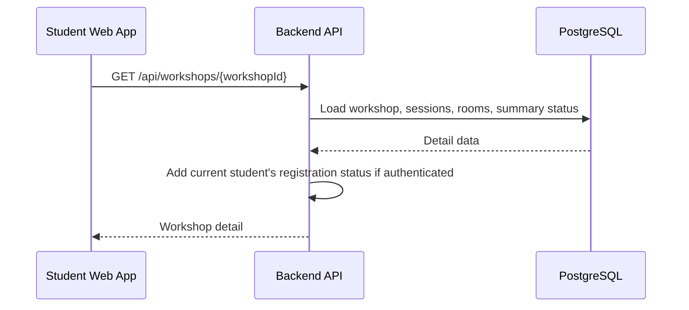
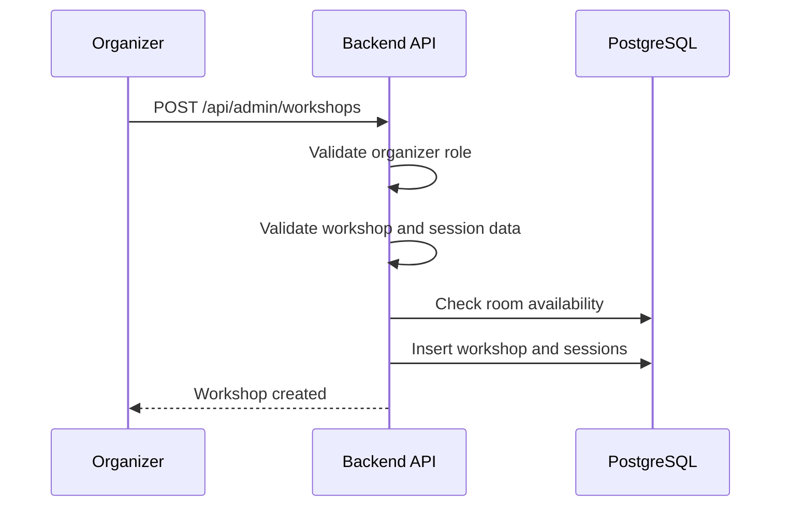
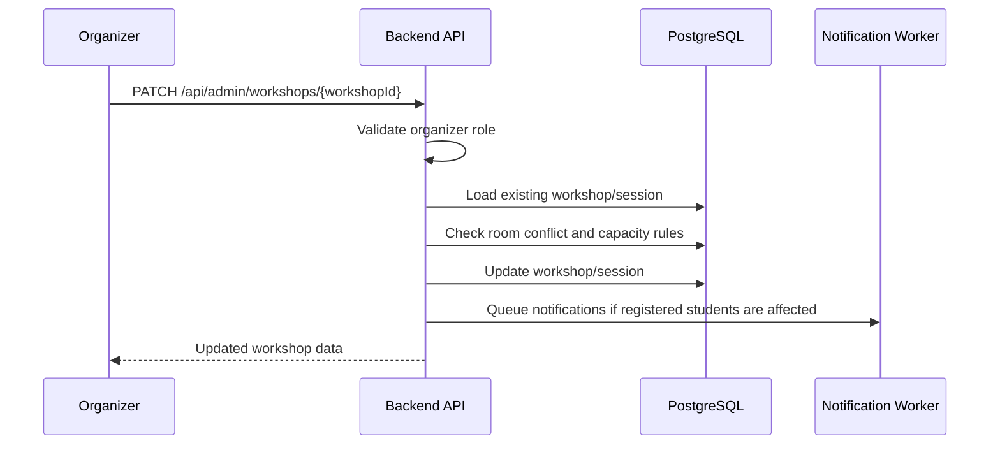
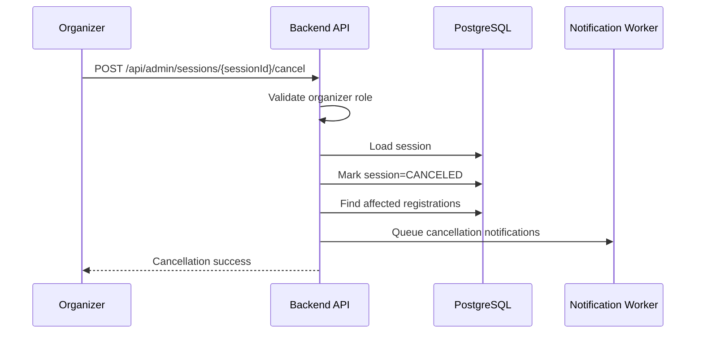
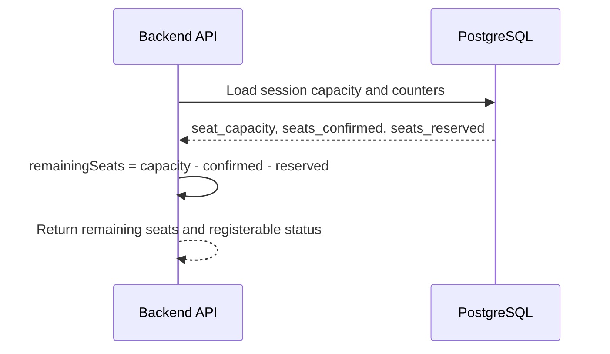

# Feature Spec: Workshop Management and Browsing

## Description

The Workshop Management and Browsing feature manages workshop metadata, session scheduling, room assignment, public browsing, and organizer administration.

This feature supports two main usage groups:

- Students browse workshops, view details, check schedules, see remaining seats, and decide whether to register.
- Organizers create, update, reschedule, cancel workshops and sessions, and manage workshop information.

Workshop browsing must remain available even if payment, notification, or AI summary providers are unavailable. Organizer write actions must be protected by backend RBAC.

Actors involved:

| Actor               | Description                                                                        |
| ------------------- | ---------------------------------------------------------------------------------- |
| Student             | Browses workshops, views details, checks remaining seats, and sees workshop status |
| Organizer           | Creates, updates, reschedules, cancels workshops and sessions                      |
| Backend API         | Validates workshop data, exposes browsing APIs, and enforces authorization         |
| PostgreSQL          | Stores workshops, sessions, rooms, registrations, documents, and summaries         |
| Notification Worker | Sends notifications when changes affect registered students                        |
| AI Summary Worker   | Provides summary status and generated summary for workshop detail pages            |

Data involved:

- `workshops`
- `workshop_sessions`
- `rooms`
- `workshop_documents`
- `ai_summaries`
- `registrations`
- `notifications`

Detailed schema, fields, constraints, and indexes are documented in [`../database.md`](../database.md).

---

## Main Flow

### Main Flow 1: Student Browses Workshop List

1. Student opens the workshop list page in the Next.js web app.
2. The web app calls the Backend API with optional filters such as date, keyword, fee type, room, or speaker.
3. The Backend API queries published workshops and active sessions from PostgreSQL.
4. The Backend API calculates or reads remaining seats for each session.
5. The Backend API returns workshop cards with title, speaker, session time, room, fee type, status, and remaining seats.
6. The web app displays the workshop list to the student.



### Main Flow 2: Student Views Workshop Detail

1. Student selects a workshop from the list.
2. The web app calls the Backend API with `workshopId`.
3. The Backend API loads workshop metadata, speaker information, sessions, room data, fee information, and summary status.
4. If the student is authenticated, the Backend API may include the current student's registration status for each session.
5. If an AI summary is completed, the Backend API includes the summary text.
6. If AI summary is still processing or failed, the Backend API returns the summary status without blocking workshop detail.
7. The web app displays the workshop detail page.



### Main Flow 3: Organizer Creates Workshop with Sessions

1. Organizer opens the admin workshop creation page.
2. Organizer submits workshop metadata and session information.
3. Backend API validates the access token and checks role `organizer`.
4. Backend API validates title, speaker, description, fee type, schedule, room assignment, and capacity.
5. Backend API checks that sessions do not conflict with existing sessions in the same room.
6. Backend API creates the workshop and session records in PostgreSQL.
7. Backend API returns the created workshop and session information.



### Main Flow 4: Organizer Updates Workshop or Session

1. Organizer edits workshop metadata or session information.
2. Backend API validates role `organizer`.
3. Backend API loads the existing workshop/session.
4. Backend API validates the requested changes.
5. If schedule or room changes are requested, Backend API checks room conflicts.
6. If capacity is changed, Backend API ensures new capacity is not below confirmed registrations.
7. Backend API updates the workshop/session.
8. If the change affects registered students, Backend API queues notification jobs.
9. Backend API returns updated data.



### Main Flow 5: Organizer Cancels Workshop or Session

1. Organizer requests cancellation for a workshop or session.
2. Backend API validates role `organizer`.
3. Backend API checks that the workshop/session exists.
4. Backend API marks the workshop/session as `CANCELED`.
5. Backend API keeps registration records so affected students can still see their registration history.
6. Backend API queues cancellation notifications to affected students.
7. Backend API returns cancellation success.



### Main Flow 6: Check Remaining Seats

1. Backend API loads session capacity and seat counters.
2. Backend API calculates remaining seats from capacity, confirmed seats, and reserved seats.
3. Backend API returns remaining seats to workshop list/detail.
4. If a session is canceled or closed, Backend API may return zero remaining seats or a non-registerable status.



---

## API Contract

### List Workshops

```http
GET /api/workshops
```

Required role: Public or authenticated.

Query parameters:

| Parameter | Required | Description                              |
| --------- | -------- | ---------------------------------------- |
| `date`    | No       | Filter sessions by date                  |
| `keyword` | No       | Search by title, description, or speaker |
| `feeType` | No       | `FREE` or `PAID`                         |
| `roomId`  | No       | Filter by room                           |
| `status`  | No       | Usually only `PUBLISHED` for public list |

Success response:

```json
{
  "success": true,
  "data": [
    {
      "workshopId": "w-001",
      "title": "System Design 101",
      "speaker": "Dr. A",
      "descriptionPreview": "An introduction to practical system design.",
      "status": "PUBLISHED",
      "sessions": [
        {
          "sessionId": "s-101",
          "startAt": "2026-05-01T08:00:00Z",
          "endAt": "2026-05-01T10:00:00Z",
          "roomId": "room-1",
          "roomName": "H1-201",
          "feeType": "FREE",
          "feeAmount": 0,
          "seatCapacity": 100,
          "remainingSeats": 12,
          "registerable": true
        }
      ]
    }
  ]
}
```

Rules:

- Public list should not expose unpublished drafts.
- Canceled sessions may be hidden from public list unless the student is already registered.
- Remaining seats must not be negative.

### Get Workshop Detail

```http
GET /api/workshops/{workshopId}
```

Required role: Public or authenticated.

Success response:

```json
{
  "success": true,
  "data": {
    "workshopId": "w-001",
    "title": "System Design 101",
    "speaker": "Dr. A",
    "description": "Full workshop description.",
    "status": "PUBLISHED",
    "summaryStatus": "COMPLETED",
    "summaryText": "This workshop introduces core system design concepts.",
    "sessions": [
      {
        "sessionId": "s-101",
        "startAt": "2026-05-01T08:00:00Z",
        "endAt": "2026-05-01T10:00:00Z",
        "roomId": "room-1",
        "roomName": "H1-201",
        "roomMapUrl": "https://example.com/maps/h1-201.png",
        "feeType": "FREE",
        "feeAmount": 0,
        "remainingSeats": 12,
        "registerable": true,
        "myRegistrationStatus": "NOT_REGISTERED"
      }
    ]
  }
}
```

Rules:

- If user is authenticated as student, response may include `myRegistrationStatus`.
- If AI summary is not ready, response still returns workshop details with `summaryStatus`.
- Workshop browsing must not depend on payment gateway, notification provider, or AI provider availability.

### Create Workshop

```http
POST /api/admin/workshops
```

Required role: `organizer`.

Request body:

```json
{
  "title": "System Design 101",
  "speaker": "Dr. A",
  "description": "Full workshop description.",
  "status": "DRAFT",
  "sessions": [
    {
      "roomId": "room-1",
      "startAt": "2026-05-01T08:00:00Z",
      "endAt": "2026-05-01T10:00:00Z",
      "seatCapacity": 100,
      "feeType": "FREE",
      "feeAmount": 0
    }
  ]
}
```

Success response:

```json
{
  "success": true,
  "data": {
    "workshopId": "w-001",
    "status": "DRAFT",
    "sessionIds": ["s-101"]
  }
}
```

Rules:

- Only organizers can create workshops.
- Session end time must be after start time.
- Seat capacity must be positive.
- Room must be available in the requested time range.
- Paid sessions must have a positive fee amount.

### Update Workshop

```http
PATCH /api/admin/workshops/{workshopId}
```

Required role: `organizer`.

Request body:

```json
{
  "title": "System Design 101 - Updated",
  "speaker": "Dr. A",
  "description": "Updated description.",
  "status": "PUBLISHED"
}
```

Success response:

```json
{
  "success": true,
  "data": {
    "workshopId": "w-001",
    "status": "PUBLISHED",
    "updated": true
  }
}
```

Rules:

- Organizer can update workshop metadata.
- Publishing a workshop requires at least one valid session.
- If the update affects registered students, notification jobs should be queued.

### Create Session

```http
POST /api/admin/workshops/{workshopId}/sessions
```

Required role: `organizer`.

Request body:

```json
{
  "roomId": "room-2",
  "startAt": "2026-05-02T08:00:00Z",
  "endAt": "2026-05-02T10:00:00Z",
  "seatCapacity": 80,
  "feeType": "PAID",
  "feeAmount": 100000
}
```

Success response:

```json
{
  "success": true,
  "data": {
    "sessionId": "s-102",
    "workshopId": "w-001",
    "status": "OPEN"
  }
}
```

Rules:

- The room must not have a conflicting session.
- Session capacity must not exceed room capacity if room capacity is enforced.
- Paid session must have positive fee amount.

### Update Session

```http
PATCH /api/admin/sessions/{sessionId}
```

Required role: `organizer`.

Request body:

```json
{
  "roomId": "room-3",
  "startAt": "2026-05-02T09:00:00Z",
  "endAt": "2026-05-02T11:00:00Z",
  "seatCapacity": 90
}
```

Success response:

```json
{
  "success": true,
  "data": {
    "sessionId": "s-102",
    "updated": true
  }
}
```

Rules:

- New capacity must not be below confirmed registrations.
- Time or room changes affecting registered students should queue notifications.
- Room conflicts must be rejected.

### Cancel Session

```http
POST /api/admin/sessions/{sessionId}/cancel
```

Required role: `organizer`.

Request body:

```json
{
  "reason": "Speaker unavailable"
}
```

Success response:

```json
{
  "success": true,
  "data": {
    "sessionId": "s-102",
    "status": "CANCELED"
  }
}
```

Rules:

- Canceled sessions must not accept new registrations.
- Existing registrations remain visible in registration history.
- Cancellation should queue notifications for affected students.

---

## Authorization Rules

| Capability                             | Student | Organizer |
| -------------------------------------- | ------- | --------- |
| Browse workshop list/detail            | Yes     | Yes       |
| View remaining seats                   | Yes     | Yes       |
| View own registration status on detail | Yes     | No        |
| Create workshop                        | No      | Yes       |
| Update workshop                        | No      | Yes       |
| Publish workshop                       | No      | Yes       |
| Create/update/cancel session           | No      | Yes       |
| Upload PDF for workshop                | No      | Yes       |
| View registration statistics           | No      | Yes       |

Example endpoint policies:

| Method | Endpoint                                     | Required role           | Purpose              |
| ------ | -------------------------------------------- | ----------------------- | -------------------- |
| GET    | `/api/workshops`                             | Public or authenticated | Browse workshop list |
| GET    | `/api/workshops/{workshopId}`                | Public or authenticated | View workshop detail |
| POST   | `/api/admin/workshops`                       | `organizer`             | Create workshop      |
| PATCH  | `/api/admin/workshops/{workshopId}`          | `organizer`             | Update workshop      |
| POST   | `/api/admin/workshops/{workshopId}/sessions` | `organizer`             | Create session       |
| PATCH  | `/api/admin/sessions/{sessionId}`            | `organizer`             | Update session       |
| POST   | `/api/admin/sessions/{sessionId}/cancel`     | `organizer`             | Cancel session       |

---

## Error Scenarios

| Scenario                                       | System Behavior                                  | HTTP Status | Error Code                          |
| ---------------------------------------------- | ------------------------------------------------ | ----------- | ----------------------------------- |
| Workshop not found                             | Reject request                                   | `404`       | `WORKSHOP_NOT_FOUND`                |
| Session not found                              | Reject request                                   | `404`       | `WORKSHOP_SESSION_NOT_FOUND`        |
| Room not found                                 | Reject request                                   | `404`       | `WORKSHOP_ROOM_NOT_FOUND`           |
| User does not have organizer role              | Reject admin request                             | `403`       | `AUTH_FORBIDDEN`                    |
| Missing required field                         | Reject request                                   | `400`       | `WORKSHOP_VALIDATION_ERROR`         |
| End time before start time                     | Reject request                                   | `400`       | `WORKSHOP_INVALID_TIME_RANGE`       |
| Schedule overlaps another session in same room | Reject request                                   | `409`       | `WORKSHOP_ROOM_CONFLICT`            |
| Seat capacity is zero or negative              | Reject request                                   | `400`       | `WORKSHOP_INVALID_CAPACITY`         |
| Session capacity exceeds room capacity         | Reject request if room capacity is enforced      | `409`       | `WORKSHOP_ROOM_CAPACITY_EXCEEDED`   |
| Paid session has no fee amount                 | Reject request                                   | `400`       | `WORKSHOP_FEE_REQUIRED`             |
| Free session has positive fee amount           | Reject request or normalize to zero              | `400`       | `WORKSHOP_FEE_NOT_ALLOWED`          |
| Capacity lowered below confirmed registrations | Reject update                                    | `409`       | `WORKSHOP_CAPACITY_BELOW_CONFIRMED` |
| Organizer cancels a session with registrations | Mark canceled, keep history, queue notifications | `200`       | `WORKSHOP_SESSION_CANCELED`         |
| Student tries to register for canceled session | Registration feature rejects request             | `409`       | `REG_SESSION_CANCELED`              |
| AI summary not ready                           | Return summary status instead of failing         | `200`       | `SUMMARY_PENDING`                   |
| Notification provider unavailable after update | Keep update committed and retry notification     | `202`       | `NOTIFY_RETRY_SCHEDULED`            |

---

## Constraints

### Business Constraints

- Workshops must have valid metadata before publishing.
- A published workshop should have at least one valid session.
- Each session belongs to exactly one workshop.
- Each session must have one room.
- Session end time must be after start time.
- Session capacity must be positive.
- Canceled sessions must not accept new registrations.
- Canceled workshops and sessions should remain visible in admin history.
- Students should see a clear canceled status if they already registered for a canceled session.
- Remaining seats must never be negative.

### Scheduling Constraints

- Two sessions cannot use the same room at overlapping times.
- Room conflict checks must happen before saving session changes.
- If room capacity is enforced, session capacity must not exceed room capacity.
- Updating session time or room after registrations exist should trigger notifications.
- Lowering session capacity below confirmed registrations is not allowed.

### Data Constraints

- `workshop_sessions.workshop_id` must reference an existing workshop.
- `workshop_sessions.room_id` must reference an existing room.
- `workshop_sessions.seat_capacity` must be greater than zero.
- `workshop_sessions.seats_confirmed` must not exceed `seat_capacity`.
- `workshop_sessions.seats_reserved + seats_confirmed` must not exceed `seat_capacity`.
- Detailed schema and database constraints are documented in [`../database.md`](../database.md).

### Authorization Constraints

- Backend authorization is mandatory for all admin workshop APIs.
- UI route guards are only for user experience.
- Only organizers can create, update, publish, or cancel workshops.
- Students cannot call organizer admin APIs.

### Availability Constraints

- Workshop browsing must remain available if payment gateway is down.
- Workshop browsing must remain available if AI provider is down.
- Workshop browsing must remain available if notification provider is down.
- Workshop list and detail APIs should avoid calling external providers directly.
- Notification jobs should run asynchronously after workshop changes.

---

## Acceptance Criteria

### Student Browsing

- Students can browse published workshops by date.
- Students can view workshop title, description, speaker, room, time, fee type, and remaining seats.
- Students can open a workshop detail page.
- Workshop detail page loads even if AI summary is not ready.
- Workshop browsing works even if payment, notification, or AI providers are down.
- Remaining seats are never displayed as negative.

### Organizer Workshop Management

- Organizer can create a workshop with one or more sessions.
- Organizer can update workshop metadata.
- Organizer can create, update, reschedule, and cancel sessions.
- Organizer cannot create a session with invalid time range.
- Organizer cannot create overlapping sessions in the same room.
- Organizer cannot lower capacity below confirmed registrations.

### Cancellation and Updates

- Canceled sessions do not accept new registrations.
- Students already registered for a canceled session can see a clear canceled status.
- Changes affecting registered students queue notification jobs.
- Notification failure does not roll back the workshop update or cancellation.
- Canceled workshops and sessions remain visible in admin history.

### Authorization

- Student accounts cannot access workshop admin APIs.
- Organizer APIs reject unauthenticated access.
- Backend authorization blocks forbidden actions even if the user manually calls the API with Postman.

### Data and Consistency

- Room conflicts are rejected before data is saved.
- Session capacity remains consistent with confirmed and reserved seats.
- Published workshops have valid required data.
- Workshop detail returns current summary status and session registration state when applicable.
